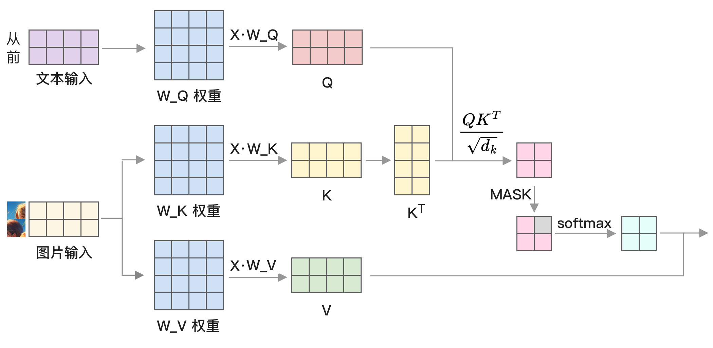

# 大模型基础

在微调前，最好能了解一些大模型的基础知识。本章将介绍大模型的基本原理及实现。

## 大模型的训练方法

大模型主要指语言模型，它本质上是一个条件概率模型，通过一段文本来预测下一个词是什么，然后再将这个词加入到文本末尾继续预测下一个词。

大模型的训练是通过大量的文本数据，采用梯度下降的方式来调整模型参数，使得模型能够更好地预测下一个词。

大模型的训练分为两个阶段：

- **预训练阶段**：通过大量的文本数据来训练模型，使得模型能够学习到文本数据的规律，这个阶段的模型被称为基础模型。
- **后训练阶段**：通过少量示例或强化学习训练让大模型完成特定任务，ChatGPT 的训练就是将大模型从文本补全转变为问答能力的过程。

## 大模型运行流程

在介绍各个细节知识点之前，首先整体了解大模型的运行过程，参考下图：


主要分为 6 步：

1. 将输入转成 token，这个过程叫做 tokenization，每个 token 转成一个数字。
2. 将 token 转成词嵌入，这个过程叫做 embedding，每个 token 对应一个向量。
3. 加上位置编码，这个过程叫做 position encoding，这里是原始 Transformers 结构的计算方法，后面会介绍目前更流行的 RoPE 方法。
4. 进行 Transformers 计算，包括 Attention 及 MLP 等，后面会详细展开，这是大模型计算的核心，最终会输出下一个词的概率分布。
5. 从这个概率中挑选下一个词，可以根据概率进行抽样，或者只选择概率最高的词。
6. 将这个词加入到句子尾部，然后循环执行。

接下来将详细介绍这些步骤的细节。

### Token

大模型输入文本会首先转成 token，这是大模型内部使用的词汇。了解它的最好方法就是上手实践。以 Llama 3.1 为例，它基于 tiktoken 库实现，是 OpenAI 开源的 token 库。

本地下载 Llama 3.1 模型后，在目录中会有一个 `tokenizer.model` 文件，我们通过加载它来分析 token。

```python
from tiktoken.load import load_tiktoken_bpe
mergeable_ranks = load_tiktoken_bpe("/改成本机地址/tokenizer.model")
```

我们可以随意查看其中的一些 token，例如：

```python
>>> list(mergeable_ranks.items())[10000:10005]
[(b'.grid', 10000),
 (b'Results', 10001),
 (b'azz', 10002),
 (b' daughter', 10003),
 (b' curr', 10004)]
```

注意，有些 token 以空格开头。对于大模型来说，`'python'` 和 `' python'` 是不同的 token，一个代表 python 在文本最开始，另一个代表 python 在文本中间。

接下来，我们参考官方项目中的代码对一段文本进行编码：

```python
import tiktoken
from tiktoken.load import load_tiktoken_bpe
mergeable_ranks = load_tiktoken_bpe("/改成本机地址/tokenizer.model")

# 这些正则和特殊 token 都来自官方项目代码
pat_str = r"(?i:'s|'t|'re|'ve|'m|'ll|'d)|[^\r\n\p{L}\p{N}]?\p{L}+|\p{N}{1,3}| ?[^\s\p{L}\p{N}]+[\r\n]*|\s*[\r\n]+|\s+(?!\S)|\s+"

special_tokens = [
    "<|begin_of_text|>", # 文本开头
    "<|end_of_text|>", # 文本结尾
    "<|reserved_special_token_0|>",
    "<|reserved_special_token_1|>",
    "<|reserved_special_token_2|>",
    "<|reserved_special_token_3|>",
    "<|start_header_id|>",
    "<|end_header_id|>",
    "<|reserved_special_token_4|>",
    "<|eot_id|>", # 标记一轮对话结束
] + [f"<|reserved_special_token_{i}|>" for i in range(5, 256 - 5)]

num_base_tokens = len(mergeable_ranks)

special_tokens = {
  token: num_base_tokens + i for i, token in enumerate(special_tokens)
}

tokenizer = tiktoken.Encoding(
  name="token",
  pat_str=pat_str,
  mergeable_ranks=mergeable_ranks,
  special_tokens=special_tokens,
)
```

然后就能使用 `tokenizer` 的 `encode` 方法对任意一段文本进行编码：

```python
>>> tokenizer.encode("从前有座")
[46281, 25580, 19361, 103605]
```

如果使用 Transformers 库，我们可以用更少的代码实现这个功能：

```python
from transformers import AutoTokenizer
tokenizer = AutoTokenizer.from_pretrained("/模型本机目录/")
tokenizer("从前有座")
```

这些词表是如何构造出来的？目前大模型中通常使用 Byte-Pair Encoding (BPE) 算法来构造。

### 使用 BPE 算法构造 token 词表

BPE 算法具体如何实现？其核心思想是将**最常出现的子词对合并，直到词汇表达到预定的大小时停止**。这个算法最初用于数据压缩。

我们用原论文中的示例说明它的执行过程，假设有以下文本：

```txt
ABABCABCD
```

BPE 算法的执行过程如下图所示：


具体步骤如下：

- 将这段文本拆分为字节，得到「A」、「B」、「C」、「D」，将它们作为基础词表。如果是中文，则使用对应的 UTF-8 字节，比如「中」字拆分为 `\xE4 \xB8 \xAD` 三个字节。
- 统计两个词汇合并在一起时出现的次数，得到「AB」出现 3 次，「BC」出现 2 次，「CA」出现 1 次，「CD」出现 1 次，「BA」出现 1 次。可以看到「AB」出现次数最多，因此将「AB」作为新词加入词表。
- 为了方便查看，这里将原先词汇的「AB」替换成「X」，得到「XXCXCD」。
- 重复第二步操作，统计两两词汇出现次数，得到「XC」出现 2 次，「XX」出现 1 次，「CX」出现 1 次，「CD」出现 1 次。这时「XC」出现概率最高，因此将它合并成一个新词汇「ABC」加入词表。
- 不断重复以上步骤，直到词汇表达到预定大小。

我们可以使用 tokenizers 库来轻松训练自己的模型，类似如下代码：

```python
from tokenizers.trainers import BpeTrainer
# 定义特殊 token
trainer = BpeTrainer(special_tokens=["[UNK]", "[CLS]", ...])
# 定义字符分割方法，包括空格、标点符号和字节级别
tokenizer.pre_tokenizer = pre_tokenizers.Sequence(
    [Whitespace(), Punctuation(), ByteLevel()])
tokenizer.decoder = decoders.ByteLevel()
# 文本文件
files = [f"data.txt"]
tokenizer.train(files, trainer)
tokenizer.save("./tokenizer.json")
```

不过，目前开源大模型的词表都已经很完善，通常不需要自己训练。

使用 BPE 算法的好处是可以让常见单词独占一个 token，不常见单词使用多个 token 拼接，从而减少词表大小，提高模型效率。

### 将 token 转成词嵌入

有了 token，接下来是将它转成词嵌入。因为计算机只能处理数字，所以要进行计算，必须先将语言转成数字形式。最早使用的是独热编码（One-Hot），即将每个词转成一个向量，向量的维度是词表大小，每个词只有一个位置是 1，其它位置是 0，比如：

```txt
从 -> [0, 0, 0, ..., 1]
前 -> [0, 1, 0, ..., 0]
```

而词嵌入是用多个数字来表示一个 token，变成了：

```txt
从 -> [0.03, 0.01, -0.7, .., 0.42]
前 -> [-0.02, 0.53, 0.25, .., 0.26]
```

相比独热编码，词嵌入能包含更多信息，因此效果更好，所以成为了现在自然语言处理中最常用的编码方式。这里继续用 Llama 3.1 作为示例，加载模型后打印其中的 `tok_embeddings.weight` 权重形状，会得到词嵌入矩阵：

```python
>>> model = torch.load("/consolidated.00.pth")
>>> model["tok_embeddings.weight"].shape
[128256, 4096]
```

其中第一个维度是词表大小，Llama 3.1 的词表大小是 128256，第二个维度是词嵌入维度。我们可以尝试打印其中一个，可以看到它由 4096 个浮点数组成，这些数字是通过训练得到的，代表了这个 token 的语义信息：

```python
>>> model["tok_embeddings.weight"][0]
tensor([ 0.0012, 0.0057, -0.0033, ..., 0.0041, -0.0026, -0.0007])
```

词嵌入可以用于计算词之间的距离，这里我们做个测试：

```python
>>> tokenizer.encode("男")
[71208]
>>> tokenizer.encode("女")
[58850]
>>> tokenizer.encode("猫")
[108429]
>>> tokenizer.encode("狗")
[117513]
```

我们得到这几个词的 token，然后用余弦相似度来计算不同词之间的相似度：

```python
>>> import torch.nn.functional as F
>>> embed = model["tok_embeddings.weight"]
>>> # 男-女
>>> F.cosine_similarity(embed[71208], embed[58850], dim=0)
0.3750
>>> # 男-猫
>>> F.cosine_similarity(embed[71208], embed[108429], dim=0)
0.0474
>>> # 猫-狗
>>> F.cosine_similarity(embed[108429], embed[117513], dim=0)
0.1357
```

相似度越大，计算结果越大。可以看到「男」和「女」的相似性大于与「猫」的相似性，而「猫」和「狗」的相似性也较高。

相似度计算是向量搜索的核心，不过 RAG 所使用的不是词嵌入，而是句子嵌入，也就是计算一个句子的向量，类似如下的代码：

```python
from transformers import AutoModel

model = AutoModel.from_pretrained("jinaai/jina-embeddings-v3", trust_remote_code=True)
texts = ["从前有座山", "山上有座庙"]
embeddings = model.encode(texts, task="text-matching")
print(embeddings[0] @ embeddings[1].T)  # 计算两个句子的相似度
```

### 注意力机制

注意力机制是大模型中最重要的部分，它是捕捉文本特征的关键。本节将详细介绍它的原理和实现。

前面提到输入转成了词嵌入，这时我们会得到一个矩阵，其中每一行代表一个 token 的词嵌入，所以行是文本长度，列是词嵌入维度。以 Llama 3.1 为例，词嵌入的维度为 4096，这个矩阵会作为注意力机制的输入，如下图所示：


首先将这个矩阵分别乘以 $W_Q$、$W_K$ 和 $W_V$ 三个权重矩阵，得到 Q、K 和 V 矩阵：

$$
  Q = x W_Q, \quad K = x W_K, \quad V = x W_V
$$

使用 PyTorch 实现的代码如下：

```python
import torch
import math
# 隐藏层的维度，这里为了方便显示用得比较小
# 如果是 Llama 3 8B，这里的值为 4096
d_model = 6

# 输入是维度为文本长度及词嵌入的矩阵
x = torch.randn(t, d_model)

# 这里为了演示随机生成权重矩阵，这个矩阵的值是通过训练得到的
w_q = torch.randn(d_model, d_model)
w_k = torch.randn(d_model, d_model)
w_v = torch.randn(d_model, d_model)

Q = x.matmul(w_q)
K = x.matmul(w_k)
V = x.matmul(w_v)
```

接下来计算 Attention，使用的公式是：

$$
  Attention(Q, K, V) = softmax\left(\frac{QK^T}{\sqrt{d_k}}\right)V
$$

这个公式的实现代码如下：

```python
scaled = Q.matmul(K.T) / math.sqrt(d_model)

attention = torch.softmax(scaled, dim=0)

output = attention.matmul(V)
```

整体运行过程如下图所示，输入是「从」和「前」两个 token 的词嵌入：


这里的 Q 乘以 K 的转置，转置就是将行变成列。下面是 K 矩阵及对应的转置示例：

$$
K = \begin{pmatrix}
a_{1,1} & a_{1,2} & a_{1,3}\\
a_{2,1} & a_{2,2} & a_{2,3}\\
a_{3,1} & a_{3,2} & a_{3,3}
\end{pmatrix}, \quad
K^T = \begin{pmatrix}
a_{1,1} & a_{2,1} & a_{3,1}\\
a_{1,2} & a_{2,2} & a_{3,2}\\
a_{1,3} & a_{2,3} & a_{3,3}
\end{pmatrix}
$$

本来矩阵是左边的行乘以右边的列，但右边转置了，就相当于左边的行乘以右边的行，变成了 Q 和 K 矩阵的每一行进行点积：

$$
  q \cdot k = q_0 k_0 + q_1 k_1 + ... + q_n k_n
$$

向量点积的几何意义是两个向量之间的**相似度**。相似度高的向量点积结果就比较大，我们可以用一个二维向量来测试：

```bash
>>> torch.dot(torch.tensor([2, 3]), torch.tensor([2, 1]))
tensor(7)
>>> torch.dot(torch.tensor([2, 3]), torch.tensor([-2, 1]))
tensor(-1)
```

可以看到向量 `[2, 3]` 和 `[2, 1]` 点积的结果更大，所以它们更相似。我们将这三个向量绘制到图中，可以更直观看出它们之间的相似度：


为什么有这样的几何意义？因为 $q$ 和 $k$ 的点积等于 $q$ 在 $k$ 向量方向上的投影长度乘以 $k$ 的大小：

$$
  q \cdot k = |q| |k| \cos \theta
$$

cos 函数的特点是在 0 到 90 度之间是正数，90 到 180 度之间是负数，所以两个向量在相似方向时点积结果更大，反之则更小。如果两个向量之间夹角是 90 度，cos 计算结果为 0，说明两个向量不相关，也叫正交。


Q 和 K 的转置相乘结果还要除以维度的开方 $\sqrt{d_k}$，这是因为点乘后结果变大，需要缩小一下方差以避免影响 softmax 计算。这里我们不做公式推导，而是简单做个实验，使用 `torch.var` 来计算 $q$ 和 $k$ 的方差，结果是 1 点几：

```bash
>>> torch.var(q)
tensor(1.0415)
>>> torch.var(k)
tensor(1.0171)
```

它们相乘后的方差会变成 64.9（具体值取决于 `d_model`，这个值越大方差越大）：

```bash
>>> torch.var(Q.matmul(K.T))
tensor(64.9575)
```

如果我们除以维度的开方，方差就又变回 1 点几了：

```bash
>>> torch.var(Q.matmul(K.T) / math.sqrt(d_model))
tensor(1.0150)
```

方差是用来衡量数值之间的差异，如果方差变大，将导致后面 softmax 计算结果变化较大，因此要除以维度的开方。

最后乘以 V 矩阵，V 可以认为是一种加权，这样注意力计算就完成了。

注意力计算用到了一些数学原理，不理解也没关系，清楚以下三个关键点就好：

1. `w_q`、`w_k`、`w_v` 矩阵是模型参数，模型训练时通过反向传播更新这些参数。
2. 所有词都会计算与其它词之间的距离，这个计算相互之间没有依赖，可以很容易并行执行，因此适合 GPU 计算，但计算量很大，是文本长度的平方。
3. attention 本质是设计了一个计算方法，使得 `w_q`、`w_k`、`w_v` 矩阵能在训练时捕捉到词与词之间的联系，这是大模型能生成正确文本的关键。目前这个计算方式对文本特征的提取效果很好，但后续也会出现更好的计算方式。

因为大模型目前都是解码架构，在前面实现的基础上还需要屏蔽后面的值，因为我们要预测下一个 token，不能提前看到结果。

先构造一个三角矩阵：

```python
mask = torch.ones(d_model, d_model, dtype=torch.bool).tril(diagonal=0)
# 它的值为
tensor([[ True, False, False, False, False, False],
        [ True,  True, False, False, False, False],
        [ True,  True,  True, False, False, False],
        [ True,  True,  True,  True, False, False],
        [ True,  True,  True,  True,  True, False],
        [ True,  True,  True,  True,  True,  True]])
```

然后在执行 softmax 前将 scaled 后面的值设置为负最大值：

```python
scaled.masked_fill_(mask.logical_not(), float("-inf"))
```

我们可以用个随机数字测试一下屏蔽后的效果：

```python
>>> tmp = torch.randn(d_model, d_model)
>>> tmp.masked_fill_(mask.logical_not(), float("-inf"))
tensor([[-1.2807,    -inf,    -inf,    -inf,    -inf,    -inf],
        [-0.0325,  0.3393,    -inf,    -inf,    -inf,    -inf],
        [ 0.7912,  0.7726,  0.3293,    -inf,    -inf,    -inf],
        [-0.3855, -1.9177,  0.1510,  0.3526,    -inf,    -inf],
        [ 1.1373, -0.9701, -1.2844,  0.3823, -1.2604,    -inf],
        [ 1.1115,  0.2452,  1.1103, -0.3839,  2.2809, -0.3807]])
```

可以看到对角线都换成了负最大值，这个值经过 softmax 后会变成 0：

```python
>>> torch.softmax(tmp, dim=0)
tensor([[0.0270, 0.0000, 0.0000, 0.0000, 0.0000, 0.0000],
        [0.0941, 0.2613, 0.0000, 0.0000, 0.0000, 0.0000],
        [0.2144, 0.4030, 0.2370, 0.0000, 0.0000, 0.0000],
        [0.0661, 0.0273, 0.1983, 0.3986, 0.0000, 0.0000],
        [0.3031, 0.0705, 0.0472, 0.4106, 0.0282, 0.0000],
        [0.2954, 0.2378, 0.5175, 0.1908, 0.9718, 1.0000]])
```

因为注意力机制很常见，这个公式在 PyTorch 2.0 中被封装成了一个函数 `scaled_dot_product_attention`，实现起来很简单：

```python
import torch
import torch.nn.functional as F

Q = torch.randn(2, 3, 8)
K = torch.randn(2, 3, 8)
V = torch.randn(2, 3, 8)
# is_causal 开启屏蔽
F.scaled_dot_product_attention(Q, K, V, is_causal=True)
```

这个函数底层实现使用了 Flash Attention 技术来优化性能，并针对 Apple M 系列芯片等特殊设备做了优化，将在 [Flash Attention] 章节中介绍。

### 多头注意力机制

前面介绍了大模型中最重要的注意力计算，Transformer 还在此基础上做了改进，变成了多头注意力机制。其做法是将输入词嵌入拆分为多个部分，并行计算它们的注意力，然后将结果矩阵合并，再经过一个线性层，如下图所示：


用公式来表示就是：

$$
  MultiHead(Q, K, V) = Concat(head_1, head_2, ..., head_h) \cdot W_O
$$

这么做的用处是让词嵌入的不同部分学习到不同的特征，比如可能有的学习词与词之间的关系，有的学习语法结构。

注意，从图片和公式看，似乎是将张量直接拆分成多个部分，然后每个部分单独计算，但实际实现时只是进行逻辑上的分割，计算时只有一个张量相乘，不会将张量分成多个张量。我们可以通过源码来理解，下面是 Llama 中的多头注意力实现源码的一部分：

```python
# hidden_size 词嵌入维度，num_heads 是头的数量
# 以 Llama 3.1 8B 为例，通过 config.json 可以知道 hidden_size 是 4096，num_heads 是 32
head_dim = hidden_size // num_heads
# 对 query_states 进行逻辑拆分
query_states = query_states.view(bsz, q_len, num_heads, head_dim).transpose(1, 2)
key_states = key_states.view(bsz, q_len, num_key_value_heads, head_dim).transpose(1, 2)
value_states = value_states.view(bsz, q_len, num_key_value_heads, head_dim).transpose(1, 2)

# 计算 attention，省略了部分
attn_output = attention(query_states, key_states, value_states)
```

上面的代码如果不熟悉 PyTorch 可能会不好理解，这里解释一下。其中，`view` 函数用于改变张量的形状，而 `transpose` 函数用于转置。例如，下面的例子先使用 `view` 将 [2, 6] 维度转成了 [2, 2, 3]，然后使用 `transpose` 将第 2 和第 3 维度交换：

```python
>>> t = torch.rand(2, 6)
>>> t
tensor([[0.3438, 0.2400, 0.8357, 0.4462, 0.8365, 0.0636],
        [0.9591, 0.9160, 0.1030, 0.8462, 0.8795, 0.5995]])
>>> t.view(2, 2, 3)
tensor([[[0.3438, 0.2400, 0.8357],
         [0.4462, 0.8365, 0.0636]],

        [[0.9591, 0.9160, 0.1030],
         [0.8462, 0.8795, 0.5995]]])
>>> t.view(2, 2, 3).transpose(1, 2)
tensor([[[0.3438, 0.4462],
         [0.2400, 0.8365],
         [0.8357, 0.0636]],

        [[0.9591, 0.8462],
         [0.9160, 0.8795],
         [0.1030, 0.5995]]])
```

因此，具体实现是将词嵌入的维度转成两个子维度后进行计算。

最后，将结果合并和线性变换的代码如下所示：

```python
# reshape 操作相当于将多头注意力的结果合并
attn_output = attn_output.reshape(bsz, q_len, -1).contiguous()

# 对结果进行线性变换
o_proj = nn.Linear(num_heads * head_dim, hidden_size)
attn_output = o_proj(attn_output)
```

### 位置编码

前面提到，注意力机制可以并行计算所有词与其他词之间的关系。如果输入只有词嵌入，注意力机制就无法区分词在不同位置的重要性。然而，在语言中，词的位置至关重要，例如「你打我」和「我打你」的意思完全不同。因此，需要一种方法使得注意力机制能够区分不同位置的词，这就是位置编码。位置编码的作用是使得不同的词嵌入在不同位置下具有区别。

在最初的 Transformers 架构中，位置编码是通过正弦和余弦函数来计算的。然而，在最新的大模型架构中，已经改用旋转位置编码（RoPE），因为它包含了相对位置信息，更适合用于训练长文本。因此，本文将重点介绍 RoPE。

旋转位置编码是整个大模型中相对难以理解的部分，不过即使不完全理解它的原理，也不会影响后续对大模型的微调和使用，因此本节可以选择跳过。

旋转位置编码的实现是将 Q 和 K 矩阵中的值每两个一组取出，然后用由位置及角度计算得到的 sin 和 cos 值进行相乘。

$$
f(x, m) = \begin{pmatrix}
\cos(m_0) & -\sin(m_0)\\
\sin(m_0) & \cos(m_0)
\end{pmatrix} \cdot \begin{pmatrix}
x_1\\
x_2
\end{pmatrix}
$$

计算过程如下所示：第一步根据 Q / K 和对应的位置计算位置编码，第二步将位置编码加到原始向量中。


为什么这样的计算能够将位置信息嵌入到向量中？这个数学推导相对复杂，超出了本书的范围，建议阅读原论文 [^suRoFormerEnhancedTransformer2023]。

[^suRoFormerEnhancedTransformer2023]: <http://arxiv.org/abs/2104.09864>

在 Llama 中的具体实现如下所示，虽然与前面描述的计算方式略有不同，但计算结果是相同的。

```python
# 在 Q 和 K 相乘前应用这个位置编码
Q, K = apply_rotary_pos_emb(Q, K, cos, sin)

def apply_rotary_pos_emb(q, k, cos, sin, unsqueeze_dim=1):
    cos = cos.unsqueeze(unsqueeze_dim)
    sin = sin.unsqueeze(unsqueeze_dim)
    q_embed = (q * cos) + (rotate_half(q) * sin)
    k_embed = (k * cos) + (rotate_half(k) * sin)
    return q_embed, k_embed

def rotate_half(x):
    """
    分割为两部分并交换，将前半部分转成负数。
    比如 [1, 2, 3, 4, 5, 6, 7, 8] 转成 [-5, -6, -7, -8, 1, 2, 3, 4]。
    """
    x1 = x[..., : x.shape[-1] // 2]
    x2 = x[..., x.shape[-1] // 2 :]
    return torch.cat((-x2, x1), dim=-1)
```

### 输出层 Softmax

前面谈到过 softmax 函数的作用，它可以将任意一组数字转成 0 到 1 之间的概率分布，通常用在模型的最后输出层。这么做的原因是我们最终的训练目标是独热（One-hot）编码，只有一个 token 为 1，其它都是 0。softmax 的输出结果在 0 和 1 之间，因此适合用来进行比较，如下图所示：


softmax 函数是如何实现的？它的原理是计算所有数字以自然数为底的指数值，然后除以它们之和。

$$
y_i = \frac{e^{x_i}}{\sum e^{x_j}}
$$

如果不太熟悉这个公式，可以通过下面的代码来理解：

```python
import math

def softmax(inputs: list[float]):
    total = 0
    for v in inputs:
        total += math.exp(v)
    return [math.exp(t) / total for t in inputs]
```

你可能会好奇，为什么要这样计算。如果要将一组数字转成 0 到 1 之间，有个简单的方法是先求和，然后每个数除以这个总和，但这么做有两个问题：一是当有些数字是负数时，不能用这种方式；二是当数值较多时，求和很容易超出表示范围导致溢出，因此使用 $e$ 的指数。

但使用 $e$ 的指数也有个问题，那就是数值较大时容易溢出。FP16 能表示的最大值是 65504，而 $e$ 的指数只要大于 11 就会超过这个值。例如，$e^{12}=162754$，溢出之后计算结果就是错误的。因此，出现了改进算法，先找出数字中的最大值，然后所有数字减去这个最大值，使得所有数字都小于等于 0，这样就不会出现最大值溢出。用 Python 来理解：

```python
def softmax(inputs: list[float]):
    max_v = max(inputs)  # 找到最大值
    total = 0
    for v in inputs:
        total += math.exp(v - max_v)
    return [math.exp(v - max_v) / total for v in inputs]
```

不过，计算最大值导致又要遍历一次向量，从而导致速度变慢。那么能否优化呢？英伟达提出了 Online Softmax [^milakovOnlineNormalizerCalculation2018] 算法，可以将前两个循环合并成一个，每次减去当前看到的最大值，代码如下所示：

[^milakovOnlineNormalizerCalculation2018]: <http://arxiv.org/abs/1805.02867>

```python
def online_softmax(inputs: list[float]):
    max_v = inputs[0]
    total = 0
    for v in inputs:
        new_max = max(v, max_v)
        total = total * math.exp(max_v - new_max) + math.exp(v - new_max)
        max_v = new_max
    return [math.exp(v - max_v) / total for v in inputs]
```

为什么能这样计算？具体公式推导如下所示：

$$
\begin{array}{l} \\
  total_{N} = \sum_{j}^{i}e^{x_j-max_{i}} \\ \\
  \ \ \ \ \ \ \ \ \ \ \
  = \sum_{j}^{i-1}e^{x_j-max_{i}} + e^{x_{i}-max_{i}} \\ \\
  \ \ \ \ \ \ \ \ \ \ \
  = \left( \sum_{j}^{i-1}e^{x_j-max_{i-1}} \right) * e^{max_{i-1}-max_{i}} + e^{x_{i}-max_{i}} \\ \\
  \ \ \ \ \ \ \ \ \ \ \
  = total_{N-1} * e^{max_{i-1}-max_{i}} + e^{x_{i}-max_{i}}
\end{array}
$$

关键在于第三步的拆分，$e^{x_j-max_{i}}$ 可以表示为 $e^{x_j-max_{i-1}} * e^{max_{i-1}-max_{i}}$，而前一部分的求和正好是上一个 total 的结果，因此只需一次循环就能计算 total，从而提升了性能。

## Llama 架构分析

Llama 是最流行的开源大模型架构，影响了许多后续模型的设计。许多模型直接采用与 Llama 相同的架构，比如 Yi、Yulan 和 Mixtral 等。因此，有必要深入了解 Llama 的实现细节。

<!-- https://github.com/naklecha/llama3-from-scratch/blob/main/llama3-from-scratch.ipynb -->
<!-- https://levelup.gitconnected.com/building-llama-3-from-scratch-with-python-e0cf4dbbc306#ff9f -->
<!-- https://levelup.gitconnected.com/building-a-million-parameter-llm-from-scratch-using-python-f612398f06c2 -->

### 整体结构

学习模型架构最快的方法是使用如下代码打印出来

```python
from transformers import AutoModelForCausalLM
model = AutoModelForCausalLM.from_pretrained('/path_to/Meta-Llama-3.1-8B')
print(model)
```

打印结果如下

```python
LlamaForCausalLM(
  (model): LlamaModel(
    # 词嵌入
    (embed_tokens): Embedding(128256, 4096)
    (layers): ModuleList(
      (0-31): 32 x LlamaDecoderLayer(
        # 自注意力
        (self_attn): LlamaSdpaAttention(
          # Q、K、V 权重
          (q_proj): Linear(in=4096, out=4096, bias=False)
          (k_proj): Linear(in=4096, out=1024, bias=False)
          (v_proj): Linear(in=4096, out=1024, bias=False)
          # 多头注意力输出降维
          (o_proj): Linear(in=4096, out=4096, bias=False)
          # RoPE 位置编码
          (rotary_emb): LlamaRotaryEmbedding()
        )
        # MLP 层
        (mlp): LlamaMLP(
          (gate_proj): Linear(in=4096, out=14336, bias=False)
          (up_proj): Linear(in=4096, out=14336, bias=False)
          (down_proj): Linear(in=14336, out=4096, bias=False)
          # 激活函数
          (act_fn): SiLU()
        )
        # 输入归一化
        (input_layernorm): LlamaRMSNorm()
        # attention 输出归一化
        (post_attention_layernorm): LlamaRMSNorm()
      )
    )
    # 输出归一化
    (norm): LlamaRMSNorm()
    # RoPE 位置编码
    (rotary_emb): LlamaRotaryEmbedding()
  )
  # 输出层
  (lm_head): Linear(in=4096, out=128256, bias=False)
)
```

整体结构如下图所示：


模型整体分为 3 部分：

- 词嵌入 `embed_tokens`，将文本转成向量。
- 解码层 `layers`，模型最重要的部分，Llama 3.1 8B 包含 32 个解码层，每个解码层的主要组成部分是自注意力和 MLP 层。
- 输出层 `lm_head`，将解码层的输出结果转成每个词的概率分布，用于挑选下一个词。

用代码来解释一下，核心代码来自 `transformers` 库，做了删减只保留核心部分便于阅读：

```python
class LlamaModel(LlamaPreTrainedModel):
  def __init__(self, config: LlamaConfig):
    super().__init__(config)
    self.padding_idx = config.pad_token_id
    # 词表大小
    self.vocab_size = config.vocab_size

    # 词嵌入
    self.embed_tokens = nn.Embedding(
      config.vocab_size, config.hidden_size, self.padding_idx)

    # 解码层，后面会展开介绍
    self.layers = nn.ModuleList(
      [LlamaDecoderLayer(config, layer_idx)
        for layer_idx in range(config.num_hidden_layers)]
    )

    self.norm = LlamaRMSNorm(config.hidden_size,
                 eps=config.rms_norm_eps)

  def forward(
    self,
    input_ids: torch.LongTensor = None,
    attention_mask: Optional[torch.Tensor] = None,
    position_ids: Optional[torch.LongTensor] = None,
    **kwargs,
  ):
    inputs_embeds = self.embed_tokens(input_ids)

    causal_mask = self._update_causal_mask(
      attention_mask, inputs_embeds
    )

    hidden_states = inputs_embeds

    for decoder_layer in self.layers:
      layer_outputs = decoder_layer(
        hidden_states,
        attention_mask=causal_mask,
        position_ids=position_ids
      )

      hidden_states = layer_outputs[0]

    hidden_states = self.norm(hidden_states)

    return hidden_states
```

### 解码层

接下来我们来看看解码层的实现，同样这里只展示核心代码：

```python
class LlamaDecoderLayer(nn.Module):
  def __init__(self, config: LlamaConfig, layer_idx: int):
    super().__init__()
    self.hidden_size = config.hidden_size

    # attention 计算，就是前面介绍过的 QKV 计算
    self.self_attn = LlamaAttention(config=config,
                                    layer_idx=layer_idx)

    # MLP 层，也叫 FFA，后面会详细介绍
    self.mlp = LlamaMLP(config)
    self.input_layernorm = LlamaRMSNorm(config.hidden_size)
    self.post_attention_layernorm = LlamaRMSNorm(config.hidden_size)

  def forward(
    self,
    hidden_states: torch.Tensor,
    attention_mask: Optional[torch.Tensor],
    position_ids: Optional[torch.LongTensor],
    **kwargs,
  ):
    residual = hidden_states

    # 输入归一化
    hidden_states = self.input_layernorm(hidden_states)

    # 计算注意力
    hidden_states = self.self_attn(
      hidden_states=hidden_states,
      attention_mask=attention_mask,
      position_ids=position_ids,
      **kwargs,
    )
    hidden_states = residual + hidden_states

    # 输出归一化
    residual = hidden_states
    hidden_states = self.post_attention_layernorm(hidden_states)
    hidden_states = self.mlp(hidden_states)
    # 残差连接
    hidden_states = residual + hidden_states

    outputs = (hidden_states,)
    return outputs
```

Llama 所使用的激活函数是通过 SiLU 函数实现的 SwiGLU。激活函数的作用是增强模型的表现力。SiLU 的计算公式为：

$$
\text{SiLU}(x) = x \cdot \text{sigmoid}(x) = x \cdot \frac{1}{1 + e^{-x}}
$$

用图来绘制的输入和输出曲线如下所示：


### MLP 层

MLP 层的实现代码为：

```python
class LlamaMLP(nn.Module):
    def __init__(self, config):
        super().__init__()
        # 隐藏层维度 4096
        hidden_size = config.hidden_size
        # 中间状态维度 11008
        intermediate_size = config.intermediate_size

        self.gate_proj = nn.Linear(hidden_size, intermediate_size)
        self.up_proj = nn.Linear(hidden_size, intermediate_size)
        self.down_proj = nn.Linear(intermediate_size, hidden_size)

        self.act_fn = nn.SiLU()  # 激活函数

    def forward(self, x):
        down_proj = self.down_proj(
            self.act_fn(self.gate_proj(x)) * self.up_proj(x)
        )
        return down_proj
```

MLP 层的实现很简单，使用了三个线性层，首先升维到 11008，然后降维回 4096，MLP 在整个模型中的参数量占比最高。

矩阵乘法是大模型中最重要的计算，但这样做的意义是什么？假设一个矩阵 $W$：

$$
\begin{pmatrix}
w_{11} & w_{12} \\
w_{21} & w_{22} \\
w_{31} & w_{32}
\end{pmatrix}
$$

输入是向量 $x$，比如：

$$
\begin{pmatrix}
x_1 \\
x_2
\end{pmatrix}
$$

矩阵乘以向量 $W x$，拆解一下计算过程，就是：

$$
\begin{pmatrix}
w_{11} & w_{12} \\
w_{21} & w_{22} \\
w_{31} & w_{32}
\end{pmatrix}
\begin{pmatrix}
x_1 \\
x_2
\end{pmatrix}
=
\begin{pmatrix}
w_{11} \\
w_{21} \\
w_{31}
\end{pmatrix}
x_1
+
\begin{pmatrix}
w_{12} \\
w_{22} \\
w_{32}
\end{pmatrix}
x_2
=
\begin{pmatrix}
w_{11} x_1 + w_{12} x_2 \\
w_{21} x_1 + w_{22} x_2 \\
w_{31} x_1 + w_{32} x_2
\end{pmatrix}
$$

这个计算过程可以认为是对输入的每个值做了调整，将输入映射到另一个空间。这个过程可以看成是一种通用近似函数，实现对数值的任意转换。

### 归一化

LlamaRMSNorm 是一种归一化层，归一化是将不同数值转换为同一区间（比如 -1 和 1 之间），以避免某些数值过大导致的偏差。尤其在大模型中，每次经过 Attention 计算后，数值可能会变化。例如，下面的示例展示了这一点：


左侧每个 token 的隐藏层数值的均值是 0，经过一次矩阵乘法后分别变成了 0.5 和 0.1。如果再经过几层计算，数值差异可能会越来越大，这将对后续计算造成影响。因此，需要进行归一化，使它们的分布一致，从而使后续计算更稳定。

主流大模型如 Llama 通常使用的归一化方法是 [^RMSNorm]，其中的 RMS 是 Root Mean Square（均方根）的缩写。其计算方法是每个数的平方和除以数量，再开方，公式如下：

[^RMSNorm]: <http://arxiv.org/abs/1910.07467>

$$
{RMS}({a}) = \sqrt{\frac{1}{n} \sum_{i=1}^{n} a_i^2}
$$

对应的实现代码如下：

```python
def rms(arr):
  square = 0
  for val in arr:
    square += (val**2)
  mean = square / len(arr)
  return math.sqrt(mean)
```

RMSNorm 的实现是将每个值除以这个均方根，再乘以一个可学习的权重，比如下面的 $g_i$：

$$
\bar{a}_i = \frac{a_i}{\text{RMS}(\mathbf{a})} g_i
$$

在 Llama 中的实现代码如下，主要区别在于采用了 PyTorch 提供的函数来实现，并加入了一个小数字以避免开方时出现 0 的情况：

```python
class LlamaRMSNorm(nn.Module):
  def __init__(self, hidden_size, eps=1e-6):
    super().__init__()
    # 可学习的权重
    self.weight = nn.Parameter(torch.ones(hidden_size))
    # 防止为 0
    self.variance_epsilon = eps

  def forward(self, hidden_states):
    # hidden_states 的维度是 [batch, token 长度, 隐藏层维度]
    # 这里的 -1 表示最后一个维度，也就是隐藏层维度
    # 计算之后的 variance 维度是 [batch, token 长度, 1]
    variance = hidden_states.pow(2).mean(-1, keepdim=True)
    # 计算平方根，并加上一个很小的数字来避免为 0
    hidden_states = hidden_states * torch.rsqrt(variance + self.variance_epsilon)
    # 最后再乘以可学习的权重
    return self.weight * hidden_states
```

再次强调，归一化的作用范围是隐藏层维度，也就是每一个 token 内的数字单独计算。

## 使用工具来学习大模型源码

前面介绍了许多理论知识及代码，接下来我们使用工具来分析大模型架构。使用工具可以更直观地了解大模型的运行原理。

### 通过调试工具来学习大模型执行过程

调试工具是快速学习源码的好方法，尤其是 Python 这种动态语言。在源码中可能会动态调用，导致编辑器中无法确定具体调用的是哪个类，而使用调试工具就能自动跳转。

这里以最常见的 VSCode 为例，介绍如何使用调试工具来学习大模型。需要先安装 `Python Debugger` 扩展。我们将使用 Qwen2.5 0.5B 版本，因为它体积小且加载速度快，即便没有 GPU 也能在 CPU 上运行；如果有 GPU，还可以使用全参数微调。

首先，点击左侧边栏的 Debug，然后点击「create a launch.json file」来创建配置，选择其中的「Python Debugger」，如下图所示：


默认情况下，会创建一个配置示例 JSON 文件。接下来需要对这个文件进行修改，添加 `"justMyCode": false` 来允许调试第三方库。完整配置如下所示：

```json
{
  "version": "0.2.0",
  "configurations": [
    {
      "name": "Python Debugger: Current File",
      "type": "debugpy",
      "request": "launch",
      "program": "${file}",
      "console": "integratedTerminal",
      "justMyCode": false
    }
  ]
}
```

然后，创建一个简单的 Transformers 库调用示例，如下所示：

```python
from transformers import AutoModelForCausalLM, AutoTokenizer

# 改成本地路径
model_name = "/path_to/Qwen2.5-0.5B-Instruct"

model = AutoModelForCausalLM.from_pretrained(
    model_name,
    torch_dtype="auto"
)
tokenizer = AutoTokenizer.from_pretrained(model_name)

prompt = "简单介绍一下大模型是什么"
messages = [
    {"role": "system", "content": "You are Qwen, created by Alibaba Cloud. You are a helpful assistant."},
    {"role": "user", "content": prompt},
]
text = tokenizer.apply_chat_template(
    messages,
    tokenize=False,
    add_generation_prompt=True,
)
model_inputs = tokenizer([text], return_tensors="pt").to(model.device)

generated_ids = model.generate(
    **model_inputs,
    max_new_tokens=512,
)
generated_ids = [
    output_ids[len(input_ids):] for input_ids, output_ids in zip(model_inputs.input_ids, generated_ids)
]

response = tokenizer.batch_decode(generated_ids, skip_special_tokens=True)[0]

print(response)
```

我们可以在任意位置设置断点，比如在 `model.generate` 这行设置断点，然后进入调试标签页运行调试。接着，通过 `F11` 键进入函数内部。由于大模型的代码量很大，所以需要多次进入。一个简单的方法是通过底部路径导航找到 Qwen 模型文件，然后在关键模块设置断点，比如 `Qwen2DecoderLayer` 类中的 `forward` 方法，如下图所示：


通过调试工具可以查看模型每个模块执行时的调用栈及输入输出，这有助于更好地理解模型的执行过程。

如果觉得 Transformers 库过于庞大，笔者推荐通过 LitGPT 学习。它的代码量很小，但支持大部分模型，并且实现了全参数微调、LoRA 微调、量化等功能。

### 使用 Profiler 工具了解模型训练过程

前面我们使用调试工具来了解模型的运行过程，还有没有更简单便捷的方法？答案是有的，那就是使用 Profiler 工具。通过它，我们不仅能了解模型的运行过程，还能知道每一部分的执行时间，以及底层的运行细节。

在普通代码中，开启 Profiler 的方法很简单，只需在模型运行时加上一段代码：

```python
from torch.profiler import ProfilerActivity
with torch.profiler.profile(
    activities=[
        ProfilerActivity.CPU,
        ProfilerActivity.CUDA,
    ]
) as prof:
    # 运行模型
    model(input)

# 输出文件方便查看
prof.export_chrome_trace("trace.json")
```

这里我们使用 torchtune 来开启 Profiler，首先需要安装 torchtune，运行如下命令：

```bash
pip install torch torchvision torchao
pip install torchtune
```

接下来使用如下命令拷贝一份配置文件：

```bash
tune cp llama3_1/8B_lora_single_device custom_config.yaml
```

其它配置文件可以通过 `tune ls` 命令查看，运行后会输出类似如下内容：

```txt
full_finetune_single_device       llama2/7B_full_low_memory
                                  code_llama2/7B_full_low_memory
full_finetune_distributed         llama2/7B_full
                                  mistral/7B_full
lora_finetune_single_device       llama2/7B_lora_single_device
                                  llama2/7B_qlora_single_device
```

其中第一列是训练方法，可以通过 `tune cp lora_finetune_single_device train.py` 来拷贝一份进行更灵活的训练流程控制，第二列是具体模型的训练配置项。

接下来修改这个配置，主要修改点有 3 个：

1. 模型路径，将其中的 `/tmp/Meta-Llama-3.1-8B-Instruct/` 改为本地地址。
2. 输出路径 `output_dir`，设置训练后的输出路径。
3. 开启 Profiler，这在配置文件中的最后一段。将 `enabled: false` 改为 `enabled: true`，将 `with_stack: False` 改为 `with_stack: True`，如下所示：

   ```yaml
   profiler:
     _component_: torchtune.training.setup_torch_profiler
     enabled: True # 开启 Profiler

     output_dir: ${output_dir}/profiling_outputs

     cpu: True
     cuda: True

     profile_memory: False
     # 是否开启栈追踪，开启后就能记录代码路径，很适合用来学习
     with_stack: True
     record_shapes: True
     with_flops: False
   ```

然后使用如下命令训练模型：

```bash
tune run lora_finetune_single_device --config custom_config.yaml
```

训练后，在 `profiling_outputs` 目录中可以找到后缀为 `.pt.trace.json` 的分析文件。这个文件可以使用 <https://ui.perfetto.dev/> 打开，通过它就能看到模型运行的底层细节。下图是其中一部分示例：


由于开启了栈追踪，因此可以看到具体的代码位置，图中包括了从词嵌入、RMSNorm、LoRA 及 Attention 的计算过程，还有 PyTorch 底层的 aten 库调用。这对于学习源码的读者非常有帮助。

### 分析大模型各部分的参数量

我们还可以使用工具来分析大模型的参数量组成。使用 DeepSpeed Flops Profiler 或 calflops 不仅能列出参数分布，还能预估每个部分的计算量。

以 calflops 为例，使用如下代码就能计算：

```python
from calflops import calculate_flops
from transformers import AutoModel
from transformers import AutoTokenizer

batch_size = 1
max_seq_length = 128
model_path = "/path_to/Meta-Llama-3.1-8B"
model = AutoModel.from_pretrained(model_path)
tokenizer = AutoTokenizer.from_pretrained(model_path)
flops, macs, params = calculate_flops(model=model,
    input_shape=(batch_size, max_seq_length),
    transformer_tokenizer=tokenizer)
```

输入结果如下，原输出结果非常长，这里为了简化，只截取其中的参数信息：

```python
LlamaModel(
  7.5 B = 100% Params
  (embed_tokens): Embedding(525.34 M = 7% Params)
  (layers): ModuleList(
    (0-31): 32 x LlamaDecoderLayer(
      218.11 M = 2.91% Params
      (self_attn): LlamaSdpaAttention(
        41.94 M = 0.56% Params
        (q_proj): Linear(16.78 M = 0.22% Params)
        (k_proj): Linear(4.19 M = 0.06% Params)
        (v_proj): Linear(4.19 M = 0.06% Params)
        (o_proj): Linear(16.78 M = 0.22% Params)
        (rotary_emb): LlamaRotaryEmbedding(0 = 0% Params)
      )
      (mlp): LlamaMLP(
        176.16 M = 2.35% Params
        (gate_proj): Linear(58.72 M = 0.78% Params)
        (up_proj): Linear(58.72 M = 0.78% Params)
        (down_proj): Linear(58.72 M = 0.78% Params)
        (act_fn): SiLU(0 = 0% Params)
      )
      (input_layernorm): LlamaRMSNorm(4.1 K = 0% Params)
      (post_attention_layernorm): LlamaRMSNorm(4.1 K = 0% Params)
    )
  )
  (norm): LlamaRMSNorm(4.1 K = 0% Params)
  (rotary_emb): LlamaRotaryEmbedding(0 = 0% Params)
)
```

其中值得关注的是 LlamaMLP 层。虽然它都是简单的线性层，但它的参数量占了大部分，每一个就占了 2.35% 的参数量，而 LlamaDecoderLayer 有 32 层，因此 LlamaMLP 在整体中占了 `2.35 * 32 = 75.2%` 的参数量，远比注意力层多。

## 不同大模型之间的主要区别

大模型之间的主要区别在于模型架构和训练数据，其中模型架构上的区别很小，主要是在归一化、位置编码和激活函数的不同选择。下面是几个大模型的技术选型：

| 模型   | 归一化    | 位置编码 | 激活函数 |
| ------ | --------- | -------- | -------- |
| GPT    | LayerNorm | Learned  | GELU     |
| Gemma  | RMSNorm   | RoPE     | GELU     |
| Llama  | RMSNorm   | RoPE     | SwiGLU   |
| Qwen   | RMSNorm   | RoPE     | SwiGLU   |
| Falcon | LayerNorm | RoPE     | GELU     |

其中：

- 归一化方式 RMSNorm 是 LayerNorm 的简化版本。
- 位置编码中的 Learned 是指通过训练学习。
- 激活函数 SwiGLU 是 GELU 的优化版本，因此这些模型在细节上的区别很小。

以 Qwen2 为例，模型架构打印出来的结果是：

```python
Qwen2ForCausalLM(
  (model): Qwen2Model(
    (embed_tokens): Embedding(152064, 3584)
    (layers): ModuleList(
      (0-27): 28 x Qwen2DecoderLayer(
        (self_attn): Qwen2SdpaAttention(
          (q_proj): Linear(in=3584, out=3584, bias=True)
          (k_proj): Linear(in=3584, out=512, bias=True)
          (v_proj): Linear(in=3584, out=512, bias=True)
          (o_proj): Linear(in=3584, out=3584, bias=False)
          (rotary_emb): Qwen2RotaryEmbedding()
        )
        (mlp): Qwen2MLP(
          (gate_proj): Linear(in=3584, out=18944, bias=False)
          (up_proj): Linear(in=3584, out=18944, bias=False)
          (down_proj): Linear(in=18944, out=3584, bias=False)
          (act_fn): SiLU()
        )
        (input_layernorm): Qwen2RMSNorm()
        (post_attention_layernorm): Qwen2RMSNorm()
      )
    )
    (norm): Qwen2RMSNorm()
  )
  (lm_head): Linear(in=3584, out=152064, bias=False)
)
```

可以看到，和 Llama 3.1 8B 的主要区别在于中间层的维度不同，没有使用 GQA 注意力机制，并在 QKV 线性层中加入了偏置（bias），整体架构区别不大。

因此，大模型之间的主要区别在于训练数据的不同。

## 新的大模型架构

本节介绍一些新的大模型架构 MoE 和 Mamba，以及它们的优缺点。

### MoE 架构

大模型参数量的增大导致了高昂的训练和推理成本，因此出现了不少技术来优化，MoE（Mixture of Experts）就是其中之一。

有传闻 [^GPT4ArchitectureInfrastructure] 说 GPT-4 是 MoE 架构，由 8 个 2200 亿参数的模型组成。虽然这个说法没有得到证实，但从 2023 年底开始，出现了大量 MoE 架构的模型，比如 Mixtral 8x7B [^aiMixtralExperts2023]、Grok-1 [^Grok12024]、Qwen1.5-MoE [^teamQwen15MoEMatching7B2024] 及 DeepSeek-V2/V3 [^deepseek-aiDeepSeekV2StrongEconomical2024]，因此许多参数量大的模型都转向了 MoE 架构。

[^GPT4ArchitectureInfrastructure]: <https://www.semianalysis.com/p/gpt-4-architecture-infrastructure>

[^aiMixtralExperts2023]: <https://mistral.ai/news/mixtral-of-experts/>

[^Grok12024]: <https://github.com/xai-org/grok-1>

[^teamQwen15MoEMatching7B2024]: <http://qwenlm.github.io/blog/qwen-moe/>

[^deepseek-aiDeepSeekV2StrongEconomical2024]: <http://arxiv.org/abs/2405.04434>

MoE 在模型架构上的主要调整是替换了 FFN 层，通过一个路由函数在多个 FFN 层中选择一个或两个来执行计算。下面是 Switch Transformer 的架构图：


前面我们分析过 LLama 3.1 8B 的参数量分布，知道其中的 MLP（也就是 FFN）占了总参数量的 75.2%。模型参数量越大，它的占比越多，比如在 PaLM 540B [^chowdheryPaLMScalingLanguage2022] 中，甚至占比达到 90%。因此，优化这部分的参数量可以显著降低模型运行所需的参数。

[^chowdheryPaLMScalingLanguage2022]: <http://arxiv.org/abs/2204.02311>

在 MoE 架构下的场景做法是将 MLP 拆分，比如划分成 8 份，每次执行时只选择其中的一个，模型计算的参数量就降低到了之前的 1/8。

简单来说，MoE 模型的优点是：

1. 运行参数量大幅减少，运行速度快。
2. 如果训练得当，模型效果接近于更大模型的效果，比如 Mixtral 8x7B 的 MoE 模型效果可以接近 47B 参数量的模型，但运行时只需计算 13B 参数。

MoE 模型的缺点是：

1. 运行时仍需加载所有参数，比如 Mixtral 8x7B 需要加载 47B 参数，在 FP16 下精度需要 94GB 显存。
2. 不容易训练，尤其是路由函数。如果路由不好，比如最差情况下每次都用一个 FFN 层，那 MoE 就失去了意义。著名的 Llama 3.1 为了降低复杂度而没有使用 MoE。

本书不推荐使用 MoE 模型进行微调，一方面是因为本书的受众主要针对垂直领域微调，建议选择参数量小的模型，而现阶段开源的 MoE 模型参数量都很大，导致训练和推理成本不低。比如 Grok-1 的参数量是 314B，参数量小于 20B 的只有 DeepSeekMoE-16B-Base 及 Qwen1.5-MoE-A2.7B。因此，MoE 模型主要面向的场景是 RAG 这类依靠提示词的应用。

另一方面，和开放领域问答不同，垂直领域通常只有少数几个固定任务，因此没必要使用 MoE 的路由选择功能。可以为每个任务单独训练一个 LoRA 模型，使用时再动态加载。后续如果发现某个任务效果差，就单独训练那个 LoRA。这种多 LoRA 方案比 MoE 训练更简单，效果也更好，因此是本书推荐的方案。

### Mamba 架构

大模型的注意力机制需要计算每个 token 和所有其他 token 的关系，因此计算量是文本长度的平方，计算量随着文本长度显著增加。为了解决这个问题，出现了许多优化技术，其中最知名的就是 Mamba，它吸引了一些基础模型厂商的关注，并在 2024 年中推出了预训练模型。在本书编写时，已经有两个开源 Mamba 模型：Mamba-Codestral-7B 和 falcon-mamba-7B [^zuoFalconMambaFirst2024]。

[^zuoFalconMambaFirst2024]: <http://arxiv.org/abs/2410.05355>

与注意力机制相比，Mamba 在推理时的计算量与文本长度无关，因此性能不会随着文本长度的增加而变慢，所需显存也不会增长，因此它更适合处理长文本任务。

Mamba 的具体数学原理比较复杂，我们可以简单理解为它构造了一种状态空间，将模型文本转换到这个状态空间中，然后再预测下一个词。因此，模型的计算量只与这个状态空间的大小有关，而与文本长度无关。

下面是 FalconMamba 7B 和 Llama 3.1 8B 的运行性能对比。在 4K 长度下，FalconMamba 的性能和显存都不如 Llama 3.1 8B；在文本长度超过 64K 后，FalconMamba 的性能才好于 Llama 3.1 8B。然而，FalconMamba 7B 的序列长度只有 8K，所以在性能方面其实还不如 Llama 3.1 8B。


下面是显存占用对比：


由于论文中未提供详细数据，我们只能通过图片大概判断在生成 4096 长度时，FalconMamba 7B 和 Mistral 7B 所使用的内存相似。之后，FalconMamba 才开始展现明显优势，因为它所使用的显存大小是固定的。

因此，从目前 FalconMamba 的表现来看，它在 4K 长度下还不如 Llama 3.1，而且在模型跑分方面没有明显优势，长文本的优势要在 64K 时才能发挥出来，而目前训练长度只有 8K，因此现阶段这个模型的价值不大，加上对中文支持不佳，因此不适合用于训练垂直领域模型。

如果只有在长文本下才有优势，意味着 Mamba 比较适合的场景只有代码生成，因为它需要输出长文本且对准确性要求不太高。

## 多模态视觉大模型

单纯文本的应用场景有限，导致目前大模型主要用于客服和问答场景。如果大模型支持输入图像、视频及语音等，就能应用于更多领域，因此多模态大模型逐渐流行起来。本节主要介绍其中使用得最多的视觉大模型。视觉大模型可以完成许多文本模型无法做到的任务，比如操作应用界面、从照片中提取信息、基于设计稿生成代码，以及作为机器人的视觉等，应用前景更为广阔。

### 多模态视觉大模型基本原理 ViT

现阶段，视觉大模型主要采用 Vision Transformer (ViT) [^dosovitskiyImageWorth16x162021] 架构，将图片转化为 token，然后就能按普通文本大模型的方式进行训练。ViT 的运行过程如下图所示：

[^dosovitskiyImageWorth16x162021]: <http://arxiv.org/abs/2010.11929>


它的实现过程分为以下几步：

- **图像切分**：将图像分割成一个个小块，比如 16x16 像素的小块，其中每个像素由 RGB 3 个数字表示，因此张量维度分别是 [16, 16, 3]。
- **维度展平**：将每个小块映射成一个 token，每个 token 的维度是 $16*16*3=768$，这里可以使用卷积操作。
- **添加特殊 token**：在 token 序列的最前面加一个特殊 `[CLS]` token 用于分类任务，这一做法仿照了 BERT 中的设计，用这个特殊 token 来作为整个图像的特征输出。
- **添加位置信息**：给这些 token 加上位置信息，这里的作用和文本一样，让模型区分不同位置上的图像 token。
- **输入到 Transformer 编码层**：将处理后的 token 输入到 Transformer 编码层中进行编码，通过后续训练来学习图像特征。

相比卷积神经网络，ViT 的优势在于在训练数据量大时效果更佳。根据原作者的测试，使用 ImageNet-1K 的 130 万图像进行训练时，ViT 的表现不如 BiT；而在使用 ImageNet-21K 的 1400 万图像训练下，ViT 和 BiT 的效果差距不大；在 JFT-300M 的 3 亿张图像训练下，ViT 则全面超过了 BiT。

为什么 ViT 在大数据量下效果比卷积神经网络好？作者认为原因在于卷积神经网络引入了归纳偏见（Inductive Bias），也就是先验知识，例如以下两个方面：

- **平移等变性（translation equivariance）**：相同的图像块在不同位置上的特征是一样的。
- **局部性（locality）**：卷积网络使用滑动窗口提取特征，假设图像相邻区域的特征相似。

这些先验知识可以帮助模型更快地学习，因此在小数据集上效果较好；但在大数据集上，模型可以自我学习到更好的隐含知识。

原始的 ViT 方案只能处理图片，而视觉大模型通常的使用场景是针对图片进行问答，需要同时输入图片和文字。在这种情况下，如何支持多模态输入呢？通常有两种做法：

- **交叉注意力（Cross Attention）模型** [^alayracFlamingoVisualLanguage2022]：使用文字的 Q 和图片的 K 及 V 进行计算。最早可能是在 Flamingo 中使用，目前使用这种做法的著名模型是 Llama 3.2 Vision。
- **统一模型**：将图片的 token 和文字放在一起进行训练。目前使用这种做法的模型较多，包括 Qwen2-VL、NVLM、MM1.5、Emu 3、Baichuan-Omni 等。

[^alayracFlamingoVisualLanguage2022]: <http://arxiv.org/abs/2204.14198>

接下来，我们以两个著名的开源项目来介绍这两种做法。

### Llama 3.2 Vision 架构

Llama 3.2 Vision 是基于交叉注意力机制实现的多模态大模型，支持图片、视频及语言输入。它的整体架构如下图所示：


整个架构图内容较多，我们主要关注图像部分。图像使用 ViT 方式编码后，与文本进行交叉注意力。具体什么是交叉注意力？它的原理如下图所示：



如果忘记了文本注意力机制，最好回到 [注意力机制] 查看一下文本注意力机制的运行图。这张图是基于那张图片改造的，通过对比更容易看出它们的区别。

交叉注意力是通过文本计算 Q 矩阵，用图像计算 K 和 V 矩阵，后续的计算与普通文本注意力机制相同。因此，从代码上看，区别在于 Q 矩阵和 K、V 矩阵不是同一个输入。下面的代码取自 Transformers 中的 Mllama 模型。

```python
# 普通注意力机制
query_states = self.q_proj(hidden_states)
key_states = self.k_proj(hidden_states)
value_states = self.v_proj(hidden_states)

# 交叉注意力机制
query_states = self.q_proj(hidden_states)
key_states = self.k_proj(cross_attention_states)
value_states = self.v_proj(cross_attention_states)
```

在 Llama 3.2 Vision 中，每 4 层有一个交叉注意力，其它层是普通文本注意力。通过打印架构可以看出来：

```python
MllamaForCausalLM(
  (model): MllamaTextModel(
    (embed_tokens): Embedding(128264, 4096, padding_idx=128004)
    (layers): ModuleList(
      # 3 个普通文本注意力
      (0-2): 3 x MllamaSelfAttentionDecoderLayer(
        (self_attn): MllamaTextSelfSdpaAttention(
          (q_proj): Linear(in=4096, out=4096)
          (k_proj): Linear(in=4096, out=1024)
          (v_proj): Linear(in=4096, out=1024)
          (o_proj): Linear(in=4096, out=4096)
        )
        (mlp): MllamaTextMLP(
          (gate_proj): Linear(in=4096, out=14336)
          (up_proj): Linear(in=4096, out=14336)
          (down_proj): Linear(in=14336, out=4096)
          (act_fn): SiLU()
        )
        (input_layernorm): MllamaTextRMSNorm((4096,))
        (post_attention_layernorm): MllamaTextRMSNorm((4096,))
      )
      # 1 个交叉注意力
      (3): MllamaCrossAttentionDecoderLayer(
        (cross_attn): MllamaTextCrossSdpaAttention(
          (q_proj): Linear(in=4096, out=4096)
          (k_proj): Linear(in=4096, out=1024)
          (v_proj): Linear(in=4096, out=1024)
          (o_proj): Linear(in=4096, out=4096)
          (q_norm): MllamaTextRMSNorm((128,))
          (k_norm): MllamaTextRMSNorm((128,))
        )
        (input_layernorm): MllamaTextRMSNorm((4096,))
        (mlp): MllamaTextMLP(
          (gate_proj): Linear(in=4096, out=14336)
          (up_proj): Linear(in=4096, out=14336)
          (down_proj): Linear(in=14336, out=4096)
          (act_fn): SiLU()
        )
        (post_attention_layernorm): MllamaTextRMSNorm((4096,))
      )
      # 省略，类似前面的结构
    )
    (norm): MllamaTextRMSNorm((4096,))
    (rotary_emb): MllamaRotaryEmbedding()
  )
  (lm_head): Linear(in=4096, out=128256)
)
```

### Qwen2-VL

Qwen2-VL [^wangQwen2VLEnhancingVisionLanguage2024] 是目前（2024-10）在 Chatbot Arena (Vision) 中得分最高的开源模型，在原有 ViT 基础上做了许多改进。它的技术方案是统一架构，将图片和文字放在一起，Qwen2-VL 的整体架构如下图所示：

[^wangQwen2VLEnhancingVisionLanguage2024]: <http://arxiv.org/abs/2409.12191>


Qwen2-VL 支持多种图像分辨率，这些图像会转成不同长度的 token，同时还支持视频输入，视频可以看成是多张图片，这些视觉 token 会和文本 token 一起输入到模型中。

通过打印 Qwen2-VL-2B-Instruct 的模型架构，可以看到它由三部分组成，分别是视觉模型、语言模型和输出层。首先看视觉部分：

```python
Qwen2VisionTransformerPretrainedModel(
  (patch_embed): PatchEmbed(
    (proj): Conv3d(3, 1280, kernel_size=(2, 14, 14), stride=(2, 14, 14))
  )
  (rotary_pos_emb): VisionRotaryEmbedding()
  (blocks): ModuleList(
    (0-31): 32 x Qwen2VLVisionBlock(
      (norm1): LayerNorm((1280,))
      (norm2): LayerNorm((1280,))
      (attn): VisionSdpaAttention(
        (qkv): Linear(in=1280, out=3840)
        (proj): Linear(in=1280, out=1280)
      )
      (mlp): VisionMlp(
        (fc1): Linear(in=1280, out=5120)
        (act): QuickGELUActivation()
        (fc2): Linear(in=5120, out=1280)
      )
    )
  )
  (merger): PatchMerger(
    (ln_q): LayerNorm((1280,))
    (mlp): Sequential(
      (0): Linear(in=5120, out=5120)
      (1): GELU(approximate='none')
      (2): Linear(in=5120, out=1536)
    )
  )
)
```

视觉部分的参数量是 675M，它由以下几部分组成：

- **PatchEmbed**：将图片分割成小块，使用卷积来实现。
- **VisionRotaryEmbedding**：视觉位置编码。ViT 图像编码通常使用固定分辨率，比如 224x224，图像要先缩放为这个大小再进行处理，这使得它只适合处理正方形的图片。然而，许多时候需要处理的图像并不是正方形，甚至长宽比可能很大，比如网页截图的页面高度远大于宽度。如果缩放为 244x244，页面内容将严重变形。Qwen2-VL 对此做了改进，通过使用 M-RoPE 位置编码来让模型可以捕捉图像的二维信息。不过在 ViT 论文中测试过二维位置信息对效果提升不明显，Qwen2-VL 也进行了消融实验。从下游任务的表现来看，M-RoPE 在图像任务上的表现与直接使用 RoPE 差异不大，但在视频任务上有所改进。
- **Qwen2VLVisionBlock**：Transformer 编码层，这里使用了 32 层，每层包括一个多头注意力机制和一个 MLP 层，与语言模型中的基本一致。
- **PatchMerger**：将相邻的 2x2 token 融合成一个，缩小长度为之前的 1/4。

接着是语言模型及输出层，这部分与前面打印的 Qwen2 模型相同。Qwen2-VL-2B-Instruct 使用参数量为 Qwen2 1.5B 的预训练模型，这里不再展开介绍。

图片和文本放在一个序列中，下面是一个示例：

```text
<|im_start|>user
<|vision_start|>图片1.jpg 的 token<|vision_end|>描述一下这张图片<|im_end|>
```

Qwen2-VL 开源了 3 种大小的模型，分别是 2B、8B 和 72B，它们的得分如下图所示：


从得分上看，2B 和 8B 的得分都明显低于 72B，尤其是 2B 模型，除了在 OCR 任务上，其余得分均低于 60。如果要进行垂直领域的微调，建议选择 8B 模型。

### 两种方案对比

前面两节介绍了多模态的两种方式：统一模型和交叉注意力模型。这两种方式哪种更好？有一个模型 NVLM [^daiNVLMOpenFrontierClass2024] 同时训练了这两种方式实现的模型，得出以下结论：

[^daiNVLMOpenFrontierClass2024]: <http://arxiv.org/abs/2409.11402>

- **统一模型的优点**

  - 参数量比交叉注意力小，对于大参数量的模型尤为显著。例如，使用交叉注意力的 Llama 3.2 Vision 405B 在原先 405B 模型的基础上增加了 100B 参数。
  - 可以同时处理多种输入，例如图片和语音混合在一起。
  - 评测集得分更高，统一模型在 MMMU、VQAv2 及 OCRBench 等测试集的分数上均高于交叉注意力模型。

- **交叉注意力的优点**
  - 训练速度更快，因为训练序列的长度更短，因此更适合处理高分辨率图片。而统一模型需要将高分辨率图片转换为很长的 token 输入，导致训练和推理成本较高。

另外，一个重要的结论是这两种多模态模型的纯文本能力不仅没有下降，反而还得到了提升。统一模型提升了 4.3 个百分点，交叉模型提升了 2.5 个百分点。

根据这些信息，笔者认为统一模型的方案更具前景，而且这个方案不会降低纯文本能力，使得它可以作为后续大模型的基础，类似于 OpenAI 的 GPT-4o 那样，只有一个多模态模型。
