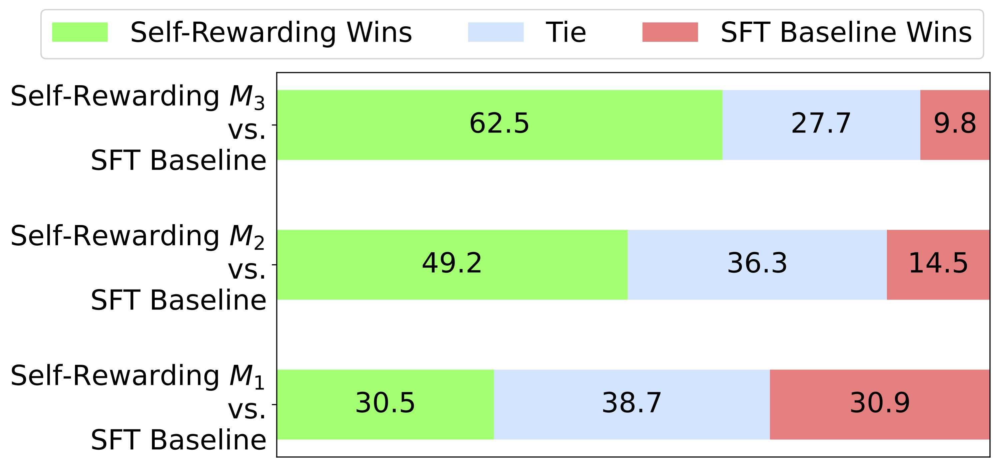
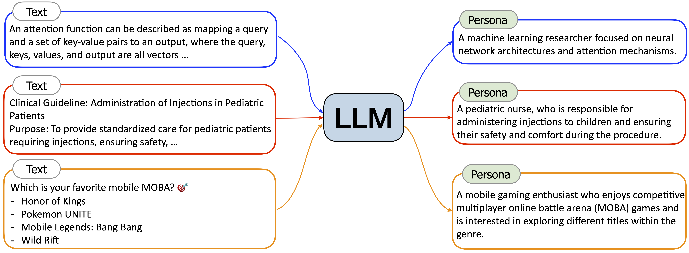
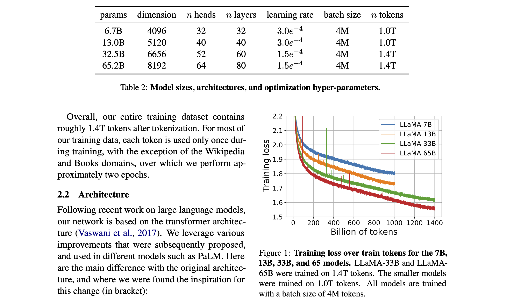
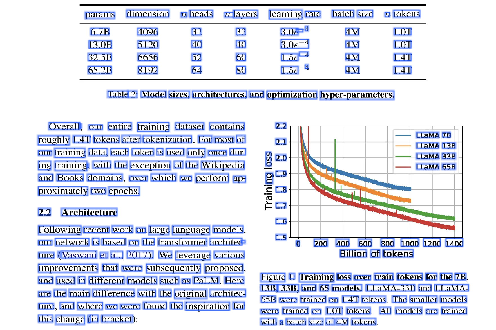
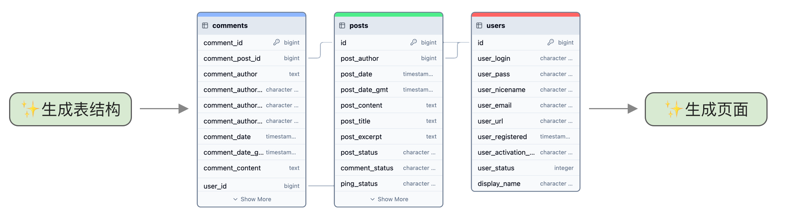

# 训练数据构造及管理

## 什么是好的训练数据

后续章节将会介绍各种构造数据的方法，但在此之前，我们先从宏观角度了解什么是好的训练数据。

首先假设最极端的情况，如果我们知道所有用户可能会问的问题，那只需要将这些问题都列出来，然后给出标准答案就行，这种情况不需要使用大模型。

但我们不知道用户会问什么，我们只能猜测用户可能问的问题，用这一小部分数据来训练模型，期望模型能泛化到其它问题。所以用来训练模型的样本应该尽可能与真实用户问题接近，越接近真实问题的数据就是越好的数据，包括以下几点：

- **应当包含所有可能的分类**，这样模型才能学到所有关键知识。
- **问题分布和真实尽可能接近**，有时我们可以通过自动化方式大量构造某种类型的问题，比如数学问题，但在实际场景下用户可能极少问，因此训练数据里不应包含太多这类问题。如果占比太多，反而容易造成幻觉。
- **文本风格应当接近**，用户问题通常是比较口语化的，还会省略一些信息，训练数据也应当是这样的风格。
- **字数应当接近**，普通用户一般不会写太长的问题，所以训练数据也应当是类似长度。后面提到的指令回译等方法构造的训练数据有可能问题过长，用户不会这样问，需要进行调整，或者参考下一小节的做法将操作分成两步。

## 训练所需数据量

训练数据量取决于做什么任务。如果是做 ChatGPT 那种开放领域问答，通常需要几十万条数据，下面是一些业界模型所使用的 SFT 数据情况：

- **LIMA** [^zhouLIMALessMore2023]，只用了 1 千条训练数据，这个例子经常被提起，很多论文都以这个例子说明质量大于数量。然而，后来 Meta 自己在训练 Llama 2/3 时用的数据量远大于 1 千，所以不能只看别人怎么说，还要看他们实际怎么做。
- **Llama 2** [^touvronLlama2Open2023]，27450 条，没有具体细节只说是收集来的。
- **Llama 3** [^grattafioriLlama3Herd2024] 大量使用合成数据，代码部分的合成数据就有 270 万，这部分占整体数据量的 14.89%，因此推测整体数据量超过 1800 万。
- **DeepSeek-V2** [^deepseek-aiDeepSeekV2StrongEconomical2024]，150 万，其中 30 万是安全相关的。
- **Yi** [^aiYiOpenFoundation2024]，小于 1 万，论文中提出和几十万条开源数据相比，小于 1 万手动标注数据效果更好，而且数据量小容易检查和优化。然而，他们自己后来又推翻了这种做法，在 2024 年 10 月最新的 Yi-Lightning [^aiYiLightningTechnicalReport2024] 模型中使用了 130 万条训练数据。
- **Qwen2** [^yangQwen2TechnicalReport2024]，50 万。
- **InterLM2** [^caiInternLM2TechnicalReport2024]，1000 万。
- **360Zhinao** [^360zhinaoteam360ZhinaoTechnicalReport2024]，最开始有 1000 万，但后来降低到几十万了。

[^zhouLIMALessMore2023]: <http://arxiv.org/abs/2305.11206>

[^touvronLlama2Open2023]: <http://arxiv.org/abs/2307.09288>

[^grattafioriLlama3Herd2024]: <http://arxiv.org/abs/2407.21783>

[^aiYiOpenFoundation2024]: <https://arxiv.org/abs/2407.19093>

[^caiInternLM2TechnicalReport2024]: <http://arxiv.org/abs/2403.17297>

[^360zhinaoteam360ZhinaoTechnicalReport2024]: <http://arxiv.org/abs/2405.13386>

可以看到开放领域问答需要大量训练数据，但在垂直领域并不需要那么多。

如果只是事实回答（如“中国首都在哪”之类的问题），有人测试过只需 60 条数据，而且会随着训练数据增多降低模型准确性，说明这类简单的记忆性任务主要依靠模型在预训练时学到的知识，不需要太多训练数据 [^yeEmpiricalInsightsFineTuning2024]。

[^yeEmpiricalInsightsFineTuning2024]: <http://arxiv.org/abs/2409.15825>

如果只是面向特定任务，笔者的经验是 500 条训练数据就有不错的效果了，但业界有许多更少的案例，比如：

- 分类及摘要类的任务 100 条数据就有效果 [^halfonStayTunedEmpirical2024]。
- 翻译类任务只需 32 条训练数据 [^zhuFineTuningLargeLanguage2024] 就能达到 82.29 分。如果用了 1024 条训练数据是 83.97 分，而用 74623 条训练数据的分数是 84.48，可以看到后续新增数据量对效果提升不明显。
- 答题类任务甚至一两条数据 [^whitakerFastaiCanLLMs2023]。

[^zhuFineTuningLargeLanguage2024]: <http://arxiv.org/abs/2404.14122>

[^whitakerFastaiCanLLMs2023]: <https://www.fast.ai/posts/2023-09-04-learning-jumps/>

因此综合来看，笔者建议**初期只需准备 100 条**训练数据测试效果。如果不是很差，可以先把模型交给产品团队使用，这样就能尽早开始开发产品交互并收集反馈。

训练数据量对最终结果有多大影响？这方面可参考的量化研究不多，笔者找到一个实验是微调翻译能力 [^vieiraHowMuchData2024]，基础模型使用 Llama 3 8B Instruct，微调方法是 QLoRA，在不同训练数据下英文翻译为韩文的得分如下，其中 BLEU、chrF、COMET 是不同评价方法，它们的得分都是越高越好。

[^vieiraHowMuchData2024]: <http://arxiv.org/abs/2409.03454>

| 训练数据量 | BLEU  | chrF  | COMET |
| ---------- | ----- | ----- | ----- |
| GPT-3.5    | 33.07 | 49.72 | 63.28 |
| 不微调前   | 20.81 | 35.37 | 36.45 |
| 1k         | 20.12 | 42.16 | 35.24 |
| 2k         | 19.12 | 41.13 | 25.03 |
| 5k         | 28.60 | 46.84 | 54.17 |
| 10k        | 31.36 | 52.62 | 70.56 |
| 14.7k      | 28.15 | 58.88 | 76.65 |
| 100k+      | 45.80 | 64.81 | 84.30 |

这个得分结果中比较意外的是 2k 训练数据的分数要低于 1k，同样的现象在翻译其它语言的测试中也出现了。但从 5k 数据之后，评分就开始上升，在 10k 数据时分数开始超过 GPT-3.5，效果最好是 100k 训练数据的模型。因此在这个有高质量训练数据的场景下，数据量越大效果越好。

## 使用开源数据

以下是一些通用文本数据，都是经过清洗的：

- **MAP-CC**，包含 8000 亿 token 文本数据，其中 84.7% 来自 Common Crawl、7.1% 来自书籍、4.2% 来自学术论文、0.3% 来自维基百科。
- **万卷** [^heWanJuanComprehensiveMultimodal2023]，经过了细粒度清洗、去重和价值对齐的文本数据，包含 5 亿个文档，数据大小 1TB，其中英文占 61.4%。
- **TeleChat-PTD** [^wangTeleChatTechnicalReport2024]，电信星辰大模型预训练语料中抽取出的综合性大规模中文数据集，数据主要来源于网页、书籍、官方媒体，使用规则和模型两种的方式进行了过滤，大小 1TB。
- **IndustryCorpus** [^BAAIIndustryCorpus2024]，从 WuDaoCorpora、BAAI-CCI、redpajama、SkyPile-150B 等超过 100TB 的开源数据集中，清洗过滤出 3.4TB 的高质量多行业分类中英文语言预训练数据集，其中中文数据占 1TB，英文数据占 2.4TB。为了方便用户使用，中文数据标注了字母数字比例、平均行长度、语言的置信度得分、最大行长度、困惑度等 12 种标签。
- **CCI2-Data** [^BAAICCI2Data]，数据来源均为高质量可信的、中国境内的互联网站，经过严格的数据清洗和去重，并在内容质量、价值观等方面进行了针对性的检测和过滤，进一步提升数据质量和安全可信程度。
- **Chinese Fineweb Edu** [^OpencsgChinesefinewebeduDatasets2024]，专为教育领域的自然语言处理任务设计，包含约 9 千万条高质量的中文文本数据，总大小约为 300GB。

[^heWanJuanComprehensiveMultimodal2023]: <http://arxiv.org/abs/2308.10755>

[^wangTeleChatTechnicalReport2024]: <http://arxiv.org/abs/2401.03804>

[^BAAIIndustryCorpus2024]: <https://huggingface.co/datasets/BAAI/IndustryCorpus>

[^BAAICCI2Data]: <https://huggingface.co/datasets/BAAI/CCI2-Data>

[^OpencsgChinesefinewebeduDatasets2024]: <https://huggingface.co/datasets/opencsg/chinese-fineweb-edu>

这些通用文本数据中肯定包含了垂直领域文本，所以还可以直接从中过滤出垂直领域文本。

如果要做问答，可以使用 COIG-CQIA [^baiCOIGCQIAQualityAll2024]，它是开放高质量问答指令集，总数有 4.8 万个，来自知乎、豆瓣、十万个为什么、考试题等，不同站点有不同收集方法：

- **知乎**，选择点赞超过 50 的答案，基于规则规律有害关键字，然后使用 GPT-4 打分。
- **豆瓣**，将书籍描述转成一种介绍任务，比如“请介绍一下《像经济学家一样思考》”。
- **小红书**，主要是模拟小红书写作风格，比如“写一篇小红书风格的帖子，标题是 xxx”。
- **财经站点**，转成生成标题的任务，比如“根据文本内容生成标题”。

虽然这个数据集主要是通用领域问答，但在垂直场景下我们也能使用类似方法收集，只需先按关键词过滤出相关领域数据即可。

## 使用大模型构造数据

使用大模型生成训练数据是成本最低的方法，可以使用 Few-shot 来让大模型生成问题及答案。具体做法是提示词里给几个示例，让大模型补充更多类似问题及回答，这种做法也被称为 Self-Instruct，比如下面的例子：

```txt
问题：{示例问题 1}
回答：{回答 1}

问题：{示例问题 2}
回答：{回答 2}

问题：
```

这个例子利用大模型的补全能力，让大模型扩充相似的问题和回答，适用于所有大模型。

不过也有研究 [^gudibandeFalsePromiseImitating2023] 认为这种基于 GPT-4 生成训练数据的方式实际效果并不好，模型只是模仿 GPT-4 的回答风格，但答案还是错的。这两年虽然出现了大量使用 GPT-4 生成训练数据微调的开源模型，尽管每个都号称超过 GPT-4，但实际场景下还是差很多。

[^gudibandeFalsePromiseImitating2023]: <http://arxiv.org/abs/2305.15717>

### 使用 function call 构造复杂数据

如果要输出复杂 JSON 的场景，由于结构比较复杂，很难通过自然语言描述清楚，这时可以尝试 `function call`，通过编写 JSON Schema 来控制，或者笔者更推荐使用 Pydantic 定义数据结构，然后让它输出 JSON Schema。使用 Pydantic 的还可以在推理阶段使用 guardrails 或 SGLang 控制模型输出，确保正确输出 JSON，下面是一个简单示例：

```python
from pydantic import BaseModel
from pydantic import Field
import json

class Form(BaseModel):
  """
  amis 表单配置
  """
  type = "form"
  title: str = Field(description="表单标题")
  body: List[FormItemType] = Field(description="表单控件")

print(json.dumps(Form.model_json_schema(), ensure_ascii=False))
```

不过需要注意，Pydantic 默认生成的 JSON Schema 会使用 `$defs` 定义复杂字段，并不是所有大模型的 function call 功能都能理解这个。如果效果不好，可以手动改成更简单的版本。如果还不行，可以试试 example 或 description，比如下面的 Enum 的例子：

```python
from enum import Enum
class FormItemType(str, Enum):
  text = 'input-text'
  number = 'input-number'
  date = 'input-date'

class FormItem(BaseModel):
  type: FormItemType = Field(description="控件类型")
```

它生成的 JSON Schema 是如下格式：

```json
{
  "$defs": {
    "FormItemType": {
      "enum": ["input-text", "input-number", "input-date"],
      "title": "FormItemType",
      "type": "string"
    }
  },
  "properties": {
    "type": {
      "$ref": "#/$defs/FormItemType",
      "description": "控件类型"
    }
  },
  "required": ["type"],
  "title": "FormItem",
  "type": "object"
}
```

笔者测试过一些国内大模型不能很好识别 `$defs` 语法，需要手动改成如下格式：

```python
class FormItem(BaseModel):
  type: str = Field(description="控件类型", examples=['input-text', 'input-number', 'input-date'])
```

它生成的 JSON Schema 是：

```json
{
  "properties": {
    "type": {
      "description": "控件类型",
      "examples": ["input-text", "input-number", "input-date"],
      "title": "Type",
      "type": "string"
    }
  },
  "required": ["type"],
  "title": "FormItem2",
  "type": "object"
}
```

但现阶段大模型提供的 function call 功能都不适合生成大量内容，可能是它的训练数据都是抽取关键信息，导致输出通常较为简洁，需要使用两步生成方案来先扩展需求。

### 使用大模型生成偏好数据

大模型同样可以用来生成偏好数据，也就是一个问题对应一个正确回答和错误回答。

如何生成偏好训练数据？具体做法是：

- 对同一个问题调用多次模型生成多个答案。
- 使用大模型进行打分，对生成的答案进行排序。
- 使用 DPO 进行偏好训练新的模型，重复以上步骤。

打分使用 5 分制，提示词参考了 [^liSelfAlignmentInstructionBacktranslation2023]，简化后的提示词如下（原提示词很长，这里做了简化和翻译）：

[^liSelfAlignmentInstructionBacktranslation2023]: <http://arxiv.org/abs/2308.06259>

```txt
下面是一个用户的问题和候选人的回答。请根据以下标准对回答进行评分（满分5分）：

1：答案不完整、模糊、跑题、有争议或并非用户所问。例如，某些内容似乎缺失，编号列表未从头开始，开头句子重复了用户的问题。
2：这意味着答案回答了用户大部分要求，但没有直接回答用户的问题。例如，它只提供了一个高级方法论，而不是用户问题的确切解决方案。
3：这意味着答案是有帮助的，但并非由 AI 助手编写。它回答了用户的所有基本要求，是完整的、自包含的，但缺点是回答不是从 AI 助手的角度出发，而是从其他人的角度出发。
4：这意味着答案是从 AI 助手的角度出发，明确地针对指令进行回答。它为用户的问题或指令提供了完整、清晰、全面的响应，没有遗漏或无关信息。它还有轻微改进的空间，例如更简洁、更集中。
5：这意味着它是来自 AI 助手的完美答案。它明确地专注于成为有用的 AI 助手，其中的响应看起来像是故意撰写来回答用户的问题或指令，没有多余的句子。答案提供了高质量的内容，展示了在该领域的专业知识，书写流畅、逻辑清晰、易于理解、引人入胜且富有洞察力。
```

根据 Meta 里的实验，这种方法每轮迭代后模型能力相比最初都有提升，如下图所示：



其中 $M_3$ 是第三轮训练的模型，和第一次训练的 $M_1$ 相比，对 SFT 模型的胜率从 30.5% 提升到了 62.5%，说明这种方式可以不断提升模型效果。

### 优化 Few-Shot 的效果

本节介绍使用 Few-Shot 的技巧，更好利用大模型来构建训练数据。不过需要注意，这些技巧都是特定场景下的经验，只作为参考，不同模型可能表现不一样。

**示例至少 3 个**，根据 GPT-3 [^brownLanguageModelsAre2020] 的研究，示例超过 2 个后效果就不错了，所以至少给 3 个示例，但太多示例有可能影响效果，一般不超过 7 个。

[^brownLanguageModelsAre2020]: <http://arxiv.org/abs/2410.13166>

**尝试换示例的顺序**，示例的顺序对效果有影响 [^luFantasticallyOrderedPrompts2022]。

[^luFantasticallyOrderedPrompts2022]: <http://arxiv.org/abs/2104.08786>

**增加角色扮演说明**，比如“你是 xx 领域的专家，擅长 yy”，但有论文 [^zhengWhenHelpfulAssistant2024] 认为角色描述对任务效果没有影响，甚至有时还会产生负面影响，具体情况取决于模型，比如在 Llama 3 8B 上有 11.7% 的角色描述造成了负面影响，但在 Qwen2.5 7B 上角色描述对效果没有影响。

[^zhengWhenHelpfulAssistant2024]: <http://arxiv.org/abs/2311.10054>

**增加风格描述**，比如“请用正式语言回答”，可以改变模型输出风格。

**如果是做分类等问题，提示词中出现的概率要和结果一致** [^minRethinkingRoleDemonstrations2022]，比如做一个情感分类，现实中 90% 是正向，那在提示词中最好也是 90% 正向。

[^minRethinkingRoleDemonstrations2022]: <http://arxiv.org/abs/2202.12837>

**示例中要包含所有输出类别**，比如做情感分类，要将所有分类都包含在示例中，避免模型输出不符预期的结果。

**使用更常见的表达方式**，比如有人发现将示例中的“Q:”改成“Question:”，在 GSM8K 评测上的准确性就从 55.5 提升到 61.0 [^fuComplexityBasedPromptingMultiStep2023]。如何判断常见？笔者有个简单办法是编码后的 token id，id 值比较小的说明更常见。

[^fuComplexityBasedPromptingMultiStep2023]: <http://arxiv.org/abs/2210.00720>

**加入分隔符**，使用特殊分隔符来避免混淆问题及答案，尤其是有多行文本的时候，比如下面的例子用了三个引号来区分：

```txt
从中文翻译成英文

中文："""
中国首都是哪里？
"""
英文："""
What is the capital of China?
"""
```

**添加跟指令无关的前缀**，有人通过在提示词中加入一些无关的前缀说明，在基础模型上能提升 34.58%，在指令模型上能提升 12.26% [^yeInvestigatingEffectivenessTaskAgnostic2023]。大模型刚出来的时候有许多提示词教程，增加一些前缀有利于提升模型能力，除了这个研究，还有一些其他人发明的超级提示词，比如 SuperPrompt [^neovertex1NeoVertex1SuperPrompt2024]，可以尝试加入它来提升效果。

[^yeInvestigatingEffectivenessTaskAgnostic2023]: <http://arxiv.org/abs/2302.14691>

[^neovertex1NeoVertex1SuperPrompt2024]: <https://github.com/NeoVertex1/SuperPrompt>

**增加情绪化描述**，有人发现提示词里增加一句“这对我的职业生涯非常重要”可以少量提升效果 [^liLargeLanguageModels2023]。

[^liLargeLanguageModels2023]: <http://arxiv.org/abs/2307.11760>

**让大模型重述问题**，在提示词后加一句“重述并扩展问题，然后回答。”让大模型重述并扩展问题，然后再回答 [^dengRephraseRespondLet2024]。

[^dengRephraseRespondLet2024]: <http://arxiv.org/abs/2311.04205>

**优化最后的提示词**，对于有些要求指定格式的场景，通过最后提示词来引导模型按指定格式输出，比如下面最后的 `{` 会让模型输出 JSON 格式：

```txt
从用户问题中提取出发地和目的地，输出 JSON 格式，由 from 和 to 两个字段组成

问：从北京飞往上海的航班有哪些？
答：{"from": "北京", "to": "上海"}

问：<<用户问题>>
答：{"
```

### 使用 CoT 提升大模型效果

CoT 是 Chain of Thought 的缩写，是提升大模型推理能力的重要提示词方法。简单来说，就是在提示词中加入推理过程，如下图所示：


这样模型在补全答案的时候也会加入推理过程，提升模型效果，尤其是数学和推理相关的问题。CoT 使得 PaLM 540B 模型在 CSM8K 任务的成功率从 18% 提升到 57%，超过了微调模型。

还有个更简单的办法是在提示词中加入一句“让我们一步步思考。”来让大模型一步步思考 [^kojimaLargeLanguageModels2023]，这个方法能让 PaLM 540B 模型在 CSM8K 任务的成功率达到 43%。

[^kojimaLargeLanguageModels2023]: <http://arxiv.org/abs/2205.11916>

为什么使用 CoT 能明显提升模型效果？有人做过实验 [^prystawskiWhyThinkStep] 发现中间步骤如果相关性高，最终推理成功率就高。

[^prystawskiWhyThinkStep]: <https://arxiv.org/abs/2304.03843>

CoT 还可以配合 **自我一致性（Self-Consistency）** [^wangSelfConsistencyImprovesChain2023] 方法使用，让大模型运行几次，比如运行 3 次，第一次答案是 18、第二次答案是 26、第三次答案是 18，因为 18 出现次数较多，所以选择它作为最终答案。这个方法可以让 CSM8K 任务的准确率从 56.5% 提升到 74.4%。

[^wangSelfConsistencyImprovesChain2023]: <http://arxiv.org/abs/2203.11171>

另外，2024 年 9 月 OpenAI 发布了新的 o1 模型，它内置了类似 CoT 的功能，模型会自动进行推理，不需要在提示词中加入 CoT，加入反而会影响效果。

### 提升数据多样性

使用大模型生成数据在实践过程中会遇到一个难题：数据多样性不足。比如，有人用 ChatGPT 生成了 1008 个笑话，其中 90% 是相同的 25 个笑话 [^jentzschChatGPTFunIt2023]。类似问题在其它领域也会出现，一开始以为使用大模型可以生成大量训练数据，但实际运行后发现生成的数据重复率高，最终可用的数据量很少。

[^jentzschChatGPTFunIt2023]: <http://arxiv.org/abs/2306.04563>

这个问题如何解决？有以下五种方法：

- 优化提示词，要求大模型输出多样性结果。
- 调大 temperature。
- 如果是 Few-Shot，动态随机调整示例顺序，以及随机抽取示例。
- 在提示词里增加多种角色说明。
- 多个大模型相互调用。

前三个比较简单，这里介绍后两种做法。首先是 **在提示词里增加多种角色说明**，这是来自 Persona Hub [^chanScalingSyntheticData2024] 的方法，它通过数据合成方式构造了 10 亿个角色，通过在提示词里加入这些角色，就能让大模型有不同输出结果。

[^chanScalingSyntheticData2024]: <http://arxiv.org/abs/2406.20094>

Persona Hub 的实现方法是基于网页文本，使用大模型来生成角色描述，如下图所示：



然后再基于这个角色来生成关联角色。目前这个项目已经发布了 20 万角色数据，我们可以直接使用它们来增加多样性。

**多个大模型相互调用**，可以先用人工 Few-Shot 示例让 A 模型生成几个示例，然后拿输出结果再放到 B 模型的 Few-Shot 里让 B 模型生成示例，然后继续用 C 模型，因为每个模型都会有一点不同，所以能增加多样性。

## 使用程序化方式合成数据

使用程序化方式可以很快生成大量训练数据，比较适合输出结构化数据的场景，比如输出 JSON 或 SQL。

程序化生成需要注意控制比例，以 SQL 为例，不同语句的使用频率相差很大，比如 having 语句很少人用，程序化生成时就应该减少比例，避免模型将它和 where 语句混淆。

下面是一段程序化合成的代码示例：

```python
import random

class Field:
  def __init__(self, name: str, key: str):
    self.name = name # 字段中文名
    self.key = key # 字段英文名

def gen_qa(table_name: str, fields: list[Field]):
  # 随机选取两个字段
  fields = random.sample(fields, 2)
  return {
    'question': f'返回{fields[0].name}和{fields[1].name}字段',
    'answer': f'SELECT `{fields[0].key}`, `{fields[1].key}` FROM `{table_name}`'
  }
```

上面的代码实现了从表结构中随机抽取两个字段，生成一个问题和对应的 SQL。

程序化生成数据推荐使用脚本语言，笔者建议最好一开始就使用强类型控制，因为后续程序会越来越复杂，强类型编写起来更安全。所以笔者主要使用 TypeScript 语言，使用 Bun 来执行脚本。如果使用 Python，建议使用 Mypy 来做静态类型检查。

除了文本之外，在多模态领域也有大量程序化合成的数据，比如：

- **WebSight** [^HuggingFaceM4WebSightDatasets2024]，包含 192 万网页截图和对应的 HTML+CSS 代码，用来实现基于截图生成代码，或自然语言生成页面代码。我们可以先使用大模型生成 HTML+CSS，然后再用 Puppeteer 来渲染层图片。
- **M-Paper** [^huMPLUGPaperOwlScientificDiagram2024]，解析学术文档 LaTex 文件，提取其中的图表和相关段落，基于它们生成图表分析数据。
- **LaTeX-OCR**，将公式渲染为图片，用来训练识别公式的模型。

[^HuggingFaceM4WebSightDatasets2024]: <https://huggingface.co/datasets/HuggingFaceM4/WebSight>

[^huMPLUGPaperOwlScientificDiagram2024]: <http://arxiv.org/abs/2311.18248>

## 从文本中构造问答

构造训练数据成本很高，有个思路是基于普通文本生成，主要有以下两种方式：

- **利用文本结构**，比如论文会有摘要部分，所以我们可以利用它来生成扩写和缩写模型，比如输入是全文，输出是摘要，这样就能训练大模型的摘要能力。
- **使用大模型生成问题**，比如截取一段普通文本，让大模型根据这段文本生成问题和回答。

### 如何解析各类文档

大模型只支持文本，但许多资料使用的是 PDF、Word、HTML 等格式。本节将介绍如何从这些格式中提取文本。

Word 比较简单，可以使用 Unstructured [^UnstructuredIOUnstructured2024] 或 magic-doc [^OpendatalabMagicdoc2024]。

[^UnstructuredIOUnstructured2024]: <https://github.com/Unstructured-IO/unstructured>

[^OpendatalabMagicdoc2024]: <https://github.com/opendatalab/magic-doc>

HTML 有个难点是它可能有广告或边栏，要先提取主体部分，导致有可能提取不正确。可以试基于规则实现的 magic-html [^OpendatalabMagichtml2024] 和基于语言模型实现的 Jina Reader-LM。

[^OpendatalabMagichtml2024]: <https://github.com/opendatalab/magic-html>

PDF 的解析比较复杂，有以下几个难题：

- PDF 规范复杂，有许多版本。
- PDF 是二维的版式结构，有两栏布局等方式，中间插入一个跨栏的图片或表格。
- 需要识别表格、图表、公式等信息。
- 有些 PDF 是扫描文件，完全由图片组成。

其中最难的就是版式结构导致的问题。我们通过一个例子来了解，下面这个 PDF 来自 Llama 论文：



这个例子中页面是两栏布局，顶部有表格，表格有标题，右侧有图片，图片上也有标题。解析这个 PDF 文件将得到类似下面的数据格式：

```json
{
  "pages": [{
      "texts": [
        {
            "x": 502, "y": 329,
            "xmax": 631, "ymax": 357,
            "text": "params"
        },
        ...
      ]
  }]
}
```

在这个例子中显示了 `params` 单词的位置在 x 轴 502 到 631 之间，y 轴 329 到 357 之间。因此解析得到的只是一个个单词及位置信息。我们将所有解析的区域加个蓝色边框标记，出来如下图所示：



由于只能拿到位置信息，很难识别某个单词到底是属于正文段落，还是属于页眉或图表标题。因此这个 PDF 的解析需要做布局和表格识别，这种识别难以通过简单规则实现，所以有的方案是用模型来识别。目前没有完美方案，需要逐个测试看自己的文档在哪个方案下效果好。目前方案主要有三种：

- **基于规则**，也就是人工编写的规则，比如位置比较近的单词认为是在同一个段落里。优点是速度快，缺点是难以支持复杂布局。
  - pdfminer.six [^PdfminerPdfminersix2024]，使用 Python 实现，无外部依赖，性能相对较好。
  - PyMuPDF [^PymupdfPyMuPDF2024]，基于 MuPDF 实现的 PDF 解析，使用 C 语言实现，因此性能最好，而且还支持 XPS、EPUB、MOBI 等格式。它还提供了一个专门用于对接大模型的 PyMuPDF4LLM 库，可以将 PDF 转成 Markdown。
- **基于定制模型**，使用定制训练的小模型（通常是卷积神经网络）来解析，先识别出表格、公式、图表等区域，然后分别使用定制的模型来提取内容。相对规则方案能支持更复杂布局，但速度较慢。
  - MinerU [^wangMinerUOpenSourceSolution2024]，将 PDF 转成 Markdown 格式，基于 PyMuPDF 和 PDF-Extract-Kit 开发，来自书生大模型团队。
  - PP-StructureV2 [^liPPStructureV2StrongerDocument2022]，支持表格识别、OCR、关键信息提取等功能，支持将 PDF 转成 Word 文件，对中文支持比较好，是国内比较常用的模型。
  - Docling [^auerDoclingTechnicalReport2024]，可以将 PDF 转成 JSON 或 Markdown 格式，方便进一步处理。在 Xeon E5-2690 上使用 16 线程的速度是每秒 0.92 页，还支持 OCR 来识别扫描的 PDF。
  - PDF-Extract-Kit [^OpendatalabPDFExtractKit2024]，整合了多个模型，支持布局、公式、表格、图片识别功能，支持 GPU 加速。
- **基于视觉大模型**，直接将 PDF 页面转成一张图片，然后使用视觉大模型来解析。优点是可以解决前面两种无法解决的部分复杂场景，但缺点是效果不稳定，不一定比基于定制模型好，而且速度最慢。目前这类产品都是实验性的，尚未大规模使用，因此不推荐。
  - gptpdf [^liCosmosShadowGptpdf2024]，使用 GPT-4o 的图像能力，速度较慢且成本高。
  - mPLUG-DocOwl2 [^huMPLUGDocOwl2HighresolutionCompressing2024]，使用高分辨率压缩技术 DocCompressor 将单页图像转成 324 个 token，使得解析速度比同类尺寸的大模型更快，首 token 延迟减少 50%，模型参数量为 8B。
  - GOT-OCR2.0 [^weiGeneralOCRTheory2024]，基于 Qwen-0.5B 模型改造和重新训练，可以将文档图片转成带格式的 markdown 文件。

[^wangMinerUOpenSourceSolution2024]: <http://arxiv.org/abs/2409.18839>

[^PdfminerPdfminersix2024]: <https://github.com/pdfminer/pdfminer.six>

[^PymupdfPyMuPDF2024]: <https://github.com/pymupdf/PyMuPDF>

[^liPPStructureV2StrongerDocument2022]: <http://arxiv.org/abs/2210.05391>

[^auerDoclingTechnicalReport2024]: <http://arxiv.org/abs/2408.09869>

[^OpendatalabPDFExtractKit2024]: <https://github.com/opendatalab/PDF-Extract-Kit>

[^liCosmosShadowGptpdf2024]: <https://github.com/CosmosShadow/gptpdf>

[^huMPLUGDocOwl2HighresolutionCompressing2024]: <http://arxiv.org/abs/2409.03420>

[^weiGeneralOCRTheory2024]: <http://arxiv.org/abs/2409.01704>

需要注意，前面介绍的不少方案是转成 Markdown 格式，Markdown 格式简单，大模型理解起来比较容易，但它最大的问题是对表格支持不好。目前 Markdown 格式没有统一的合并单元格方案，因此如果文档中有合并单元格的情况，则不适合用 Markdown，只能转成 HTML，但大模型。

## 根据答案构造问题

大模型训练需要问题和答案，有时候我们更容易获取答案，比如类似如下的场景：

- 自然语言生成网页，有大量页面可以作为答案。
- 自然语言生成 SQL，日志中可以收集大量真实 SQL 调用。

这种情况下可以通过指令反向翻译的方式来生成问题 [^liSelfAlignmentInstructionBacktranslation2023]。以自然语言生成 SQL 为例，具体步骤是：

- 人工编写一些自然语言和 SQL 的问答对。
- 训练一个从 SQL 生成自然语言的模型。
- 用这个模型来基于现有 SQL 生成自然语言问题。
- 对这些新生成的问题进行人工筛选和修改，得到更多训练数据。
- 重复第 2 步，用更多数据训练新的模型。

通过这几步，就能得到大量高质量的训练数据。

## 构造数据的方法优缺点汇总

本节将汇总所有本书出现过的方法供参考：

| 构造方法          | 优点                         | 缺点                               |
| ----------------- | ---------------------------- | ---------------------------------- |
| 真实用户问题      | 最能反应真实需求，多样性好   | 需模型上线后才能收集到             |
| 人工撰写          | 高质量，安全无幻觉           | 成本高，多人协作需对齐             |
| 大模型生成        | 成本低                       | 多样性不足，可能存在幻觉           |
| 开源数据集        | 数据量大                     | 质量参差不齐，垂直领域的数据集较少 |
| 抓取问答站点      | 多样性好                     | 有版权问题，需开发爬虫程序         |
| 基于 NLP 任务转换 | 可以利用之前的数据           | 任务较为简单                       |
| 基于现有数据扩充  | 成本最低，可以提升模型泛化性 | 可能改变原有意思，需二次检查       |

大模型生成可以用大模型直接生成垂直领域的问题和答案，也可以基于一段文本，让大模型根据文本生成问题和答案。

基于 NLP 任务转换是指使用之前 NLP 任务，比如文本分类，将它转成让大模型判断文本的所属分类。

## 优化数据的方法

### 使用数据增强来成倍扩充数据

使用数据增强（Data Augmentation）方法可以成倍扩充训练数据，它的原理是基于现有训练问题生成不改变意思的新问题，新问题使用同样的答案。通常有两种做法：

- 使用 NLP 方法
  - 两次翻译，将问题翻译成英文再翻译成中文。
  - 同义词替换，使用同义词库来替换问题中的部分关键词。
  - 加一些错误，比如添加拼写错误。
  - 加一些干扰，比如添加无关的信息。
- 使用大模型生成相似问题

目前建议优先使用反向翻译和大模型方法，因为开发成本最低。如果有现成同义词库也可以做同义词替换。

反向翻译需要找个翻译模型，可以使用商业翻译 API 或直接用大模型来翻译。

使用大模型方法就是通过指令让大模型重写个问题，比如类似下面的指令：

```txt
我希望你充当提示词重写器，在不改变意思的情况下，重写下面这句话：
```

比如 WizardLM [^xuWizardLMEmpoweringLarge2023] 使用大模型来在广度和深度两方面扩展现有指令，深度扩展就是让大模型将指令改成更复杂的版本，比如添加约束条件、具体化等，提示词如下（原文是英文，翻译成了中文并做了适当简化）：

[^xuWizardLMEmpoweringLarge2023]: <http://arxiv.org/abs/2304.12244>

```txt
我希望你扮演一个提示词重写者。
你的目标是将给定的提示重写为更复杂的版本，以制作那些著名的 AI 系统（例如，ChatGPT 和 GPT4）更难处理。
但是重写的提示必须是合理的，必须被人类理解和回应。

可以使用重写的方法：
1. 添加一个或多个约束条件
2. 如果#给定的提示词#包含询问，加深提问细节
3. 将一般概念替换成更具体的概念
4. 如果#给定的提示词#可以使用几个简单的思考过程来回答，重写时添加明确要求写出多步思考过程

#给定的提示#: {需要重写的指令}
#重写的提示词#
```

广度扩展是扩充类似的提示词，使用如下提示词（原文是英文，翻译成了中文）：

```txt
我希望你扮演一个提示词创建者的角色。
你的目标是从#给定提示词#中汲取灵感，创作一个全新的提示词。
这个新提示词应该属于与#给定的提示词#相同的领域，但更加罕见。
#创造的提示词#的长度和复杂度应该与#给定提示词#相似。
#创造的提示词#必须合乎逻辑，并且能够被人类理解和回应。
#给定的提示词#: {需要重写的指令}
#创造的提示词#:
```

需要注意，数据增强并不适合所有任务类型。对于一些问题和答案密切相关的任务，比如文本生成 SQL，数据增强可能改变原先的意思，导致不匹配。因此所有增强出来的数据都需要进行人工检查。

另一方面，数据增强技术虽然之前在小模型上有不错效果，但在大模型时代效果可能不明显，因为大模型本身就具备大量语言知识。在实际使用时会发现，大模型能在拼写错误的情况下也能正确回答，因此还需实际训练来验证改进效果，建议先扩充一倍试试。

### 将复杂的任务分步

有时我们训练的是一种“翻译类”任务，比如根据用户描述生成应用，需要用户详细描述需求，模型才能生成准确的回答。

但在生产环境中，用户的问题往往会很简略，比如用户可能会问：“开发校园管理系统”，这个描述过于简单，导致生成效果会很差。要如何优化？

一个方案是训练的时候针对这种简单问题，模型会自动扩展需求，但可能导致模型在不需要的时候也扩展，生成过多冗余内容。

另一个笔者认为更好的方案是将操作变成两步。第一步是扩展需求，先设计表结构。这一步可以单独训练一个模型，也可以使用提示词来让对话模型生成，比如：

```txt
你是个软件开发需求分析师，擅长将用户需求扩展为数据库表结构设计，用户问题是：“开发校园管理系统”，请分析出需要哪些表和对应的字段，返回 JSON 格式，如下示例所示。
```

第二步再根据模型生成的详细字段生成页面。这样生成应用的模型就不用考虑需求太简单的情况，训练起来更简单。而且第一步生成的字段信息还能通过可视化界面让用户确认和修改，如下图所示：



拆分除了提升效果，还有以下 3 点好处：

- **避免上下文窗口过长**，一次性生成太多很容易超过模型上下文窗口。虽然现在很多开源模型上下文窗口已经加长了，但这些模型在较长上下文上的表现并不好 [^hsiehRULERWhatsReal2024]，而且生成较长内容需要大量 KV 缓存。
- **可以分步骤确认**，拆分成子问题就能在每个阶段返回结果让用户确认，用户能进行二次编辑来解决模型幻觉问题，避免模型错误不断放大。
- **可以单独优化**，如果发现某个子问题训练效果差，可以单独优化这个问题。

[^hsiehRULERWhatsReal2024]: <http://arxiv.org/abs/2404.06654>

### 优化 JSON 数据

无论是人工还是大模型生成的数据，在格式上都很难保持一致。我们知道大模型训练是预测下一个 token，如果格式不一致，会导致相互干扰。因此最好对数据进行预处理，让格式尽可能一致。

这里以 JSON 为例，建议做以下处理：

1. 检查 JSON 格式是否正确，去掉不规范的 JSON。
2. 对 JSON 中的字段进行排序，JSON 字段对结果没有影响，但训练时如果字段顺序相同，会更方便模型预测。
3. 对 JSON 进行格式化，一方面可以降低 token 数量，另一方面也能让格式统一。

在 Python 中后面两步可以使用 `json.dumps` 来实现，方法是：

```python
json.dumps(data, sort_keys=True, separators=(',', ':'))
```

## 训练数据的管理

训练数据决定了模型最终效果，因此对训练数据的管理至关重要，需要不断进行更新和完善。训练数据管理包括：

- **数据探索和查找**，方便查找和查看各种类型的数据，尤其是多模态数据更需要有可视化界面。
- **统一字段及格式**，统一的格式能方便上下游交换数据，最好通过定义强类型来方便校验。
- **版本管理**，增加版本信息，方便后续能重现训练效果，尤其是新数据有可能导致训练效果变差，这时需要能和之前效果好的训练数据进行对比，分析其中的不同。
- **大量文件存储**，如果要做增量预训练，就需要管理大量文本数据的存储，以及支持对其进行 ETL。
- **数据标签**，使用标签对数据进行管理，可以有以下几种维度：
  - **质量**，对训练数据质量进行打分，可以通过人工或大模型方式。
  - **类型分布**，统计不同训练任务的数据分布。
  - **难度**，划分任务难度等级。

这里重点讨论和训练相关的数据标签管理。首先是质量，质量对模型效果影响最大，即便是完全人工编写的数据，也可能因为水平的不同导致质量低效。

类型分布是指数据的内在分布情况，它对训练效果也有影响，因为大模型训练本质上是调整模型输出概率。如果不常见的用法在训练数据里经常出现，训练后的模型就可能在不该使用的地方使用。以生成表单为例，表单中最常见的是文本输入框，而用地图选择地理位置的输入框则很少见。因此我们的训练数据里最好也较多是文本输入框，限制地图输入框的数量。

难度管理是指不同任务的难度，比如生成一个简单的表单和生成一个复杂的表单，前者只需要几个字段，后者需要几十个字段。

标签管理有什么好处？最大的作用是训练时可以根据标签筛选不同数据，方便进行对比训练，比如只训练高质量的数据，或调整不同分类的数据配比，通过多次实验找到效果最好的模型。

具体使用什么工具管理取决于团队规模。如果团队很小，可以先使用多维表格类的产品，它使用起来简单，支持简单的多人协作和 API，比如开源的 NocoDB。


如果团队人数较多，就需要专门的数据管理平台，比如 Pachyderm [^PachydermAutomateData2024] 或 DVC [^thedvcteamandcontributorsDVCDataVersion2024]，也可以自行研发。它是模型训练过程中最重要的平台，值得投入精力开发。

[^PachydermAutomateData2024]: <https://github.com/pachyderm/pachyderm>

[^thedvcteamandcontributorsDVCDataVersion2024]: <https://github.com/iterative/dvc>
