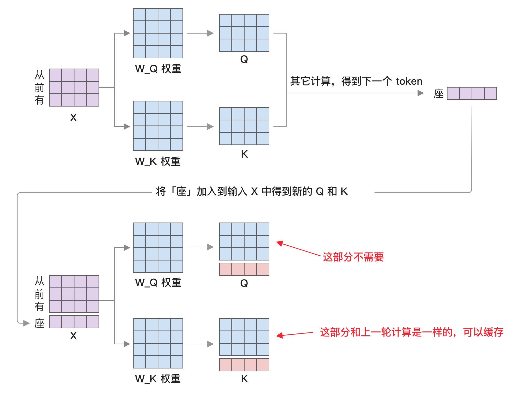
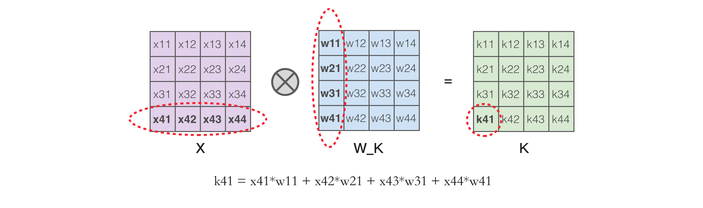
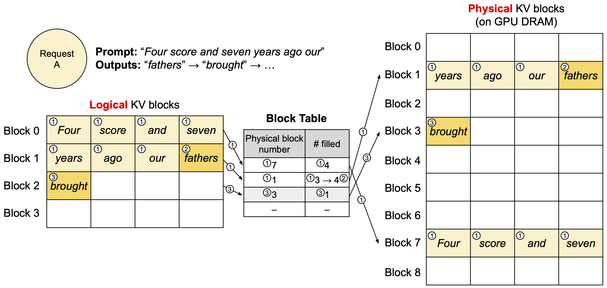
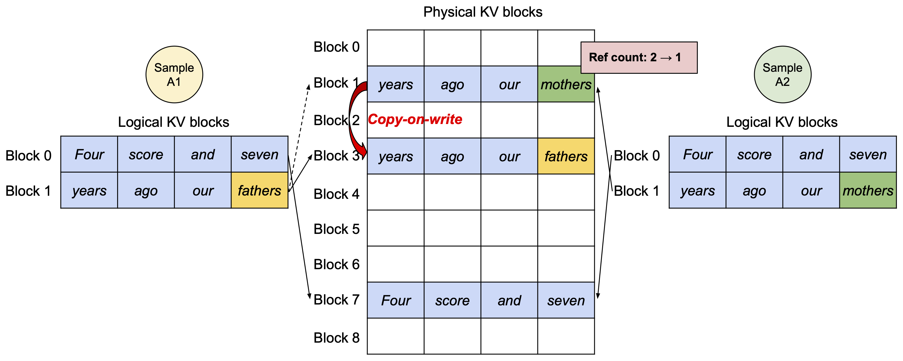
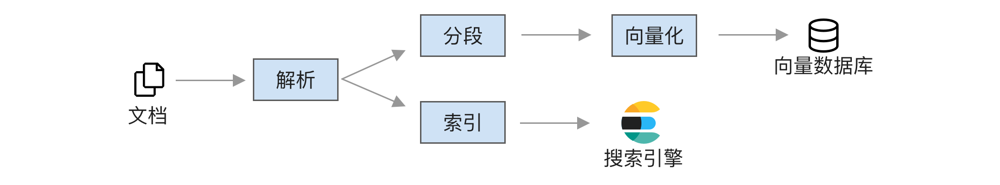

# 部署

本章将介绍如何对大模型进行部署，包括硬件选择、推理设置、性能优化等。

## 部署前的准备

### 硬件需求

大模型部署的硬件要求低于训练，通常瓶颈在显存。推理运行时的显存没有训练所需的梯度、优化器状态和激活值，但多了 KV 缓存，因此显存占用由三部分组成：

- **模型参数**：如果是 7B 模型，使用 FP16 显存就需要 14 GB，如果使用 INT8 量化就能降低到 7 GB。
- **KV 缓存**：这个和文本长度有关，后面将分析。
- **其它显存占用**：包括 PyTorch 自身消耗以及显存碎片，这部分不大，预计有 1 GB。

### 如何选择显卡或加速卡

本节介绍常见的推理硬件以及选型方法，首先是 Nvidia 的 GPU，它有众多型号让人眼花缭乱，不过我们只需要看 3 个最重要的指标：算力、显存大小和显存带宽，参考下面的表格：

| 型号         | FP16 算力    | 显存大小       | 显存带宽               |
| ------------ | ------------ | -------------- | ---------------------- |
| H200         | 990 TFLOPS   | 141 GB         | 4.8 TB/s               |
| H100/H800    | 990 TFLOPS   | 80 GB 和 94 GB | 3.35 TB/s 和 3.9 TB/s  |
| H20          | 148 TFLOPS   | 96 GB          | 4.0 TB/s               |
| A100/A800    | 312 TFLOPS   | 40 GB 或 80 GB | 1555 GB/s 和 2039 GB/s |
| L40S         | 362 TFLOPS   | 48 GB          | 864 GB/s               |
| L20          | 119.5 TFLOPS | 48 GB          | 864 GB/s               |
| RTX 6000 Ada | 91 TFLOPS    | 48 GB          | 960 GB/s               |
| V100         | 112 TFLOPS   | 16 GB 或 32 GB | 900 GB/s               |
| A10          | 125 TFLOPS   | 24 GB          | 600 GB/s               |
| L4           | 242 TFLOPS   | 24 GB          | 300 GB/s               |
| RTX 4090     | 165 TFLOPS   | 24 GB          | 1 TB/s                 |

选型关注点主要有以下几方面：

- **FP16 算力**：决定模型首个 token 输出延迟。如果是提示词很长的场景，比如长文本摘要，算力就很重要。查看时需要注意 Nvidia 有时提供的是稀疏化版本，比如 H100 参数表中 FP16 的稀疏算力是 1979，实际算力要除以 2。
- **显存大小**：决定可用模型的参数量及并发。7B 模型 FP16 需要至少 14 GB 显存，而 KV 缓存还会占用大量显存，因此显存也决定了能同时支持的用户数，比如 LLama 7B 模型一个用户最高可占用 2 GB 的 KV 缓存。要支持高并发就必须使用大显存的显卡。
- **显存带宽**：决定输出后续每个 token 的速度，对输出较长 JSON 字段的场景很重要，因为 JSON 需要等所有内容都生成才能输出，显存带宽低将导致等待时间过长。
- **价格**：不同时期变化较大，尤其是许多显卡在国内很难原价买到，即便是相同的显卡，整机之间的价格差异也不小，取决于 CPU 型号、内存条、网卡等因素。
- **新技术**：新一代的 H100/200/20、L20 及 L40S 支持 FP8 精度，相比表格中的 FP16 能提升一倍算力，同时模型体积减小也能提升解码速度，而较老的 V100 不支持 BF16 会导致训练过程不稳定。

虽然表格中有很多显卡，但本书微调通常使用 13B 及以下的模型，因此 48 GB 显存就够用了，所以 L40S 是不错的选择，但 L40S 在国内禁售，只能选择 L20 或 RTX 6000 Ada，但 RTX 6000 Ada 是面向桌面的显卡，不适用于服务器，因此只能选择 L20，目前售价大概 2.5 万到 3 万。

如果是 7B 的小模型，还能选择 24 GB 显存的显卡进一步降低成本，比如 A10 或 RTX 4090，其中 RTX 4090 性能更好且成本低，但它是桌面端显卡，不允许在数据中心运行，只有小的云厂商提供。

如果是国产加速卡，主要有以下几种选择（这里并未列出全部，因为很多找不到官方提供的算力及带宽说明）：

| 型号             | FP16 算力  | 显存大小 | 显存带宽   |
| ---------------- | ---------- | -------- | ---------- |
| 昇腾 910B        | 320 TFLOPS | 64 GB    | 1.6 TB/s   |
| 摩尔线程 S4000   | 100 TFLOPS | 48 GB    | 768 GB/s   |
| 寒武纪 MLU370-X8 | 96 TFLOPS  | 48 GB    | 614.4 GB/s |
| 昆仑芯 R300      | 128 TFLOPS | 32 GB    | 512 GB/s   |

其中用得比较多的是昇腾 910B，它提供了推理框架 MindIE，支持 LLama3、Qwen 等常用模型，实现了 Continuous Batching、PageAttention、FlashDecoding、量化等技术。它的性能如何？有人测过结果如下 [^ChiGuoDongBuTuGuoDongPiLLMGuoChanHuaLiangHuaJiShuZaiMindIEZhongDeYingYong]

[^ChiGuoDongBuTuGuoDongPiLLMGuoChanHuaLiangHuaJiShuZaiMindIEZhongDeYingYong]: <https://mp.weixin.qq.com/s/BG9rnh6c0XddlWUNT01HLQ>

| 模型          | 首 token 延迟 | 每个 token 耗时 | 生成 token 数量 | 总耗时   |
| ------------- | ------------- | --------------- | --------------- | -------- |
| Baichuan2 7B  | 48.2 毫秒     | 23 毫秒         | 204             | 6.1 秒   |
| Baichuan2 13B | 52 毫秒       | 25 毫秒         | 182             | 6.5 秒   |
| Qwen1.5 72B   | 154.4 毫秒    | 124 毫秒        | 191             | 13.42 秒 |

对比之下，vLLM 在 A100 上运行 Llama8B 每个 token 耗时目前降到了 12 毫秒，910B 性能还差一倍，但这个速度也超过了普通人阅读速度，可用于问答类应用，但如果输出 500 token 的长 JSON 内容，输出时间预计要等待十几秒。

不过国产加速卡的主要问题是美国禁止 HBM 出口到中国，同时台积电也可能不会代工，导致后续可能无法生产。

### 推理框架选择

虽然 Transformers 框架也能用来推理，但这个框架里的模型通常是用来训练的，并没有针对推理做太多性能优化，使用它做推理通常较慢，因此在推理场景需要使用专门优化性能的推理框架。

现阶段大模型常见推理框架有：

- **vLLM**：现阶段最热门的推理框架，基本快成为事实标准了。强大的影响力使得最近几个月新出的开源大模型都会厂商提供对应的 vLLM 实现，许多大模型服务商也使用 vLLM，比如月之暗面 [^qinMooncakeKVCachecentricDisaggregated]。
- **SGLang**：和 vLLM 一样来自学校，支持结构化输出，相比 vLLM 功能少，比如不支持加载多个 LoRA，开发者人数也少，但代码量小适合用来学习和二次开发。
- **TensorRT-LLM**：英伟达自家的推理框架，支持的模型数量比 vLLM 少，尤其是很多国产模型不支持，功能也少，但优点是性能最好，完全使用 C++ 实现，缺点是使用复杂，需要转模型格式，还需要自己实现 OpenAI 接口兼容服务，而且有部分代码未开源。
- **LMDeploy**：由上海人工智能实验室开发，支持大部分国内模型及常见国外开源模型，底层引擎有两个，一个是基于 FasterTransformer 开发的 TurboMind，主要用于支持 LLaMA 系列模型，另一个是基于 PyTorch 实现的各种常见模型架构，基于 Triton 实现了 FlashAttention 等内核，支持华为昇腾加速卡。
- **TGI**：来自 Hugging Face，曾经改过 license 不允许商用，但后来或许是迫于竞争压力又改回 Apache 2.0 了，支持的模型数量最少，目前用的人很少。

通常情况下选 vLLM 就好了，它支持的模型最多，社区强大，第二个是 SGLang，它的优点是结构化输出下性能好，第三个是 TensorRT-LLM，它的性能最好，但功能和支持的模型都较少，适合大企业。

## 使用 vLLM 进行推理

vLLM 是目前最流行的推理框架，因此主要以它作为例子进行介绍，首先使用如下命令进行安装（只支持 Linux 系统，如果是 Windows 系统，需要使用 WSL 2 或 Docker）：

```bash
pip install vllm
```

使用 vLLM 推理有两种方式，一种是使用 vLLM 的 LLM API，适合离线批量调用，另一种是使用 vLLM 内置的 OpenAI 兼容服务。本书推荐优先使用后者，因为接口统一，后续可以无缝迁移到其它使用相同接口的推理服务，比如 SGLang 及后面提到的 llama.cpp。

使用如下命令启动 OpenAI 兼容服务，需要修改其中的模型及 LoRA 文件路径：

```bash
vllm serve /path/to/model --port 8000 --enable-lora --lora-modules my_lora={path/to/lora} --api-key token-abc123
```

然后就能使用 8000 端口访问推理服务了，参考如下代码（需使用 `pip install openai` 安装 openai 库）：

```python
from openai import OpenAI
client = OpenAI(
    base_url="http://localhost:8000/v1",
    api_key="token-abc123",
)

completion = client.chat.completions.create(
  model="my_lora",
  messages=[
    {"role": "user", "content": "你是谁"}
  ]
)

print(completion.choices[0].message)
```

或者也可以使用类似 Chatbox AI 这样的客户端来连接，无需写代码，具备历史消息管理功能，可以更好显示 Markdown 内容，使用起来更方便。

如果是前面训练的 Qwen 模型，你会发现输出不符合预期，这是因为默认的模板是 Llama 格式，和 Qwen 的格式不一致，所以我们需要使用 Qwen 的模板。首先创建一个新文件 `template_chatml.jinja`，内容如下（这段代码来自 Qwen 的 GitHub 项目 [^qwenChatTemplate]）：

[^qwenChatTemplate]: <https://github.com/QwenLM/Qwen/blob/main/recipes/inference/vllm/template_chatml.jinja>

```jinja

{{ '<|im_start|>system\nYou are a helpful assistant.<|im_end|>\n' }}
{{ '<|im_start|>' + message['role'] + '\n' + message['content'] + '<|im_end|>\n' }}
{{ '<|im_start|>assistant\n' }}

```

这段代码就是将消息格式化成纯文本，如果感兴趣可以使用如下代码测试：

```python
from jinja2 import Environment, FileSystemLoader
env = Environment(loader = FileSystemLoader('.'))

template = env.get_template("template_chatml.jinja")

print(template.render(messages=[
  {"role": "user", "content": "你是谁"}
]))
# 输出如下：

# <|im_start|>system
# You are a helpful assistant.<|im_end|>
#
# <|im_start|>user
# 你是谁<|im_end|>
```

然后在启动 vLLM 时指定这个文件为模板。

```bash
vllm serve /path/to/model --port 8000 --enable-lora --lora-modules my_lora=/path/to/lora --api-key token-abc123 --chat-template /path/to/template_chatml.jinja
```

每个开源模型可能都有自己特殊的模板，通常可以在模型权重目录中的 `tokenizer_config.json` 文件里的 `chat_template` 字段找到。实际上，Qwen 的完整模板非常长，还包括工具调用功能。如果要使用工具调用，就需要从这个文件中提取完整模板。不过，也有可能后续 vLLM 版本会自动读取，建议先查阅官方文档。

## 推理设置

### 推理参数

推理参数主要有以下几个：

- **Top-k**，表示模型输出时只保留概率最高的 k 个 token。
- **Top-p**，表示模型输出时只保留概率累加到 p 为止的 token。
- **Temperature**，这个值越大，模型的输出变化越多。
- **Max token**，表示模型最多输出多少 token，这个参数可以控制输出的长度。如果输出 JSON，这个参数需要加长。在 vLLM 中使用 OpenAI 的参数 `max_completion_tokens` 控制，默认取自模型窗口大小，现在窗口大小很多都增加到 32K 了。如果模型输出结果不会很长，最好设置这个参数，可以避免模型死循环导致占用大量资源。
- **Stop token**，输出时遇到这个 token 就停止。在 vLLM 中有两个参数，一个是 `stop`，可以设置字符串，另一个是 `stop_token_ids`，可以设置 token id，后者更准确。
- **Frequency penalty**，频率惩罚，限制某个 token 重复出现，出现次数越多惩罚越大，比如第一次重复出现减 0.2，第二次出现减 0.4。它可以显著缓解大模型重复输出问题，但对于某些特殊任务，比如生成 JSON，这个惩罚会导致引号和逗号也被惩罚，无法正确输出 JSON。有些框架，比如 vLLM 的 tools 功能，会做特殊处理来避免它的影响。
- **Presence penalty**，存在惩罚，和前面不同，这里是只要出现一次就惩罚，比如每次重复出现都减 0.2，不会像 Frequency penalty 那样随着出现次数变多而加大惩罚。

Top-k 相比 Top-p 最大的好处是它不需要计算所有输出的 softmax，只需要找到前 k 个最大值，然后计算这 k 个值的 softmax，计算量从 $O(n)$ 降到了 $O(k)$。最新模型的词表都超过了 10 万，比如 Llama 3.1 有 13 万，因此使用 Top-k 可以大幅降低计算量。

Top-k 和 Top-p 都能限制模型选择概率太小的 token，可以减少模型出错率。如果同时设置，会先使用 Top-k，然后再使用 Top-p。

Temperature 是在运行 softmax 函数前先除一下这个值，softmax 的公式是

$$
y_i = \frac{e^{x_i}}{\sum {e^{x_j}}}
$$

Temperature 就是所有 $x_i$ 除以这个值，公式变为如下

$$
y_i = \frac{e^{\frac{x_i}{T}}}{\sum e^{\frac{x_j}{T}}}
$$

其中的 $T$ 就是 temperature 值，它的作用是影响概率分布。我们可以想象一下，假设 $T$ 的值越大，每个 $x_i$ 除以它得到的值就越小，最后无限接近 0，每个值之间的差异变小。而 $T$ 如果小于 1，每个 $x_i$ 的值就会成倍放大，加大它们之间的差异。

可以通过下面的例子来证实：

```python
>>> input = torch.FloatTensor([0.1, 0.2, 0.3, 0.4, 0.5])
>>> softmax(input, -1)
[0.1621, 0.1792, 0.1980, 0.2188, 0.2419]
>>> softmax(input / 0.1, -1)
[0.0117, 0.0317, 0.0861, 0.2341, 0.6364]
>>> softmax(input / 2, -1)
[0.1805, 0.1898, 0.1995, 0.2097, 0.2205]
>>>
```

- 第一行定义了一组输出，比如假设是 0.1 到 0.5，这是模型最终算出来每个 token 对应的值。
- 第二行使用 softmax，这个函数就是将一堆值变成百分比分布，这些值加起来是 1，后面我们就按照这个概率进行随机选择，比如最后的 0.5 对应就是 24.19% 的概率被选中。
- 第三行将 input 除以 0.1，这个 0.1 就是 temperature，除以之后再运行 softmax，最后的 0.5 变成 63.64%，被选中的概率大幅增加。
- 第四行将 input 除以 2，经过 softmax 后概率被压平了，0.5 的概率将为 22%，而之前最低的 0.1 概率变成了 18.05%，差距明显变小，导致选中 0.1 那一列的概率也增加了。

通过下面的图表可以更直观地看出概率变化：


可以看到，temperature 不可以为 0，若为 0 时需要做特殊处理，变成选最大值。

关于 temperature 的一个常见误解是认为设置为 0 模型输出结果就是固定的。在大部分情况下确实是这样，但在实际运行时，多个 GPU 浮点计算执行结果有不确定性，导致有很小的概率输出不一致。

### 最优推理参数

推理时几个参数的最优设置是什么？这个问题没有正确答案，需要根据任务类型做详细测试。有研究针对生成 Python 代码任务做了研究 [^aroraOptimizingLargeLanguage2024]，这个任务下的结论是：

[^aroraOptimizingLargeLanguage2024]: <http://arxiv.org/abs/2408.10577>

- temperature 低于 `0.5`
- top-p 低于 `0.75`
- frequency penalty 大于 `-1` 小于 `1.5`
- presence penalty 大于 `-1`

他们的实验方式是通过排列组合来测试，temperature 取 [0.0, 0.25, 0.5, 0.75, 1.0, 1.25, 1.5, 1.75, 2.0] 之间，top-p 取 [0.0, 0.25, 0.5, 0.75, 1.0]，而两个惩罚参数都取 [-2.0, -1.50, -1.0, -0.50, 0.0, 0.50, 1.0, 1.50, 2.0]。其中 temperature 和 top-p 两个参数每次只用其中一个，这样排列组合就有 1134 种情况，然后测试在所有任务下的效果。

从他们的实验看，对结果影响最大的是 temperature，相关系数达到 -0.7，其次是 top-p，相关系数是 -0.361，而 frequency penalty 只有 0.058，presence penalty 只有 0.03。

在代码生成任务上，temperature 高于 1.0 或 top-p 大于 0.5 准确率就会开始显著下降，而 frequency penalty 和 presence penalty 对结果影响小，但最好不设置。

虽然这个结论不一定适用于其他任务，但其中的实验方法可以借鉴。

### 束搜索

束搜索（Beam Search）是一种大模型解码算法，也就是如何选择下一个 token 的方法，常见有以下两种：

- **根据概率选择**，如果算出某个 token 的输出概率是 90%，那就有 90% 的情况下选它，这是大模型默认做法，它的好处是可以通过 temperature 参数控制输出的多样性。
- **选择概率最高**，也叫贪心搜索，每次只选概率最高的 token。

**选择概率最高**的 token 有个问题是单次概率最高并不代表全局概率最高，比如下面这个例子：

| 首个 token 的概率 | 选 A 的下一个 token 概率 | 选 B 的下一个 token 概率 |
| ----------------- | ------------------------ | ------------------------ |
| A: 0.5            | C: 0.3                   | D: 0.2                   |
| B: 0.4            | D: 0.2                   | E: 0.1                   |
| ...               | ...                      | ...                      |

如果一开始选择概率最高的「A」，下一个 token 最高概率是 0.3，所以整体概率是 $0.5 * 0.3 = 0.15$；而如果一开始选择概率次高的「B」，下一个 token 最高概率是 0.4，整体概率是 $0.4 * 0.4 = 0.16$，所以选择概率最高并不一定能得到全局最优解。

而使用束搜索就能很好解决这个问题，它的原理是每次选择概率最高的前 n 个 token，然后分别计算这些 token 的下一个 token 的概率，选整体概率最高的组合，如下图所示：


上面这张图的执行流程是：

- 选择初始概率最高的前 2 个 token，也就是「A」和「C」。
- 分别计算「A」和「C」的下一个 token 的概率，发现「C」下一个词概率都很低，因此放弃。
- 而「A」的下一个 token 概率最高的是「B」和「D」，接下来再计算「AB」和「AD」的下一个词概率。
- 比较这两个分支的概率结果，最终选择「ADE」作为输出。

束搜索虽然能得到比贪心搜索更好的结果，但它成倍增加了计算量，因为每次都要计算 n 个 token 的下一个 token 的概率，而且 KV 缓存管理困难，所以在实际应用中很少使用束搜索，本文中唯一使用的例子是淘宝离线运行的 BEQUE 系统。

目前 vLLM 中已经支持了束搜索，只需通过 `use_beam_search=True` 参数开启。

## 性能优化

### 推理场景下的性能瓶颈

首先定义一个概念：计算强度（Arithmetic intensity），它是算力除以显存带宽。以 A100 为例，它 FP16 的算力是 312 TFLOPS，80 GB SXM 的显存带宽是 `2039 GB/s`，所以两者相除就是：

`312 * (10**12) / (2039 * 1024 * 1024 * 1024) = 142 FLOPs/byte`

我们可以通过分析模型的算力及带宽需求判断瓶颈到底是算力还是显存带宽。高于 142 的情况下，瓶颈是算力；低于 142 的情况下，瓶颈就是带宽。

以矩阵乘法为例，一个 MxN 的矩阵和 NxK 的矩阵相乘，计算强度的计算公式为

$$
\text{AI} = \frac{2 \times (M \times N \times K)}{2 \times (M \times N + N \times K + M \times K)} = \frac{M \times N \times K}{M \times N + N \times K + M \times K}
$$

如果是一个 1024x4096 的矩阵和 4096x4096 的矩阵相乘，计算强度是 $\frac{1024 \times 4096 \times 4096}{1024 \times 4096 + 4096 \times 4096 + 1024 \times 4096} = 682$，瓶颈是算力。

而如果是一个 1x4096 的矩阵和 4096x4096 的矩阵相乘，则计算强度是 1，瓶颈是显存带宽。

我们可以通过上述公式，根据模型的结构来计算模型的算力及带宽需求，从而判断瓶颈是算力还是显存带宽。这里使用论文 [^chenCoarseFineEvaluationInference2024] 中算好的例子，模型是 Llama 7B，批量为 1，文本长度是 1024，推理分为两个部分，每部分的瓶颈不一样：

[^chenCoarseFineEvaluationInference2024]: <http://arxiv.org/abs/2404.11502>

1. **输入部分**，就是给大模型的提示词，这部分的计算主要是矩阵和矩阵相乘，这部分的算力显存带宽比是 2730，因此输入部分的瓶颈是算力，加大算力可以提升这部分速度，降低首个 token 延迟。
2. **输出部分**，也叫解码部分，这时模型需要一个个输出 token，因为有 KV 缓存，所以这部分的计算是向量和矩阵相乘，算力带宽比是 1，远小于 142，因此输出部分的瓶颈是显存带宽，只有加大带宽才能提升速度。

> 需要注意，这个结论使用的批量为 1，实际推理运行时如果并行请求比较多，可以通过批处理来提升输出部分的吞吐量。但随着批数量增加，KV 缓存也同时增多，因此受到显存大小限制，批数量并不能很大。

所以大模型的实际性能表现主要取决于使用场景：

- 如果只是用来做简单判断或调用工具，输入内容很多，模型输出很少，这时需要更大算力。
- 如果是用来做分析或扩充，比如让模型头脑风暴，输入的提示词很短，但希望模型输出大量内容，这时需要更大显存带宽。

因为大模型使用场景通常是输出比较多，因此现阶段制约大模型性能的主要因素是显存带宽。有个例子是 H200，它和 H100 的算力一样，只是将显存从 HBM3 换成了 HBM3e，显存带宽从 3.35TB/s 增加到了 4.8TB/s，推理性能就提升了 1.4 到 1.9 倍，几乎等于显存带宽提升。

未来的 B200 主要提升也是因为 FP4 及带宽更大的显存带宽，因此如果模型架构不变，后续英伟达将遇到瓶颈，因为精度很难再降，只能等显存带宽优化。

由于 HBM 目前还没法国产，长鑫存储等公司的 HBM 制造还在早期阶段，预计只能到 2026 年生产少量 HBM2e，所以国产加速卡很容易被卡脖子，比如美光 HBM 2024 及大部分 2025 的产能已经被占满，国内加速卡无法使用。

除了等待 HBM 国产，另一个思路是像 Groq 那样使用 SRAM，SRAM 显存带宽能到 80TB/s，但 SRAM 显存太小了，比如 Groq 的 SRAM 只有 230 MB，跑大模型要几百张卡，比如 Cerebras 44G SRAM 的产品售价据说 250 万美元，但 SRAM 的问题是它的物理结构复杂，需要 6 个晶体管来实现，制造成本高，并不遵循摩尔定义，后续价格也不会降多少，因此并不适合参数量大的大模型。

除了等待带宽更大的显存，目前就只有三种技术能优化大模型解码性能：

- **减少显存访问次数**，比如 FlashAttention 技术。
- **减少模型显存**，通过降低模型参数、量化及拆解来减少所需显存。
- **提升批数量**，同时处理多个用户请求，这样就能有效利用算力，虽然不会提升单个请求的执行时间，但能提升整体吞吐量，在 vLLM 等推理框架中会自动调度实现。

我们还可以通过显存带宽来反向推算模型的极限推理性能，简单来说就是显存带宽除以参数量的字节数，比如一个显存带宽 2039 GB/s，那一个 7B 模型在 FP16 下输出极限性能是 `2039 * 1024 * 1024 * 1024 / (8000000000 * 2) = 136.3 tokens/s`，通常推理最多框架能达到这个理论值的 70%，也就是每秒 95 token。

### 投机解码

投机解码（Speculative Decoding）[^chenAcceleratingLargeLanguage2023] 是一种提升大模型解码性能的方法，它的原理是用小参数模型预测几个 token，然后用大参数模型验证，取其中正确的前几个。

[^chenAcceleratingLargeLanguage2023]: <http://arxiv.org/abs/2302.01318>

这里用一个示例来说明流程，为了方便阅读假设每个汉字一个 token：

- 小参数模型生成 5 个 token，比如「从前有座河」，生成时记录下每个 token 输出时的 logits。
- 大参数模型用这几个 token 进行一次计算，和小参数模型输出的 logits 进行比较，具体比较算法后面介绍。
- 经过比较后，大参数模型接受其中 3 个 token，比如「从前有」。
- 用大参数模型生成第 4 个 token，比如「个」。
- 执行和第 1 步一样的操作，继续使用小参数模型生成 5 个 token，然后一致循环直到遇到终止 token。

这样整体运行时间是小参数模型生成 5 个 token 的时间加上大参数模型验证的时间，这个时间要小于大参数模型生成 3 个 token 的时间，为什么？因为：

- 小参数模型执行速度更快。
- 在输出阶段模型性能受限于显存带宽，几个 token 一起计算比一个个 token 输出快得多。

假设大参数模型每个 token 需要 1 秒，小参数模型每个 token 需要 0.1 秒，大参数模型同时计算 5 个 token 只需 2 秒，是否使用投机采样的区别就是：

- 不使用投机采样，大参数模型输出 3 个 token 需要 3 秒。
- 使用投机采样，小参数模型输出 5 个 token 需要 0.5 秒，大参数模型同时计算 5 个 token 需要 1.5 秒，最后接受了其中 3 个 token，总耗时 2 秒。

至于大模型如何验证小模型输出的 logits，有很多种方法，DeepMind 中的做法是使用如下计算方法：

$$
r \sim U[0, 1]\\

r<\min(1, \frac{q_i({x}_i)}{p_i({x}_i)})
$$

其中 $r$ 取 0 到 1 之间正态分布的随机值，每个 token 验证时都随机获取，$x_i$ 是要验证的 token，$q_i (x_i)$ 是这个 token 在大参数模型中的概率，$p_i (x_i)$ 是这个 token 在小模型中的概率，只要这个比值大于随机数 `r` 就接受这个 token，为什么这样计算？它的原理来自统计学中的拒绝采样（Rejection Sampling），在论文附录证明了这样计算后的概率相当于直接使用大模型输出的概率。

投机解码预计能提升 2 倍的性能，但它要求大参数模型和小参数模型输出结果很相似，这样才好比较 logits。如果小参数模型和大参数模型输出差异较大，导致每次输出结果大参数模型都不认可，反而会增加延迟。

目前 vLLM 中已经支持了投机解码，启动配置如下所示：

```bash
vllm serve Qwen/Qwen2.5-7B-Instruct \
    --speculative-model Qwen/Qwen2.5-0.5B-Instruct \
    --num-speculative-tokens 5
```

其中的主要配置是通过 `speculative-model` 参数指定小模型，`num-speculative-tokens` 参数指定小模型生成 token 的数量。

另一个与投机解码相关的技术是 Medusa [^caiMedusaSimpleLLM2024]，它通过修改模型来让模型可以一次性输出多个 token，但这个技术需要对模型做二次训练，所以目前用的人不多。

[^caiMedusaSimpleLLM2024]: <http://arxiv.org/abs/2401.10774>

### 使用小模型来解决简单问题

除了投机解码，还有个方法是用小模型来解决简单问题，使用大模型来处理复杂问题，这样能降低成本。而且在某些特殊领域，比如数学计算问题，调用定制的计算器效果更好。

要怎么拆分需求？有三种做法：

- 使用简单的正则判断，适用于简单场景，比如「你是谁」、数学计算。
- 使用模型来分类，使用一个小模型进行分类，不同问题使用不同模型回答，比如 RouteLLM [^ongRouteLLMLearningRoute2024] 项目，它先抽取 Chatbot Arena 中的问题，然后使用大模型来标注哪个结果更好，最后用这个标注使用 BERT 模型训练了一个分类器。
- 综合考虑模型及成本，比如 Routoo [^mohammadshahiRoutooLearningRoute2024] 训练了一个模型分数预测模型，然后根据预测的分数和成本来选择使用哪个模型，最终在 MMLU 评测上分数和 Mixtral 8x7b 接近，但成本降低了 1/3。

[^ongRouteLLMLearningRoute2024]: <http://arxiv.org/abs/2406.18665>

[^mohammadshahiRoutooLearningRoute2024]: <http://arxiv.org/abs/2401.13979>

具体要如何训练分类模型？最简单是使用参数量小的大模型，比如 Qwen2.5-0.5B，输入是用户问题，输出是分类名称，然后使用前面介绍的 LlaMA-Factory 等工具微调。

如果觉得 5 亿参数量的模型太大影响运行速度，另一个方案是使用 1 亿参数的 bert-base-chinese 模型，但没有现成的工具训练，需要编写代码，首先准备类似如下格式的数据，每行是一个 JSON 对象，有两个字段分别代表用户问题和分类：

```txt
{"text": "问题 1", "label": 0}
{"text": "问题 2", "label": 1}
```

相关的训练代码如下所示，为了简化，这里去掉了验证相关的代码，可以参考 Huggingface 上的 Text classification 指南：

```python
from transformers import AutoModelForSequenceClassification
from transformers import TrainingArguments, Trainer
from transformers import AutoTokenizer
from transformers import DataCollatorWithPadding
from datasets import load_dataset

tokenizer = AutoTokenizer.from_pretrained("bert-base-chinese")

def preprocess_function(examples):
    return tokenizer(examples["text"], truncation=True)

# 加载数据，并转成 token
train_data = load_dataset("json", data_files="data.json")
train_data = train_data.map(preprocess_function, batched=True)

# 标签定义，这里我们设置了 3 个模型
id2label = {0: "模型 1", 1: "模型 2", 2: "模型 3"}
label2id = {"模型 1": 0, "模型 2": 1, "模型 3": 2}

# 加载分类模型
model = AutoModelForSequenceClassification.from_pretrained(
    "bert-base-chinese",
    num_labels=len(id2label),  # 自动和分类数量一致
    id2label=id2label, label2id=label2id
)

data_collator = DataCollatorWithPadding(tokenizer=tokenizer)

# 定义训练超参数
training_args = TrainingArguments(
    output_dir="model_classification",  # 输出路径
    learning_rate=2e-5,
    per_device_train_batch_size=16,
    num_train_epochs=2,
    weight_decay=0.01,
    save_strategy="epoch",
    load_best_model_at_end=True,
)

# 初始化训练
trainer = Trainer(
    model=model,
    args=training_args,
    train_dataset=train_data,
    tokenizer=tokenizer,
    data_collator=data_collator,
)

trainer.train()
```

如果我们打印模型架构，最后一个线性层如下所示：

```txt
(classifier): Linear(in_features=768, out_features=3, bias=True)
```

所以这个模型最终只会输出 3 个分类，不像大模型那样输出所有词表概率导致可能出现非预期结果，因此输出结果更可控。

但最终哪个模型效果好还得测试才知道。BERT 模型分数不一定差，但它的主要缺点是上下文窗口只有 512，不适合长文本分类。

### 使用语义缓存

大模型调用成本高、运行速度慢，我们可以使用缓存来提升场景问题的性能，这方面比较知名的项目是 GPTCache [^zilliztechGPTCache2024]，它的原理是基于向量数据库来缓存，执行过程如下所示：

[^zilliztechGPTCache2024]: <https://github.com/zilliztech/GPTCache>

- 将用户输入问题转成向量。
- 使用相似性搜索找到缓存中的类似问题，如果找到就直接返回。
- 如果没有，就使用大模型回答，然后存入向量数据库中。

这里最重要的是相似性搜索，如果出错会导致答非所问，用户体验很差，所以使用这个功能需要仔细评估相似性准确率，以及在界面中做优化，比如用户点重试的时候不使用缓存。

由于向量数据库搜索出来的结果可能不准确，GPTCache 提供了多种相似性评估策略，比如使用 sbert 模型进行重排序（rerank）评估，但这个默认模型使用 cross-encoder/quora-distilroberta-base，数据来自类似知乎的英文问答站点，中文效果不好，可以换成 BAAI/bge-reranker-large。

### 剪枝和蒸馏

剪枝和蒸馏都是将大模型参数量变小的方法。

**剪枝是删除部分参数**，利用神经网络容错性好的特点，但这个做法容易导致模型能力降低。比如，有人使用结构化方式 [^xiaShearedLLaMAAccelerating2023] 基于 Llama 2 7B 剪枝出来的 1.3B 及 3B 小模型，不过我们测试过这些模型微调后虽然看起来能用，但泛化能力较弱，幻觉严重。

[^xiaShearedLLaMAAccelerating2023]: <http://arxiv.org/abs/2310.06694>

**蒸馏是用小模型来模拟大模型的输出结果**。大模型的训练目标是硬标签，类似 `[1, 0, 0]`，也就是这 3 个 token 中正确的是第一个。而如果我们有已经训练好的大模型，它的输出结果是 softmax，比如 `[0.8, 0.05, 0.15]`，比起硬标签，这个结果提供了更丰富的信息，比如第 3 个 token 的概率是第 2 个 token 的 3 倍，因此反向传播时可以更准确更新梯度，所以小模型通过用大模型的 softmax 结果来训练收敛更快。

蒸馏很适合用来训练面向特定任务的小模型，比如我们可以微调一个 32B 的模型，然后通过蒸馏将它的能力移植到 3B 甚至 0.5B 的小模型上，提供高性能推理服务，在之前介绍的苹果智能模型 AFM 中用到了类似方法。

具体方法可以使用 TRL 中的 GKD 训练脚本，首先微调好 32B 模型，然后使用同样的微调数据，通过如下命令来蒸馏：

```bash
python examples/scripts/gkd.py \
    --model_name_or_path Qwen/Qwen2-0.5B-Instruct \
    --teacher_model_name_or_path <微调好的 32B 模型路径> \
    --dataset_name <训练数据文件路径>  \
    --learning_rate 2e-4 \
    --per_device_train_batch_size 4 \
    --gradient_accumulation_steps 8 \
    --output_dir <输出模型路径> \
    --logging_steps 10 \
    --num_train_epochs 1 \
    --gradient_checkpointing \
    --use_peft \
    --lora_r 64 \
    --lora_alpha 16
```

这些超参数在前面都有介绍，下面看看它的关键源码，这些代码在 `gkd_trainer.py` 文件中：

```python
# 运行小模型
outputs_student = model(
    input_ids=inputs["input_ids"],
    attention_mask=inputs["attention_mask"],
)

# 运行大模型，不计算梯度
with torch.no_grad():
    outputs_teacher = self.teacher_model(
        input_ids=inputs["input_ids"],
        attention_mask=inputs["attention_mask"],
    )

# 计算损失，具体函数在后面介绍
loss = self.generalized_jsd_loss(
    student_logits=student_logits,
    teacher_logits=teacher_logits,
    beta=self.beta,
)

@staticmethod
def generalized_jsd_loss(
    student_logits, teacher_logits, beta=0.5, reduction="batchmean"
):
    # 计算学生和老师的 log 概率
    student_log_probs = F.log_softmax(student_logits, dim=-1)
    teacher_log_probs = F.log_softmax(teacher_logits, dim=-1)

    # 计算混合分布的 log
    beta = torch.tensor(beta, dtype=student_log_probs.dtype)
    mixture_log_probs = torch.logsumexp(
        torch.stack([student_log_probs + torch.log(beta), teacher_log_probs + torch.log(1 - beta)]),
        dim=0,
    )

    # 计算 KL 散度
    kl_teacher = F.kl_div(mixture_log_probs, teacher_log_probs, reduction="none", log_target=True)
    kl_student = F.kl_div(mixture_log_probs, student_log_probs, reduction="none", log_target=True)

    # 计算广义 JS 散度
    jsd = beta * kl_teacher + (1 - beta) * kl_student

    # 应用归约方法
    if reduction == "batchmean":
        return jsd.sum() / mask.sum() if labels is not None else jsd.sum() / (jsd.size(0) * jsd.size(1))
    elif reduction == "sum":
        return jsd.sum()
    elif reduction == "mean":
        return jsd.mean()
    else:
        return jsd
```

和 SFT 训练的不同在于，SFT 训练的损失是计算输出概率和 token 的交叉熵，而蒸馏的损失计算是模型输出概率之间的散度。

在这个具体实现中增加了一个可调的超参数 `beta`，用于控制两种散度计算的占比，取值 0 到 1 之间。

### 前缀缓存

大模型运行先计算提示词，然后再一个个输出 token，提示词阶段包含系统提示词和用户提示词两部分，系统提示词一般是固定的，而用户提示词虽然多变，但有些用户问题经常出现。因此，如果能缓存下系统提示词及部分常见用户提示词的 KVCache，就能大幅降低首个 token 输出延迟。

SGLang 提出的 RadixAttention 技术就能解决这个问题，它可以自动缓存相同提示词的 KVCache，使用前缀匹配树（Radix Tree）来找到相同提示词，然后使用 LRU 算法自动缓存最常见的提示词。

RadixAttention 最适合的场景是有大量系统提示词，或者用户有长提示词的场景，比如上传了一个很大的文档，然后根据这个文档提问。

目前 vLLM 中已经实现了类似技术，只需配置 `enable_prefix_caching` 开启。

### 内核优化

FlashInfer [^FlashinferaiFlashinfer2024] 是一个大模型内核实现，类似前面提到过的 Liger Kernel，实现了 RMSNorm、KV Cache 等所有功能，但不同的是它基于 CUDA 编写，只实现了前向计算，不支持反向传播，所以只能用在推理场景中。它的共享前缀批量解码技术比 vLLM 中的 PageAttention 实现性能更好，因此 vLLM 已经开始逐渐集成 FlashInfer 中的内核实现。

[^FlashinferaiFlashinfer2024]: <https://github.com/FlashInfer/FlashInfer>

FlashInfer 很容易集成到现有推理框架中，由于性能优异，目前许多推理框架都开始使用 FlashInfer，包括 SGLang、TGI、MLC-LLM 等。

## 显存优化

### KV 缓存及优化

不了解大模型的人看到 KV 缓存的第一反应可能是 Redis 那种键值对缓存，但其实这是指之前在 [注意力机制] 经过的 K 和 V 矩阵。

在推理场景下，KV 缓存是重点。在文本较长的时候，KV 缓存会占据较多显存。

我们回忆一下 attention 的计算，用户输入会分别经过 `W_Q`、`W_K`、`W_V` 矩阵变化，得到 Q、K、V 矩阵，然后再进行 attention 计算：

$$
  Attention(Q, K, V) = softmax(\frac{QK^T}{\sqrt{d_k}})V
$$

可以看到 Q 矩阵在左边，而 K 和 V 矩阵都是右边。最开始是一个矩阵计算，Q 乘以 K 的转置，然后再乘以 V，接着经过 MLP、LM_HEAD 等计算，最终算出的**下一个 token**，如下图前半部分所示。



接下来再将「座」这个 token 放到提示词里继续同样的计算，这时 Q 和 K 矩阵都会多出一行。但根据矩阵乘法的计算方法，X 的行乘以 `Q_K` 的列，以下图中的 `k41` 为例，它的值取决于 X 的最后一行和 `W_K` 的所有值。



因此 Q 和 K 相乘结果中的前 3 行和上一轮计算是一样的。同样，Q 矩阵和 K 转置相乘的结果我们也只需要最后一行，所以矩阵计算可以简化为如下，我们只需计算「座」这个 token 的 Q 和 K，然后加上之前计算过的 K 矩阵，就能继续计算 $Q K^T$ 了。


因此使用 KV 缓存可以将之前的矩阵乘以矩阵变成向量乘以矩阵，大幅减少计算量。比如 Llama 2 7B 模型的 K 和 V 矩阵大小都是 4096x4096，如果输入文本有 32 个 token，矩阵所需浮点数计算量是 $2 * 32 * 4096 * 4096 = 1,073,741,824$，而使用缓存后降低为 $2 * 4096 * 4096 = 33,554,432$，文本越长，差距越大。

> 算力计算方法：矩阵 $A∈R^{(m×n)}$ 和矩阵 $B∈R^{(n×p)}$ 相乘需要进行 $m n p$ 次乘法和 $m(n-1)p$ 次加法，约等于 $2 m n p$ 次浮点数计算。

KV 缓存的缺点是占用大量显存，具体有多大？在 FP16 精度下，KV 缓存的计算方法是 $2 * 2 * batch * layers * header * header\_dim * length$，其中第一个 2 是 FP16 精度，第二个 2 是 K 和 V 两个，$batch$ 是批量大小，$layers$ 是层数量、$header$ 是头数量，$header\_dim$ 是头维度、$length$ 是输入和输出文本长度总和。

以 Llama 7B 模型为例，批量为 1 时，如果文本达到 4096，所需显存就是 `4*1*32*32*128*4096 = 2GB`，平均每个 token 需要使用 0.5MB。如果每个请求都预留 2GB 显存，40GB 的显卡除去 14GB 模型显存之外剩 26GB 显存，最高也只能并行处理 13 个请求。

如何优化 KV 缓存占用，主要有以下这些方法：

- 共享 K 和 V 矩阵，比如 GQA 的做法是让多个 query 共享一个 K 和 V 矩阵，具体细节将在稍后介绍。
- 进行矩阵拆解，比如 DeepSeek-V2 的 MLA 架构可以减少 90% 以上的 KV 缓存显存，目前看这个方案性价比最高。
- 通过量化的方式减少精度，vLLM 可以配置 `--kv-cache-dtype=fp8` 来使用 FP8 精度，相对 FP16 精度能减少一半显存占用，但需要硬件支持。
- 卸载到 CPU 内存，比如 InfiniGen [^leeInfiniGenEfficientGenerative2024] 将 KV 缓存存入 CPU 内存，计算时只取一部分来减少性能损耗。
- 优化显存分配，不用每个请求都预留完整长度的显存，这是 vLLM 的核心，它的 PageAttention 算法是参考操作系统虚拟内存分页技术减少浪费。
- KV 缓存过滤，比如 PyramidKV [^cai.PyramidKVDynamicKV2024] 认为只需 12% 的 KV 缓存就能保持性能不损耗。
- 使用单独的 KV 缓存集群统一管理，比如 Kimi 中的做法 [^qinMooncakeKVCachecentricDisaggregated]。

[^leeInfiniGenEfficientGenerative2024]: <http://arxiv.org/abs/2406.19707>

[^cai.PyramidKVDynamicKV2024]: <http://arxiv.org/abs/2406.02069>

[^qinMooncakeKVCachecentricDisaggregated]: <https://arxiv.org/abs/2407.00079>

这里介绍其中 GQA 方法，也是目前最常见的方法。

默认 Transformers 使用多头注意力机制，每个 query 都有自己对应的 key 和 value，导致大量显存占用，尤其是在推理阶段需要保存 KV 缓存。

为了解决这个问题，有人提出了 MQA 注意力，让 query 共享 key 和 value，但这会降低模型效果，于是就有人提出折中的分组注意力 GQA，让几个 query 共享一个 key 和 value，这样既能降低显存占用，又能不显著降低模型效果，它们的区别如下所示：


前面打印 Llama 3 架构的时候可以看到 K 和 V 的权重矩阵输出只有 Q 的 1/4。

```txt
(q_proj): Linear(in=4096, out=4096, bias=False)
(k_proj): Linear(in=4096, out=1024, bias=False)
(v_proj): Linear(in=4096, out=1024, bias=False)
```

因此是 4 个 query 共享一个 key 和 value，这样就能将 KV 缓存减少为之前的 1/4。

### 模型量化原理

量化是指将模型参数转成更小的精度，比如从 FP16 转成 INT8 或 INT4 整数。以 A100 为例，它 FP16 的算力是 312 TFLOPS，INT8 的算力是 624 TOPS，因此用 INT8 可以算得更快，另一方面还能减少显存占用。所以整体来说，量化的优势是：

1. 减少模型存储空间，7B 模型 INT8 量化后只需 7G 空间。
2. 减少显存占用，7B 模型 INT8 量化后只需 7G 显存。
3. 减少显存带宽需求，能提升推理速度。
4. 在 Nvidia GPU 中，INT8 的算力更高，是 FP16 的两倍。

但由于 INT8 表示范围太少，只有 -127 到 127（为了保持正反数字左右平衡，丢弃了 -128 这个值），很容易溢出。因此在激活值计算的时候需要转回浮点数，所以每一层矩阵计算都需要执行量化和反量化操作。

量化有许多实现方法，以最大值量化为例，比如 `[1.1, -0.3, 16.3, 1.2]` 这一组数字，具体量化过程如下图所示：


这张图的执行过程是：

- 先找到绝对值最大的数，也就是 `16.3`。
- 用 `127` 除以 `16.3` 等于 `7.7914`，这个就是**缩放系数**，通常使用 FP32 精度。
- 然后每个值乘以这个缩放系数，并对结果做一下四舍五入，得到 `[9, -2, 127, 9]`。
- 如果要还原，就除以这个缩放系数，还原成 `[1.1551, -0.2567, 16.3000, 1.1551]`。
- 可以看到 `1.1` 和 `1.2` 经过量化后数值相等了，这就是精度丢失。

使用代码实现如下所示：

```python
import torch

def quantize(input_data, scale):
    return torch.round(input_data * scale).to(torch.int8)

def dequantize(quantized_data, scale):
    return quantized_data.to(torch.float32) / scale

input_data = torch.Tensor([1.1, -0.3, 16.3, 1.2])
scale = 127.0 / torch.max(torch.abs(input_data))

quantized_data = quantize(input_data, scale)
print("量化结果：", quantized_data)

dequantized_data = dequantize(quantized_data, scale)
print("反量化结果", dequantized_data)
print("误差:", dequantized_data - input_data)
```

需要注意，实际执行量化的时候并不是一次性将模型的所有参数放在一起量化，这样精度丢失太严重。因此通常是将参数分组，比如 16 个数字一组，然后对这一组进行量化，每组都有独立的缩放系数。

另一个问题是需要处理异常值，也就是有某些值过大导致量化后精度损失严重。所以 LLM.int8() 量化方法还会将这些异常值分开使用 FP16 计算，再将其它用 INT8 计算的结果进行合并，这样可以减少精度损失，但降低了速度。

### 不同量化方法的选择

目前有多种量化方法：AWQ、bitsandbytes、GGUF、GPTQ 等，如何选择？首先根据需求选择是否支持 CPU，然后根据量化位数选择，有些只支持少数几种量化位数，它们之间的对比如下表所示。

| 方法         | 是否支持 CPU | 量化位数    |
| ------------ | ------------ | ----------- |
| AWQ          | ✅           | 4           |
| bitsandbytes | ❌           | 4,8         |
| GGUF         | ✅           | 1-8         |
| GPTQ         | ❌           | 2,3,4,8     |
| EXL2         | ❌           | 2,3,4,5,6,8 |

其中 GGUF 主要是 llama.cpp 中使用，通常用于 CPU 推理场景。在剩下四种量化方式中，bitsandbytes 主要用于训练，它的优点是可以动态执行量化，比如 QLoRA 在 Transformers 里的实现就是用 bitsandbytes，但这种运行方式导致它的性能较慢，因此推理场景下通常是在 AWQ、GPTQ 和 EXL2 中选择。

AWQ、GPTQ 和 EXL2 都需要预先将模型进行量化，生成一个新的模型。以 AWQ 为例：

```python
from awq import AutoAWQForCausalLM
from transformers import AutoTokenizer

# 模型路径
model_path = 'llama-8b'
# 量化后模型保存路径
quant_path = 'llama-8b-awq'
# 量化配置
quant_config = { "zero_point": True, "q_group_size": 128, "w_bit": 4, "version": "GEMM" }

model = AutoAWQForCausalLM.from_pretrained(model_path)
tokenizer = AutoTokenizer.from_pretrained(model_path)

# 执行量化
model.quantize(tokenizer, quant_config=quant_config)

# 保存量化后模型
model.save_quantized(quant_path)
tokenizer.save_pretrained(quant_path)
```

AWQ 推出时间比 GPTQ 晚，一般认为 AWQ 性能和效果好于 GPTQ，推荐优先尝试。但 AWQ 目前只支持 4 位量化，效果可能不如 8 位量化的 GPTQ。

EXL2 是来自 ExLlamaV2 [^turboderpExLlamaV22024] 中的方法，在 GPTQ 基础上做了改进，性能更好，但目前在 vLLM 中还不支持。

[^turboderpExLlamaV22024]: <https://github.com/turboderp/exllamav2>

需要注意，和不量化的版本相比，目前在 vLLM 中量化性能较差，所以目前不建议使用量化运行模型，除非是模型较大，比如 70B 的模型使用 4 位量化后只需 35G 显存，可以单卡运行。

另外，除了前面这几种在预训练后进行量化的方法，还有一些在预训练时就量化的方法，它能使用更小的位数，比如 BitNet 1.58b [^maEra1bitLLMs2024]，但缺点是需要二次预训练（也叫校准）来避免精度损失过大，所以不太实用，因此不再详细介绍。

[^maEra1bitLLMs2024]: <http://arxiv.org/abs/2402.17764>

### PagedAttention 显存优化

前面提到 KV 缓存会占用较多内存，即便是最小是 7B 模型，文本长度达到 4096 也需要 2GB 显存，而推理常用显卡的显存都很小，比如 A10 只有 24GB，KV 缓存限制了显卡的并行处理请求数量。

vLLM 中的 PagedAttention 就是针对这一问题提出的解决方案。它的原理来自操作系统中对内容的分页管理算法，像之前的 7B 模型可以不用一次性申请 2GB 显存，而是需要时再分块申请，默认每个块里放 16 个 token 所需的 KV 缓存，用完再申请新的块，如下图所示：



这张图左侧是逻辑块，从应用层角度看起来是一块连续空间，但它实际是分散在显存中的多个物理块，通过中间的查找表来映射。

除了避免一次性申请大量显存，PagedAttention 还支持多个请求共享 KV 缓存，如下图所示：



其中物理显存中的 `Block 7` 是两个请求共享的，减少了显存需求。这在角色扮演类的大模型场景中很有用，因为通常都有很长的人物设定提示词，PagedAttention 可以让多个请求共享这部分提示词的显存，大幅降低显存需求。

PagedAttention 的缺点是要修改 Attention 实现，不能简单地进行矩阵相乘，而是要先根据映射表查到对应的物理显存，物理内存不连续也导致了无法使用 FlashAttention 加速。

### 张量和流水线并行

我们还可以配置张量和流水线并行来将模型参数划分到不同显卡中，从而降低单个显卡的显存占用，能够运行百亿以上参数的大模型。

在模型训练的章节中介绍过了张量并行原理，这里简单介绍一下流水线并行，它的原理是每张显卡只加载一部分层，执行完一张显卡后将结果传递到下一个显卡执行，如下图所示：


流水线优点是对网络要求不高，因为每一层输出结果数量不大，只需普通的以太网就能传输，但缺点是机器资源利用率低，比如上图中执行 GPU 0 的时候，后面两个 GPU 是闲置的。

它们的配置方法通常是单机内的多张显卡使用张量并行，跨机器使用流水线并行，比如有 2 台机器，每台有 8 张显卡，这时可以配置张量并行为 8，流水线并行为 2，这样就将大模型拆分成了 16 份，大幅减小每张显卡所需显存，可以运行更大参数量的模型。

vLLM 框架中在单机上启用张量和流水线并行很简单，只需在启动时加上一个配置项

```bash
vllm serve /path/to/model --tensor-parallel-size 8
```

而多机配置依赖 Ray 框架，官方提供了两个脚本，一个是依赖 Docker 镜像的 `run_cluster.sh`，另一个是不依赖 Docker 的 `multi-node-serving.sh`，可根据实际情况使用。

### vLLM 的 CPU 卸载

如果显存实在不够，比如想在 24GB 显存上运行 13B 模型，除了量化之外，还能使用 CPU 卸载，也就是将部分参数放入 CPU 内存。在 vLLM 中可以通过配置 `--cpu-offload-gb=4` 来卸载 4GB 大小的参数，但卸载之后在运行时需要从 CPU 内存中读取，严重影响推理性能，因此不推荐设置太大。

具体实现可以参考 vLLM 中的源码，如下所示：

```python
def maybe_offload_to_cpu(module: torch.nn.Module) -> torch.nn.Module:
    # 获取参数原本所在的设备
    device = next(module.parameters()).device

    # 如果模块已经在 CPU 上,直接返回
    if device == torch.device("cpu"):
        return module

    # 检查是否已达到最大卸载字节数限制
    global _CPU_OFFLOAD_MAX_BYTES, _CPU_OFFLOAD_BYTES
    if _CPU_OFFLOAD_BYTES >= _CPU_OFFLOAD_MAX_BYTES:
        return module

    # 检查是否可以使用固定内存(pinned memory)
    pin_memory = is_pin_memory_available()

    # 标记是否有参数被卸载到 CPU
    offloaded_parameters = False

    # 遍历模块的所有参数
    for p in module.parameters():
        # 如果达到最大卸载限制则中断
        if _CPU_OFFLOAD_BYTES >= _CPU_OFFLOAD_MAX_BYTES:
            break

        # 在 CPU 上创建一个空的张量，保持与原参数相同的大小和步长
        cpu_data = torch.empty_strided(
            size=p.data.size(),
            stride=p.data.stride(),
            dtype=p.data.dtype,
            layout=p.data.layout,
            device='cpu',
            pin_memory=pin_memory
        )

        # 将参数数据复制到 CPU
        cpu_data.copy_(p.data)
        p.data = cpu_data

        # 更新已卸载的字节数
        _CPU_OFFLOAD_BYTES += p.data.numel() * p.data.element_size()
        offloaded_parameters = True

    # 如果有参数被卸载，修改前向传播函数
    if offloaded_parameters:
        original_forward = module.forward

        def forward(*args, **kwargs):
            # 恢复原始的前向传播函数
            module.forward = original_forward

            # 将所有参数移回原始设备
            device_state = {
                k: v.to(device, non_blocking=True)
                for k, v in module.state_dict().items()
            }

            # 使用 functional_call 执行前向传播
            output = functional_call(module,
                                   device_state,
                                   args=args,
                                   kwargs=kwargs)

            # 重新设置包装后的前向传播函数
            module.forward = forward
            return output

        # 替换模块的前向传播函数
        module.forward = forward

    return module
```

## 使用 CPU 部署

### 使用 CPU 推理的性能分析

如果实在没有 GPU，在 CPU 上也能勉强运行 INT4/INT8 精度的 7B 模型，比如使用 llama.cpp 或 llamafile，其中 llamafile 也是基于 llama.cpp 开发的，但 Justine Tunney 对其做了性能优化，在 AMD 上性能更好。

Intel 最近也一直在提升 CPU 下运行大模型的性能，开发了 Intel® Extension for Transformers、Neural Speed 和 xFasterTransformer 等项目，还为 vLLM 扩充了 CPU 运行模式。

但 CPU 下真的能运行大模型吗？前面提到过 GPU 下输出瓶颈是显存带宽，我们也能同样计算 CPU 下的情况。以 3 代 Xeon 8380 为例，它的算力是 1152 GFLOPS，内存 DDR4-3200 的内存带宽是 25.6G/s，按前面的公式计算，计算强度为 `1152 * (10**9) / (25.6*1024*1024*1024) = 41.9`，即便 8 通道理论值也是 5，实际不可能达到。

因此，CPU 和 GPU 一样在输出阶段受限于内存带宽，所以新版 CPU 能做的只有优化输入部分的性能，比如新的 AMX 指令支持 INT8 和 BF16 数据的矩阵乘法，但输出解码部分无法优化。因此，最近 Intel 对外宣传大模型性能提升主要是降低首个 token 延迟。

另外，Xeon Max 有 HBM2e 内存版本，用它来跑大模型输出速度会更快，但它的价格比 A100/H200 贵，算力还低了 100 多倍，性价比过低。

在问答场景下可以一个个字流式输出，输出慢点用户还能忍受，但如果是输出上千 token 的 JSON，运行一次要等待几十秒，用户体验差，要用 CPU 推理只能用小模型。

比如，Qwen2.5 0.5B 的 INT8 量化在 CPU 下运行速度不慢，在 Xeon 下使用 llama.cpp 运行输出部分的速度能达到 50 token 每秒。

总结一下，如果要用 CPU 运行大模型，最好满足以下几点：

- 3B 及以下小模型。
- 使用 Xeon 3 代以上 CPU，并使用支持 AMX 的推理框架。
- 使用 DDR5 内存。

另外值得一提的是苹果芯片，它是目前运行大模型性价比最高的方案，最新的 M4 Max 芯片在极客湾的测试中，7B 模型 INT4 量化的速度能达到 69 token 每秒，而 RTX 4090 是 114 token 每秒，因此已经能达到其 60% 的性能。而且 M4 Max 有个巨大优势是有 128G 统一内存，使得它能放更多 KV 缓存，甚至还能运行 72B 的模型，或许会成为后续小公司低成本运行大模型的好方案。

### llama.cpp 的使用方法

前面提到 CPU 下可以使用 llama.cpp 运行大模型，本节介绍具体使用方法。

首先下载源码和编译，如果是 Windows 系统需要先安装 w64devkit，然后执行如下命令：

```bash
git clone https://github.com/ggerganov/llama.cpp
cd llama.cpp
make
python3 -m pip install -r requirements.txt
```

llama.cpp 的量化对 LoRA 支持不好，所以建议先将 LoRA 合并到权重里。

然后使用如下命令对模型进行量化，需要将模型改到对应的目录：

```bash
# 首先转成 gguf 格式，生成 ggml-model-f16.gguf 文件
python3 convert_hf_to_gguf.py ./Llama-2-7B/
# 然后进行 INT8 量化，生成 ggml-model-int8.gguf 文件
./llama-quantize ./Llama-2-7B/ggml-model-f16.gguf ./Llama-2-7B/ggml-model-int8.gguf Q8_0
```

其中 `Q8_0` 是 INT8 量化的配置项，对于 Llama-2-7B 模型，`Q8_0` 量化后的大小是 7.16GB。

除了 `Q8_0` 量化外，llama.cpp 还支持以下量化方法：

- `Q2_K`，平均位数是 3.35，大小 2.83GB。
- `Q3_K_S`，平均位数是 3.50，其中 S 是 Small 的意思，大小 2.95GB。
- `Q3_K_M`，平均位数是 3.75，其中 M 是 Medium 的意思，大小 3.3GB。
- `Q4_K_S`，平均位数是 4.58，大小 3.86GB。
- `Q4_K_M`，平均位数是 4.84，大小 4.08GB。
- `Q5_K_S`，平均位数是 5.52，大小 4.65GB。
- `Q5_K_M`，平均位数是 5.68，大小 4.78GB。
- `Q6_K`，平均位数是 6.56，大小 5.53GB。

注意到 `Q4_K_M` 量化后的体积是 4.08GB，比 `Q8_0` 的一半要多不少，这是为什么？因为 `Q4_K_M` 量化要求列的维度必须被 256 整除，不能整除的张量只能量化为 Q6，因此并不是所有权重都量化为 Q4。

量化位数越大，模型效果越接近原始参数，但也导致体积增大，运行速度变慢。比如在笔者的台式机上，使用 Qwen2.5 0.5B 测试，`Q4_K_M` 量化后的解码速度是 58.98 token/s，`Q8_0` 量化后的解码速度是 47.49 token/s，具体使用哪种量化方法取决于实际任务的效果测试。

最后使用如下命令运行模型，注意其中的 `--chat-template chatml` 参数，它指定使用 chatml 模板，可用于 Qwen 模型，如果是 Llama 模型则使用 `llama3`。

```bash
./llama-server -m ./Qwen2-0.5B/Qwen2-int8.gguf --chat-template chatml
```

服务启动后默认使用 8080 端口，可以直接访问来进行简单对话测试，也提供了兼容 OpenAI 协议的接口方便调用，使用方法和 vLLM 类似。

llama.cpp 除了支持 CPU 运行外，还支持苹果芯片、Nvidia、AMD 以及国产的摩尔线程和昇腾加速卡，甚至可以在手机上运行。在每个平台上都尽可能使用加速指令，比如 ARM 的 NEON 和 Intel 的 AMX。

llama.cpp 相比基于 PyTorch 框架的优势是只有单文件部署简单，没有 Python 版本及第三方库依赖，但推理速度不如 vLLM。

### 适合 CPU 运行的小模型

用 CPU 运行最好使用小模型，除了 Qwen 之外，还有哪些好用的小模型呢？这方面有人做了全面调研 [^luSmallLanguageModels2024]，主要结论如下：

[^luSmallLanguageModels2024]: <http://arxiv.org/abs/2409.15790>

- 如果只看跑分，Phi-3.5-mini 2.7B 效果最好，在许多测试集上得分都很高，接近 LLaMA 3.1 8B，这可能是因为它的训练数据有大量教材，但它的缺点是词表只有 32k，对中文支持不好，另外上下文窗口只有 4k。
- 如果考虑中文，比较好的选择是 Qwen2.5 1.5B、Gemma-2 2B 及 MiniCPM-2B。

另外，这篇论文还测试了不同小模型的性能和内存占用情况。在延迟方面，Qwen2 0.5B 通过共享嵌入层和 `lm_head` 降低了延迟，而内存占用方面，Gemma-2 2B 由于词表大小是 256k 导致内存占用最多。

如果对小模型感兴趣，推荐通过这篇论文和另一篇更全面的论文 [^wangComprehensiveSurveySmall2024] 了解，以下是除了前面几个之外，笔者认为其他值得尝试的小模型，它们的词表和训练 token 数量都很大，词表大一般对中文支持更好，而训练 token 数量多的模型通常不会太差。

[^wangComprehensiveSurveySmall2024]: <http://arxiv.org/abs/2411.03350>

| 模型                                         | 词表大小 | 窗口大小 | 训练 token 数量 |
| -------------------------------------------- | -------- | -------- | --------------- |
| Fox-1 1.6B [^huFox1TechnicalReport2024]      | 256K     | 8K       | 3T              |
| Stable LM 2 1.6B [^bellagenteStableLM22024]  | 100K     | 4K       | 2T              |
| SmolLM2 1.7B [^SmolLM2GreatData2024]         | 49K      | 8K       | 11T             |
| OLMo 1B [^groeneveldOLMoAcceleratingScience] | 50K      | 2K       | 3T              |

[^huFox1TechnicalReport2024]: <hhttp://arxiv.org/abs/2411.05281>

[^bellagenteStableLM22024]: <http://arxiv.org/abs/2402.17834>

[^SmolLM2GreatData2024]: <https://huggingface.co/HuggingFaceTB/SmolLM2-1.7B>

[^groeneveldOLMoAcceleratingScience]: <https://arxiv.org/abs/2402.00838>

## 安全性优化

### 如何缓解模型幻觉

模型幻觉是指模型生成捏造的信息，比如让大模型推荐几本书，它可能会列出市面上未出现过的书。

产生幻觉的原因主要有以下几种：

- 预训练中大部分是网页文本，这些文本中存在过时或错误信息。
- 许多数据不在互联网上，比如公司内部数据，这些知识模块肯定不知道。
- 模型训练是最大似然估计，不断优化预测下一个词的概率，这种训练方法无法完整记录原始信息，比如 OLMo 模型的训练数据有 1PB，但 7B 模型在 FP16 下只有 14GB，丢失了大量信息。
- 指令微调会增加幻觉，比如微调数据里都是肯定回答，就可能导致大模型不会反驳，而是用户说什么都肯定。
- 对齐会造成偏见，模型对齐虽然能减少输出有害内容，但也容易造成偏见，因为是和训练人员对齐，这些人员不可避免会有偏见和刻板印象。
- 如果使用 RAG 方案，可能会检索到不相关的内容。
- 推理时的参数，比如 temperature 过高会导致模型选择更低概率的词。
- 自然语言本身的歧义性，除了模型输出，用户输入的问题有时也会过于省略，有多种解读。

幻觉有时不一定是问题，比如在写作、头脑风暴等场景下，幻觉反而能提供不一样的思路。不过，在对准确率要求较高的医疗、法律等领域，幻觉是阻碍大模型落地的首要难题。然而大模型是基于统计的技术，它无法彻底解决幻觉问题，但可以通过以下方法缓解：

- 选用参数量更大的模型，参数量大的模型能记录更多知识，因此幻觉问题会相对较少。
- 使用 CoT 等提示词技巧。
- 使用 RAG 补充更多信息。
- 降低 temperature 提升模型输出稳定性，但这会降低模型输出多样性。
- 使用外部信息纠正，比如自然语言生成 SQL，模型可能会查询不存在的表或字段，这时可以尝试自动替换为正确的相似表或字段。
- 将结果转成更易读的格式，方便用户确认是否正确。

目前想要避免幻觉问题就只能**避免使用大模型生成回答**，比如只用大模型改写用户问题，最终回答是通过检索数据库得到的，这样返回内容可以绝对准确，适用于对准确率要求高的场景，比如医疗相关的问题。

### 应对输出死循环问题

有时模型输出会陷入死循环状态，比如一直输出某些字符。这个问题产生的原因有很多，可能是预训练中的文本有问题，也可能是微调时相似内容太多。

大模型输出本质上是概率问题，因此这个死循环问题无法根本解决，常见的缓解方法有：

- **在推理时增加重复惩罚**，是前面[推理参数]里提到的 Frequency penalty 和 Presence penalty。
- **加大 temperature**，让输出结果更随机。
- **优化微调数据集**，去掉相似内容，或通过两次翻译等方式提升数据多样性。

由于无法彻底解决，所以应当在模型运行时监控这种情况。当它发生时，通常模型会运行很长时间，输出 token 数量达到窗口大小限制。

### 输出安全控制

模型输出结果不确定，容易出现非预期效果，比如黄反等问题，因此模型在生产环境中使用必须加上防御措施，主要包括以下几方面：

- **输入控制**，需要有办法快速屏蔽某些输入，比如关键词屏蔽。需要建立一个后台系统，在发现问题时能实时添加屏蔽词，避免让更多用户尝试。
- **输出格式控制**，比如 JSON 输出结构可能存在语法错误，需要进行修复。
- **输出内容检查**，包括但不限于以下几种情况：
  - **黄反检测**，检测内容是否合规。这方面的敏感词表可以在 GitHub 上查找，也可以调用第三方服务，或用小模型微调一个分类器。
  - **个人隐私信息检测**，检查内容中是否出现手机号、邮箱、信用卡等个人信息，可以使用简单的正则判断。
  - **提示词泄露检测**，检测内容是否出现系统提示词，避免提示词泄露。
- **调用频率监控**，模型可能会被竞争对手利用来训练自己的模型，或恶意调用占用大量资源，因此需要针对 IP 及用户进行监控，拦截过于频繁的调用，并通过定时分析来上报，对调用较多的用户账号进行人工分析，判断是否是恶意行为。
- **死循环问题检测**，如果出现前面介绍的死循环问题，用户等待时间将很长且耗费大量 GPU 资源，因此需要自动检测这种情况的发生。最简单的方式是检测模型输出结果正好是最大长度，这时通常是复读机问题导致，然后记录下当时的输入和推理参数。如果发生一定次数，可以自动临时禁用这个输入。

## 使用 vLLM 输出 JSON 格式

vLLM 基于 Outlines、lm-format-enforcer 和 XGrammar 实现了结构化输出功能，默认使用 XGrammar 的实现，支持通过 Pydantic 来控制输出 JSON 格式，使用方法参考如下示例：

```python
from pydantic import BaseModel

class User(BaseModel):
    name: str
    last_name: str
    id: int

json_schema = User.model_json_schema()

completion = client.chat.completions.create(
    model="Qwen/Qwen2.5-1.5B-Instruct",
    messages=[
        {
            "role": "user",
            "content": "Create a user profile with the fields name, last_name and id",
        }
    ],
    extra_body={"guided_json": json_schema},
)
print(completion.choices[0].message.content)
```

除了 JSON 之外，还支持以下几种特殊格式的输出：

- **输出类别**，用于分类问题或答题类的输出，控制答案必须是 A、B、C、D，使用 `{"guided_choice": ["A", "B", "C", "D"]}`。
- **正则**，使用正则来控制输出文本，比如限制输出必须是 email 格式，使用 `{"guided_regex": "^\w+@\w+\.\w+$"}`。
- **EBNF 语法**，通过定义 EBNF 语法来输出复杂 DSL，用于配置文件等特殊文本输出，使用 `{"guided_grammar": "..."}`。

### 兼容错误 JSON 输出

有时我们无法使用 Outlines 等工具，比如调用公有云的大模型 API，这时最好使用能容忍错误的 JSON 解析器，比如：

- Python 下的 dirtyjson。
- JavaScript 下的 jsonrepair 或 dirty-json。

使用这些库甚至能在 JSON 不完整的情况下得到可用的 JSON，比如 jsonrepair 修复 `{"name": "nwi` 后会得到 `{"name": "wu\n"}`，这样我们就能实现模型流式输出时也能看到部分效果，避免了等待完整 JSON 时间过长的问题，提升用户体验。

## 使用 RAG 提升实时性

微调相比 RAG 的最大缺点之一是缺乏实时性，因为每次数据变化都需要重新训练。针对这个问题的解决方法是 RAG 和微调结合，使用 RAG 查询最新数据来提升实时性，比如 Gorilla。

因此本节将介绍如何实现 RAG。RAG 整体流程分为两个阶段，第一阶段是离线建立索引，如下图所示：



整体分为以下几步：

- 文档解析，将 PDF、Word 等文档转成文本格式。
- 将文档分段，每段都使用句子嵌入模型（比如 BAAI/bge-m3）转成向量。常见的分段方法有三种：
  - 固定分段，比如按字符长度进行分割。
  - 结构分段，比如三级标题。
  - 语义分段，使用句子嵌入来判断句子相似性，将相似的放在一起。
- 存入向量数据库（比如 Qdrant）。
- 通过索引存入搜索引擎（比如 ElasticSearch）。

这里我们同时存入向量数据库和搜索引擎，因为这样效果更好。详细对比分析可以参考 Blended RAG。

第二阶段是用户查询时的流程，如下图所示：


查询的主要过程是：

- **检索**，分为向量检索和搜索引擎检索。
  - 向量搜索，首先转成向量，然后调用向量数据库进行相似性搜索，找到最相似的文档段落。
  - 搜索引擎检索，先提取关键词，这里可以使用大模型来提取，然后使用搜索引擎进行检索。
- **过滤**，对结果进行过滤，比如解决权限问题，过滤掉用户无权限访问的文档。
- **重排序**，对查询到的段落进行重新排序，挑选前几个最相关的，这里可以使用 Reranker 模型，比如 BAAI/bge-reranker-v2-m3。
- **生成**，最后将最相关的段落放入提示词中，使用大模型生成答案。

为了保证效果，在微调大模型时也需要在上下文中加入相关信息。

## 大模型应用

### 常见应用模式

大模型研究的重点已经转向应用，各个行业都在寻找如何在自己的领域中使用大模型。在应用之前，我们需要了解大模型适合做什么，以及有哪些对接方案。根据一篇评估综述 [^changSurveyEvaluationLarge2024]，大模型（主要是指 ChatGPT）在各种任务上的表现如下：

- 做得好的

  - 情感分析（Sentiment analysis）
  - 文本分类（Text classification）
  - 对话（Dialogue）
  - 翻译（Translation），ChatGPT 很擅长翻译为英文
  - 问答（Question answering）
  - 写作（Writing tasks）

- 做得不好的
  - 语义理解（Semantic understanding），还不如 BERT。
  - 推理（Reasoning），这个细分领域较多，在数学、符号、常识、空间等方面的推理都比较差，但在时间、医学方面的推理表现尚可。
  - 摘要（Summarization），有时还会生成比内容更长的摘要。

这些表现可以作为大模型应用的重要参考。另一方面，由于大模型无法解决幻觉问题，因此应用大模型的场景最好能满足以下两点：

1. **能容忍错误，没有唯一正确答案**，例如起名、续写文章等。
2. **结果容易验证**，例如给开发者用的代码补全，开发者知道自己想要什么。

不满足这两点的场景将难以商业化落地，例如面向大众的医疗问答，用户既不能容忍错误，也很难验证结果是否正确。这类产品不适合使用大模型，因此最好改成面向医生的辅助工具，因为医生可以对结果进行验证。

从具体实践上看，大模型应用通常有如下几种方案：

1. **问答**，解答用户问题，例如教育、医疗、法律类问题，客服场景等，通常是和搜索结合的 RAG 应用，是目前最常见的大模型项目。
2. **聊天**，主要是情感陪伴类场景，游戏 NPC 交互等，现有大模型原生应用中第二火的 character.ai 就是这种。
3. **文本转换**，将一段文本转换成另一段文本，例如自然语言转 SQL、转代码、转命令，还有根据长文本生成大纲或摘要。
4. **续写和改写**，主要用于文章和代码场景中，帮助续写内容。
5. **填空**，调用单个外部工具，例如订机票场景，需要填的内容包括起点、终点、时间，根据用户语言抽取这些内容，如果不满足就一直询问，用于功能固定的场景，2015 年火过一段时间的智能助理大多是这样实现的。
6. **组合多个工具完成任务**，针对复杂的问题，让大模型拆分子问题，组合多种工具来完成任务。这需要较强的推理能力，但目前大模型在这方面能力较弱，因此这类产品还不成熟。

还可以在一个产品中整合多个方案，例如在问答中如果判断问题可以使用工具解决，就调用工具。

在了解大模型能力及应用方案后，接下来需要结合产品特点寻找适合调用大模型的部分，主要关注点包括：

- **与不使用大模型相比**，对于产品整体价值的提升有多少？大模型通常只能用在产品某一个小部分，需要判断这部分带来的收益与大模型的成本相比是否值得。
- **与定制小模型相比**，大模型的提升有多大？有许多简单场景，例如文本分类，使用小模型效果不差且性能更好。
- **价值与成本比**，大模型训练和调用成本是多少，包括人力和硬件成本，这些成本与模型提升的价值相比是否值得？
- **购买与自研成本对比**，对于一些常见大模型功能，例如客服等，市场上已经有大量成熟产品，目前这些产品同质化竞争激烈，价格不贵，只要没有定制需求，购买或许比自研划算。
- **大模型带来的风险是否可控**，大模型肯定会产生幻觉，风险是否可控？

### 设计大模型的人机交互

本节介绍一些在大模型交互设计时的建议，部分参考了微软 [^amershiGuidelinesHumanAIInteraction2019] 和谷歌 [^PeopleAIGuidebook] 的 AI 人机交互设计指南：

[^amershiGuidelinesHumanAIInteraction2019]: <https://dl.acm.org/doi/10.1145/3290605.3300233>

[^PeopleAIGuidebook]: <https://pair.withgoogle.com/guidebook>

- **设定正确的预期**，大模型自身的概率性使得它必然产生幻觉，但用户不清楚这一点，因此需要设置正确的预期，告知用户可能不准确，说明有哪些局限性，并加上免责声明，避免暗示用户系统可以完美运行，给用户过高的预期，导致落差较大。
- **提供引导和记忆**，在对话框旁加入提示，告知用户可以问什么，并记下用户之前的输入，以减少输入成本。
- **告知用户执行细节**，如果需要执行自动化操作，例如添加日程或查询数据，需要告知用户这个操作的细节，例如添加日程的具体时间、查询数据的过滤条件等，用户就能判断模型是否正确理解，从而提升信任。
- **提供思考过程或参考资料**，对于推理类的输出，应该提供思考过程；对于 RAG 类的问答，应该在结果中标注出参考资料。
- **提供人工干预**，如果大模型需要执行多步操作，最好每一步都能让用户确认和干预，避免大模型越错越远。
- **操作可回滚**，所有大模型自动执行的操作都应该可回滚，让用户可以安心尝试，不用担心出错。
- **应对错误情况**，大模型肯定会出错，需要提供应对方案，例如告知出错原因、重试按钮、反馈按钮、提供其他操作建议等。

### 生产环境效果跟踪及优化

模型在生产环境运行时肯定会遇到不符合预期的情况，需要一开始就建立监控机制，收集模型问题和回答结果，最关键的几点包括：

- **采集真实用户问题**，需要定期抽样分析实际使用时的输入输出，了解用户场景问题及模型表现，并将它们加入训练数据中以优化效果。
- **模型使用情况**，用户量化模型实际收益，判断后续是否加大投入，包括日活、月活、用户留存率、平均使用次数等。
- **模型性能**，用于判断是否需要扩充硬件资源，可以包括以下指标。如果使用 vLLM，可以通过 `curl http://0.0.0.0:8000/metrics` 来获取，或者部署 Prometheus 服务来监控：

  - 队列时长：用户请求通常需要先放入队列中等待执行。
  - 提示词时长：用户提示词部分的处理耗时。
  - TTFT (Time to First Token)：首个 token 耗时。
  - ITL (Inference Token Latency)：后续每个 token 的耗时。
  - 依赖资源时长：例如向量数据库。
  - 解码时长：模型输出部分的耗时。
  - 总时长：每次推理的总时长。
  - 吞吐量：每秒可生成的 token 数量，可以通过更大的批量来提高。
  - 错误率：请求错误率。

- **模型效果**，分析模型的真实表现和用户满意度。

关于模型性能的关键指标可以参考下图示例：


其中模型效果评估需要结合产品交互设计，通常有两种做法：

- **自动方式**，在使用流程中自动融入，例如用户必须点「采纳」按钮才能使用这个答案，还有一个「重试」按钮来让模型重新生成。我们可以认为这两个按钮代表模型正确输出和错误输出，自动化方式的好处是可以大量采集数据，但需要在交互流程做调整，并不适合所有场景，例如多轮聊天时总不能每个答案都让用户点一下采纳。
- **手动方式**，例如在界面中加入点赞和踩的按钮，用户需要点击这些按钮来反馈。这种方式需要用户参与，用户通常不会点击，导致采集数据量小，但它不需要修改交互流程，适用范围广。

这两种做法并不是二选一，可以同时使用以最大限度收集数据。

## 大模型未来发展展望

最后我们来分析一下大模型未来会怎样发展。要如何才能看清未来呢？笔者认为比较好的办法是先分析哪些因素变化较快，哪些因素变化较慢。

从**大模型运行速度方面**分析：

- 变化快的因素

  - **算力在增长**，2 年内增长了 3 倍，还可以通过分布式来扩充。
  - **模型参数量增长迅速**，在 2 年内增长了 750 倍，从 GPT-1 的 1 亿参数增长到 1750 亿参数。

- 变化慢的因素
  - **精度无法降低**，新的英伟达 Blackwell 架构已经支持 FP4 精度，后续无法再降低。
  - **新模型架构接受度慢**，2023 年出现了许多新的架构，但只有两个 7B 的 Mamba 模型：FalconMamba-7B 和 Codestral Mamba，前面我们分析过效果一般。大模型训练存在一个悖论：大模型架构改造成本高，只有企业能够承担，而企业关注利润，不愿意冒险，因此新架构进展缓慢，我们将长期使用 Transformers。
  - **显存带宽提升缓慢**，显存带宽提升速度为 2 年 1.6 倍，新的 HBM4 预期要到 2026 年才会发布，实际搭载的显卡预计要到 2027 年。

硬件提升速度如下图所示 [^gholamiAIMemoryWall2024]：

[^gholamiAIMemoryWall2024]: <http://arxiv.org/abs/2403.14123>


大模型推理性能受限于显存带宽，精度无法再降低，因此模型参数量很难再增长，这导致许多大模型转向了 MoE 架构。因此，大模型未来仍将难以用于对性能要求高的场景，**大模型和小模型将长期共存**。

从**大模型效果方面**分析：

- 变化快的因素

  - **上下文窗口大小越来越大**，目前常见模型已经从 2k 增长到 128k，未来还会继续增长。
  - **合成训练数据越来越多**，通过合成方法可以获得大量训练数据。
  - **多模态数据将更加丰富**，高质量文本数据已经显著增加，但多模态数据量还有大量增长空间。
  - **新的微调方法层出不穷**，目前 LoRA 的许多优化都声称能达到全参数微调效果。
  - **通过大量输出来提升效果**，OpenAI 的 o1 开启了提升效果的新思路，类似的做法还有多次采样，比如让模型运行 64 次，然后取其中最常见或最好的作为答案。这些方法能在短期内大幅提升效果，但性能较差，而这部分的性能瓶颈是显存带宽，提升速度很慢。

- 变化慢的因素
  - **难以出现比 Attention 更好的特征提取架构**，Attention 已经出现 7 年了，这期间未出现更好的文本特征提取架构，不知下一次技术突破要等多久。
  - **高质量数据增长缓慢**，例如 Wikipedia 的新增文章数量在稳定下降，2023 年的增长只有 2.6%。
  - **难以找到好的评估方法**，现有大模型评估主要关注选择题，因为它很容易计算结果，然而这并不能代表模型真实效果，目前缺乏有效的评估方法，这方面的进展缓慢，许多文本类的评估还在使用 2001 年出现的 BLEU 算法。
  - **幻觉问题无解**，大模型基于概率，不可避免会产生幻觉，这个问题无法根本解决，这将极大限制大模型的使用场景，更多只能作为辅助。
  - **可解释性研究进展缓慢**，大模型的特点是有大量参数计算，这个计算远超人类的理解能力，因此只能通过将其简化为人类能理解的形式，比如通过统计和可视化方式简化。无论哪种方法都必然是有损的，只能部分解释。

因此，从效果方面看，未来大模型将会有以下趋势：

- 多模态大模型将更加流行，因为多模态训练不仅不会影响文本效果，反而还能提升，而且多模态数据有更多增长空间，因此后续多模态模型会成为主流，一个模型就能完成多种任务。
- 由于不确定性和不可解释性，大模型无法用于对准确度要求高的场景，比如医疗和法律等。
- 基础模型的提升将变缓，因为合成数据质量无法达到类似 Wikipedia 那样的专业文本，基础模型提升带来的收益会越来越小。
- 强化学习训练将越来越重要，因为它能进一步提升性能，越来越多人会认识到它的重要性，微调不再只有 SFT+DPO，会有更多人尝试 PPO 和 GRPO 等强化学习训练。后续可能出现某个模型只使用了少量的监督数据，主要能力是靠强化学习训练出来的，而其效果还比用了上百万监督数据训练的模型更好。这时，本书中介绍的许多训练技巧及数据构造技巧都变得不再重要，重要的只有算力。

## 全书重点总结

本书为了追求全面性，介绍了大量大模型微调及部署相关细节。本节将总结本书的重点内容。

- 大模型微调

  - 数据是最关键的，不了解模型底层原理也能进行微调。
  - 使用 LoRA 训练可以大幅降低成本，7B 模型只需消费级的 4090 显卡。

- 部署
  - 有 GPU 资源的可以直接使用 vLLM，利用其中的 OpenAI 兼容服务，注意配置模板。
  - 没有 GPU 资源的可以使用 llama.cpp 部署小于 7B 的模型，它也提供了 OpenAI 兼容服务，同样需要配置模板。
