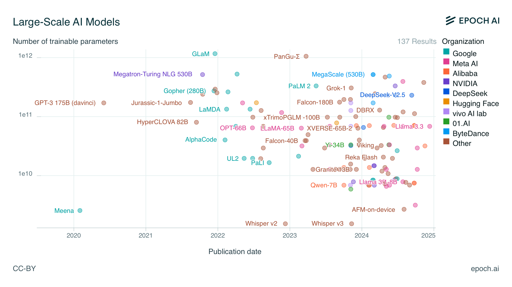

# 前言

ChatGPT 的诞生开启了大模型时代，各个行业都在探索如何利用大模型。早期的实践以提示词工程为主，通过优化提示词来提升模型表现。然而，人们逐渐发现大参数模型存在诸多局限性，并不适合所有应用场景，主要包括：

- **运行速度慢**，完整输出通常需要十几秒。
- **成本高昂**，大参数模型需要多卡 GPU 部署，对显存要求高。尤其在当前国内无法通过正规渠道购买的情况下，价格居高不下，仅大型公司有能力采购。
- **隐私难以保障**，模型通常以 API 方式提供服务，需要将数据发送至第三方平台，存在泄露风险。

因此，从 2023 年开始，小参数模型逐渐兴起。下图是来自 EPOCH AI 的统计数据：

可以看到，早期的大模型参数量普遍在 1000 亿以上，甚至出现了如 GLaM 这样拥有 1.2 万亿参数的模型。但从 2023 年开始，越来越多约 100 亿参数的模型开始涌现，小参数语言模型日益受到重视：

- **在开源模型领域**，截至 2024 年 12 月，Hugging Face 网站上下载量最大的模型是 Qwen2.5-1.5B-Instruct，下载量达到 700 万（笔者认为其中可能不少是来自 vLLM 文档默认示例），而 Qwen2.5-72B-Instruct 模型的下载量只有 28 万。
- **在闭源模型领域**，ChatGPT 默认模型已经变成了 GPT-4o mini，虽然没有公布参数量，但从运行速度来看，肯定是小参数模型。

虽然小参数模型运行成本较低，但其能力相对较弱。此时，提升能力的最佳方案是对模型进行微调，通过微调可以使小参数模型在特定领域的能力接近大参数模型的效果。

但微调需要对模型有一定了解，相较于提示词的门槛高很多，许多重要知识分布在论文及博客中，需要花费大量时间研究。本书将全面介绍微调相关知识，**让没有深度学习经验的工程师也能微调垂直领域的大模型**，分为以下几个章节：

1. **大模型微调入门**，分别使用大模型平台和本地工具对模型进行微调，让读者对微调有初步了解。
2. **大模型基础**，介绍大模型底层实现原理及源码实现。
3. **微调训练基础**，介绍微调相关的基础知识。
4. **训练数据构造**，数据质量决定了模型效果，本章节将介绍各种构造训练数据的方法。
5. **效果评估**，介绍如何自动化评估效果，现有的评估方法都有哪些局限性。
6. **微调实践**，介绍各个垂直领域的微调实践，可以快速借鉴其中的经验。
7. **模型部署**，介绍模型部署相关技术，如何降低成本和提升性能。

本书不要求读者具备深度学习经验，但需要具备编程基础，最好了解 Python 和 Linux 的基础知识。

读者无需担心自己不懂算法。在大模型场景下，各个模型之间的差距较小，可微调的参数也不多，使得训练数据的质量成为最关键的因素。
