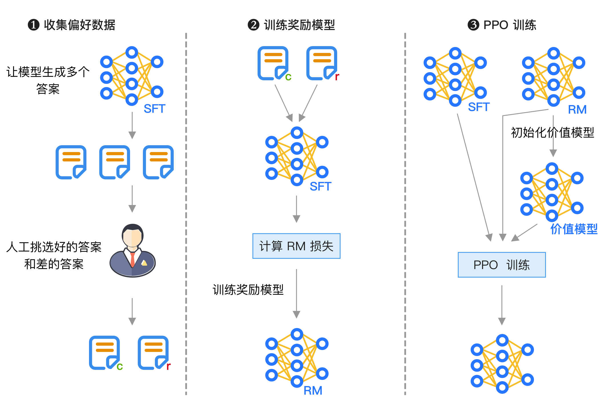
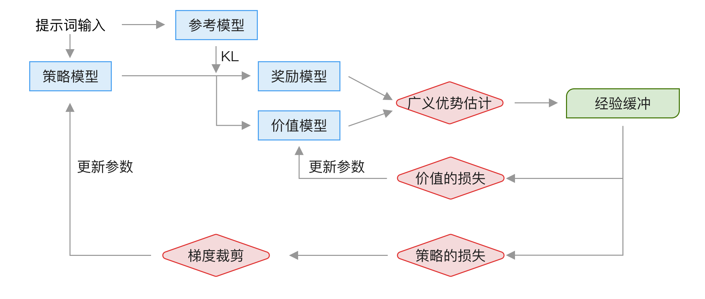

# 对齐训练

前面的指令微调 SFT 可以将基础模型的续写转成问答，但指令微调只是让模型遵循指令，可能会导致以下几个问题：

- 模型什么问题都回答，甚至会回答风险的问题，比如「如何制造炸弹」。
- SFT 的问题和答案都是固定的，模型容易死记硬背，泛化性弱，在没见过的问题上表现不好。
- 人工编写的答案不都是完美的，可能存在更好的回答，或者更适合大模型理解的回答。
- 有些隐性规则难以通过损失函数来体现，比如输出「有用」的回答。

因此，现代大模型在 SFT 之后还会使用对齐训练来进一步提升效果，其中最著名的是 RLHF（Reinforcement Learning from Human Feedback），基于人类反馈来进行强化学习训练。强化学习具有一定的「探索性」，使得模型可以找到比人工答案更好的回答，比如著名的强化学习例子 AlphaGo，它的开发者段位不高，但 AlphaGo 却能通过自己学习战胜人类最强棋手。

本章将介绍目前常见的对齐训练算法 PPO、GRPO 及 DPO，使用 TRL 框架，因为它的功能最全，LLama-Factory 也是基于它实现，而 torchtune 还未实现 PPO 算法。

除了 TRL 之外，还有两个国内的框架也值得关注，它们在性能和对多 GPU 的支持上做得更好：

- **OpenRLHF** [^openrlhf]，它在性能和显存上做了许多优化，比如使用 vLLM 来执行推理，将优化器显存协作到 CPU 等。
- **veRL** [^veRL]，字节跳动豆包团队开发的强化学习框架，支持大规模 GPU 集群，训练吞吐量高。

[^openrlhf]: <https://github.com/OpenRLHF/OpenRLHF>
[^veRL]: <https://github.com/volcengine/verl>

## 强化学习基础

强化学习是一种模型训练方法，它的训练方式是通过让模型在环境中不断尝试来学习，和监督指令微调最大的不同是，指令微调告诉答案，而强化学习只提供奖励反馈。

这里打个比方，比如写作文训练，指令微调的做法是直接给模型提供作文题目和范文让模型学习，而强化学习训练是先训练一个文章打分系统，然后模型根据这个打分系统来随意发挥写作文，目标是让写出的作文得分越来越高。因此，通过强化学习方式训练的模型泛化性更强，在遇到没见过的作文题目时也能写出不错的作文，而且也更有可能写出比范文更好的作文。此外，强化学习还可以通过不断训练来提升写作能力，因为相对于固定数量的范文，强化学习的训练量可以随着算力不断增加。

强化学习主要有以下几个部分组成，以大模型作为场景：

- **智能体**，也叫**策略**，是我们要训练的大模型。
- **动作**，指生成下一个 token。
- **状态**，是当前生成的所有文本。
- **奖励**，生成当前 token 时的得分。
- **价值**，生成完整回答时的总分，在生成当前 token 时无法知道，只能预测。

具体要如何训练取决于使用的优化算法，在大模型中通常使用 PPO 算法进行训练，后面我们会详细介绍。

## RLHF PPO 训练整体流程

PPO 训练的整体流程如下图所示：



训练主要分为 3 个阶段：

- 收集偏好数据，方法是让模型生成多个答案，然后由人工挑选出好的和差的答案，这一步也可以让大模型来判断，这种方法被称为 RLAIF（Reinforcement Learning from AI Feedback）。
- 训练奖励模型，使用前面得到的数据训练一个奖励模型，这个模型会输出打分。
- DPO 训练，输入最初的模型和奖励模型，具体计算细节将在后面介绍。

但 PPO 强化学习训练的缺点是超参数很多，训练复杂，我们将在后面介绍。

## 训练奖励模型的方法和原理

首先是奖励模型的训练，可以使用 TRL 库，所需的数据格式如下：

```json
{"chosen": "<问题和正确的回答1>", "rejected": "<问题和错误的回答1>"}
{"chosen": "<问题和正确的回答2>", "rejected": "<问题和错误的回答2>"}
```

如果是对话模型，则每一行是如下格式：

```json
{
  "chosen": [
    { "role": "user", "content": "用户问题1" },
    { "role": "assistant", "content": "正确的回答1" }
  ],
  "rejected": [
    { "role": "user", "content": "用户问题1" },
    { "role": "assistant", "content": "错误的回答1" }
  ]
}
```

使用如下命令训练，使用 `Qwen2.5-7B-Instruct` 作为 SFT 模型，输出模型的路径为 `Qwen2.5-7B-RM`，其它超参数和 SFT 训练是一样的，不过通常只训练一个轮次以避免过拟合：

```bash
python examples/scripts/reward_modeling.py \
    --model_name_or_path "Qwen2.5-7B-Instruct" \
    --dataset_name <训练数据路径> \
    --output_dir "Qwen2.5-7B-RM" \
    --per_device_train_batch_size 8 \
    --num_train_epochs 1 \
    --gradient_accumulation_steps 1 \
    --remove_unused_columns False \
    --gradient_checkpointing True \
    --learning_rate 1.0e-5 \
    --logging_steps 25 \
    --eval_strategy steps \
    --eval_steps 50 \
    --max_length 2048 \
    --use_peft \
    --lora_r 32 \
    --lora_alpha 16
```

奖励模型和默认模型的不同，它使用如下方式加载：

```python
model = AutoModelForSequenceClassification.from_pretrained(
  "Qwen2.5-0.5B-Instruct", num_labels=1
)
```

我们可以通过打印来查看使用 `AutoModelForSequenceClassification` 的模型结构和使用 `AutoModelForCausalLM` 的区别：

```python
# 自回归模型
Qwen2ForCausalLM(
  (model): Qwen2Model(
    ...# 这部分是相同的，所以忽略
  )
  (lm_head): Linear(in_features=896, out_features=151936, bias=False)
)

# 奖励模型
Qwen2ForSequenceClassification(
  (model): Qwen2Model(
    ...# 同前
  )
  (score): Linear(in_features=896, out_features=1, bias=False)
)
```

可以看到奖励模型的输出是一个值，然后使用如下公式来计算损失：

$$
L(r_{\phi}) = - \log \sigma(r_{\phi}(x, y_c)- r_{\phi}(x, y_r))
$$

其中 $\sigma$ 是 sigmoid 函数，$r_{\phi}$ 是模型，$x$ 是输入，$y_c$（c 是 chosen）是正确的回答，$y_r$（r 是 rejected）是错误的回答。

用代码来实现就是：

```python
# 正确回答的输出
rewards_chosen = model(
    input_ids=inputs["input_ids_chosen"],
    attention_mask=inputs["attention_mask_chosen"],
    return_dict=True,
)["logits"]
# 错误回答的输出
rewards_rejected = model(
    input_ids=inputs["input_ids_rejected"],
    attention_mask=inputs["attention_mask_rejected"],
    return_dict=True,
)["logits"]
# 计算它们之间的损失
loss = -nn.functional.logsigmoid(rewards_chosen - rewards_rejected).mean()
```

<!--
奖励数据集
https://huggingface.co/datasets/allenai/llama-3.1-tulu-3-8b-preference-mixture?row=0
-->

## PPO 训练细节及超参数

PPO 是一种强化学习训练算法，这里先简单介绍一下强化学习，以游戏为例来介绍。假设我们训练一个模型来玩游戏，模型通过观察游戏画面来做出行为，比如向左移动、射击等，然后观察这个行为的反应，比如得分、失败等，然后根据这个反应来调整模型参数。

强化学习和监督学习最大的不同是，监督学习有标准答案，可以通过反向传播来快速更新，而强化学习只知道行为的好坏，因此强化学习需要通过探索来自动发现最优解。

虽然强化学习从原理上看起来简单，但要如何映射到大模型上呢？这里的实现细节比较复杂，设计许多公式，因此我们不详细展开，而是介绍整体流程，让读者有直观的了解。

PPO 训练时会启动 4 个模型：

- **奖励模型**，这个就是前面训练的奖励模型，用于计算生成当前 token 时的奖励，训练时不会更新参数。
- **价值模型**，在强化学习里叫 **critic**，这个模型是基于奖励模型初始化的，它的作用是预判整体结果的得分，因为前面的奖励模型只能得到当前 token 生成时的得分，无法判断最终完整句子的得分，而模型训练时需要根据最终得分来判断下一步输出什么。和奖励模型不同，价值模型在训练时会更新参数，让预判越来越准确。
- **策略模型**，在强化学习里叫 **actor**，这就是我们要训练的模型，基于 SFT 模型初始化，会在训练时更新参数。
- **参考模型**，这个模型也是基于 SFT 模型初始化，但在训练时不会更新参数，它的主要目的是避免策略模型训练时结果偏离太多。

如果前面的描述没看懂，我们可以结合 TRL 项目中的代码来理解，下面是四个模型初始化的代码，可以看到这 4 个模型分别来自两个模型：

```python
reward_model_path = "Qwen2.5-7B-RM" # 之前训练的奖励模型路径
sft_model_path = "Qwen2.5-7B-Instruct"

# 奖励模型
reward_model = AutoModelForSequenceClassification.from_pretrained(
    reward_model_path, num_labels=1
)
# 价值模型
value_model = AutoModelForSequenceClassification.from_pretrained(
    reward_model_path, num_labels=1
)
# 策略模型，也就是要训练的模型
model = AutoModelForCausalLM.from_pretrained(
    sft_model_path
)
# 获取 LoRA 训练配置
peft_config = get_peft_config(model_args)
if peft_config is None:
    # 如果不使用 LoRA 训练，需要单独启动一个参考模型
    ref_model = AutoModelForCausalLM.from_pretrained(
        sft_model_path
    )
else:
    # 如果使用 LoRA 训练，参考模型和策略模型将共享参数
    ref_model = None
```

可以看到 PPO 训练要占用大量显存，参数部分需要 4 个模型，而激活部分需要 2 个模型。如果使用 LoRA 训练，策略模型和参考模型可以共享参数，节省一个模型参数所需显存。

整个 PPO 训练流程如下图所示：



分为以下几步：

1. 将一批提示词分别输入到策略模型和参考模型中，得到输出结果，这一步的主要作用是采样输出数据。
2. 将策略模型的输出结果分别输入到「奖励模型」和「价值模型」中，然后经过 GAE（Generalized Advantage Estimation）广义优势估计计算，得到经验缓冲。
3. 使用经验缓冲中的数据来计算「价值模型」的损失，使用梯度更新「价值模型」的参数。
4. 使用经验缓冲中的数据来计算「策略模型」的损失，然后使用裁剪限制，最后使用梯度更新「策略模型」的参数。

为了便于理解，我们通过如下简化后的代码来了解运行流程，只考虑单机单卡的情况：

<!-- https://newfacade.github.io/notes-on-reinforcement-learning/17-ppo-trl.html -->

```python
optimizer = torch.optim.AdamW(lr=args.learning_rate)

# 生成答案的配置
generation_config = GenerationConfig(
  max_new_tokens=args.response_length, # 生成答案的长度，默认是 53
  temperature=(args.temperature + 1e-7), # 温度参数，默认是 0.7
  top_k=0.0,
  top_p=1.0,
  do_sample=True,
)

if args.total_episodes is None:
  # num_train_epochs 是轮数，train_dataset_len 是训练数据量
  total_episodes = num_train_epochs * train_dataset_len
else:
  total_episodes = args.total_episodes

for step in range(total_episodes / batch_size):
  # 获取一批提示词，大小为 batch_size
  queries = next(iter_dataloader)
  # 使用策略模型生成一批结果
  responses, logits = batch_generation(model, queries, generation_config)
  # 使用奖励模型计算分数
  scores = get_reward(reward_model, queries, responses)
  # 获取生成的 Softmax 概率
  logprobs = forward(model, queries, responses)
  ref_logprobs = forward(ref_model, queries, responses)
  # 计算价值
  values = get_reward(value_model, queries, responses)
  # 计算收益
  rewards = compute_rewards(scores, logprobs, ref_logprobs)
  # 减去 KL 散度
  rewards = rewards - kl_coef * (logprobs - ref_logprobs)
  # 计算广义优势估计
  advantages, returns = compute_advantages(values, rewards, args.gamma, args.lam)

  # 使用前面收集到的经验缓冲来训练模型
  for _ in range(args.num_ppo_epochs): # PPO 截断的轮次
    output, vpreds = forward(model, queries, responses)
    # 计算策略损失
    loss_p = policy_loss(output, logprobs, advantages)
    # 裁剪值，这里省略了公式里的很多计算
    loss_p = clip(loss_p, 1.0 - args.cliprange, 1.0 + args.cliprange)
    # 计算价值损失
    loss_v = value_loss(vpreds, returns, args.cliprange_value)
    # 计算总损失
    loss = loss_p + args.vf_coef * loss_v
    # 反向传播
    loss.backward()
    # 更新参数
    optimizer.step()
```

这段代码省略了很多计算细节，不完全准确，因为我们的重点不是实现 PPO，而是了解如何调参。在这个流程中主要有以下几个超参数：

- **num_train_epochs**，训练轮数，这个和模型训练的 epoch 是一样的，也可以通过设置 **total_episodes** 来执行总训练数据量。
- **batch_size**，批量大小。
- **learning_rate**，模型的学习率，在 OpenRLHF 中还可以单独设置价值模型的学习率。
- **response_length**，生成的文本长度，具体取决于应用类型，默认 53 比较小，一般需要加大。
- **temperature**，生成文本时的温度，温度越高生成的文本越随机，默认是 0.7，可以先用这个默认值。
- **kl_coef**，KL 散度惩罚系数，用于控制策略模型和参考模型之间的差异，默认是 0.2，这个系数越大，模型生成结果和参考模型差异大时会得到更多惩罚。如果模型训崩了可以适当调大这个惩罚，但太大也会导致模型变得更加小心，训练速度慢。
- **gamma**，价值折扣系数，默认值是 1，**lam** 优势折扣系数，默认值是 0.96，这些是计算广义优势时的主要超参数。优势计算中的价值包含当前及外价值，而这个折扣系数用于未来价值，因为未来生成的文本是不确定的，因此收益要打折扣。这两个参数的区别比较用文字解释，可以通过下面这段实现代码来直观了解。

  ```python
  for t in reversed(range(gen_length)):
    nextvalues = values[:, t + 1] if t < gen_length - 1 else 0.0
    delta = rewards[:, t] + args.gamma * nextvalues - values[:, t]
    lastgaelam = delta + args.gamma * args.lam * lastgaelam
    advantages_reversed.append(lastgaelam)
  ```

- **num_ppo_epochs**，PPO 训练轮次，默认是 4，这样做的原因是前面的推理计算比较慢，根据 OpenRLHF 论文里的说法，前面的推理占了 80% 的时间，所以在 OpenRLHF 中使用 vLLM 来提升这部分的速度。
- **cliprange**，策略损失的裁剪范围，默认是 0.2，也就是 0.8 到 1.2 之间，这个裁剪是为了避免更新幅度太大导致训练不稳定。如果训练不稳定时可适当加大，但也会导致训练收敛变慢。
- **cliprange_value**，价值损失的裁剪范围，默认也是 0.2，和 **cliprange** 的作用类似，但用于价值模型。

实际 DPO 算法的代码细节比较复杂，比如策略模型损失计算及裁剪，完整的公式是：

$$
\text{L}_{policy} = \frac{1}{T}\sum\max\left(-
\frac{\pi_{\theta}(a_t|s_t)}{\pi_{\theta_{\text{old}}}(a_t|s_t)}  \hat{A}(s_t,a_t), \;\;
-\text{clip}\left(\frac{\pi_{\theta}(a_t|s_t)}{\pi_{\theta_{\text{old}}}(a_t|s_t)}, 1 - \epsilon, 1+\epsilon \right) \hat{A}(s_t,a_t)
\right)
$$

对应 TRL 中的部分代码是：

```python
vpred = vpred_temp[:, context_length - 1 : -1].squeeze(-1)
vpred = torch.masked_fill(vpred, padding_mask_p1[micro_batch_inds], 0)
vpredclipped = torch.clamp(
    vpred,
    mb_values - args.cliprange_value,
    mb_values + args.cliprange_value,
)
vf_losses1 = torch.square(vpred - mb_return)
vf_losses2 = torch.square(vpredclipped - mb_return)
vf_loss_max = torch.max(vf_losses1, vf_losses2)
vf_loss = 0.5 * masked_mean(vf_loss_max, ~padding_mask_p1[micro_batch_inds])
vf_clipfrac = masked_mean(
    (vf_losses2 > vf_losses1).float(), ~padding_mask_p1[micro_batch_inds]
)
logprobs_diff = new_logprobs - mb_logprobs
ratio = torch.exp(logprobs_diff)
pg_losses = -mb_advantage * ratio
pg_losses2 = -mb_advantage * torch.clamp(ratio, 1.0 - args.cliprange, 1.0 + args.cliprange)
pg_loss_max = torch.max(pg_losses, pg_losses2)
pg_loss = masked_mean(pg_loss_max, ~padding_mask[micro_batch_inds])
```

可以看到具体代码比较难理解，因此我们不详细展开，想要学习实现细节的读者推荐阅读复旦大学[^zhengSecretsRLHFLarge2023]及 Huggingface[^huangImplementationDetailsRLHF2024] 的论文。

[^zhengSecretsRLHFLarge2023]: <http://arxiv.org/abs/2307.04964>
[^huangImplementationDetailsRLHF2024]: <http://arxiv.org/abs/2403.17031>

总结一下强化学习 PPO 训练有以下几个难点：

- PPO 训练对显存要求高，有许多超参数，调参需要对 PPO 实现细节有了解，并根据输出日志进行调整，较难掌握。
- 训练过程不稳定，因此 PPO 算法通过裁剪来避免偏离太多，但这个参数是个双刃剑，裁剪太多导致模型更新速度慢。
- 需要先训练一个奖励模型，这个奖励模型是后续训练的基础，而我们很难评估奖励模型的训练效果。如果奖励模型没训好，后续 PPO 调参效果也不好，因此强化学习训练最容易实现的场景是奖励比较明确的情况，比如代码和数学训练。
- 模型可能找到骗过奖励模型的方法，这种行为被称为 Reward Hacking，比如模型发现文本越长得分越高，导致训练后的模型倾向生成冗长的文本 [^singhalLongWayGo2024]，甚至可能发现输出几千个「good」的得分很高，模型就干脆只输出这个词了，导致模型训练崩溃。

[^singhalLongWayGo2024]: <http://arxiv.org/abs/2310.03716>

整体来说，PPO 训练很复杂，因此在开源界很少使用，笔者也不建议初期使用 PPO 训练，目前更推荐的做法是后续章节介绍的 DPO 训练。

如果要做 PPO 训练，可以先用 TRL 中提供的脚本，使用如下命令训练：

```bash
python examples/scripts/ppo/ppo.py \
    --dataset_name <训练提示词> \
    --output_dir <输出目录> \
    --num_ppo_epochs 1 \
    --num_mini_batches 1 \
    --learning_rate 3e-6 \
    --per_device_train_batch_size 1 \
    --gradient_accumulation_steps 16 \
    --total_episodes 10000 \
    --model_name_or_path <模型路径，用于 tokenizer> \
    --sft_model_path <模型路径> \
    --reward_model_path <奖励模型路径> \
    --local_rollout_forward_batch_size 1 \
    --missing_eos_penalty 1.0
```

## 强化学习 GRPO 训练

强化学习除了 PPO 算法，还有 GRPO 算法，它是 DeepSeek R1 中的强化学习训练算法。由于 DeepSeek R1 成功出圈，在全球得到了大量关注，使得 GRPO 成为了新的热门强化学习算法。

下图是来自论文中的 GRPO 和 PPO 算法对比：


GRPO 和 PPO 最大的不同是去掉了价值模型。没有价值模型要如何计算优势？GRPO 的做法是每一个问题生成多个回答 $o_1, o_2, \cdots, o_G$，计算它们的奖励，然后计算这些奖励的平均值和标准差，最后通过如下公式来计算优势：

$$
A_i = \frac{r_i - {\mathrm mean(\{r_1, r_2, \cdots, r_G\})}}{{\mathrm std(\{r_1, r_2, \cdots, r_G\})}}
$$

对应的代码比较简单：

```python
# 计算每个答案的平均奖励
mean_grouped_rewards = rewards.view(-1, self.num_generations).mean(dim=1)
# 计算每个答案的标准差
std_grouped_rewards = rewards.view(-1, self.num_generations).std(dim=1)
# 计算优势，这里加 1e-4 是为了避免标准差为 0 的情况
advantages = (rewards - mean_grouped_rewards) / (std_grouped_rewards + 1e-4)
```

其中 $r_i$ 是当前奖励，有了这个奖励就能计算损失了。具体损失计算公式比较复杂，这里我们不展开详细介绍，因为了解前面的优势计算方法就知道所有训练关键超参数了。GRPO 的核心思想是通过「群体智慧」来优化模型，认为生成多个答案的整体效果比生成单个答案好。

具体训练可以使用 TRL 中的脚本，运行类似如下命令来训练：

```bash
python trl/scripts/grpo.py \
    --dataset_name <训练提示词> \
    --output_dir <输出目录> \
    --model_name_or_path <模型路径> \
    --reward_model_name_or_path <奖励模型路径> \
    --max_prompt_length 512 \
    --num_generations 8 \
    --temperature 0.9 \
    --max_completion_length 256 \
    --beta 0.04 \
    --use_vllm True
```

这里我们主要介绍 GRPO 中特有的超参数：

- **max_prompt_length**，提示词最大长度，默认是 512，需要根据需求调整。
- **num_generations**，每个提示词生成多少个回答，默认是 8，这个值越大，训练越稳定，但也越慢。
- **temperature**，生成回答时的温度，默认是 0.9，这个值越大，生成结果越随机。相比 PPO 训练，这个值最好大一点来生成多种回答。
- **max_completion_length**，生成回答的最大长度，默认是 256，这个值需要根据需求调整。
- **beta**，KL 惩罚系数，默认是 0.04，和 PPO 类似，这个是指和参考模型的偏离程度，但在 GRPO 中是按 token 粒度计算的，惩罚系数的值相对较小。如果训练崩溃可以适当调大。
- **use_vllm**，是否使用 vLLM 来生成。由于每个问题要生成多个答案，因此 GRPO 训练下性能的主要瓶颈是生成，因此最好使用 vLLM 来提升速度。

另外，GRPO 在实现时还支持使用规则来计算奖励，这样甚至不用训练奖励模型，只需根据奖励规则来训练，很适合用来训练数学模型，具体做法将在 [深度思考模型 DeepSeek-R1] 章节中介绍。

## DPO 偏好训练

DPO 相对于基于 PPO 训练起来更简单，它无需训练奖励模型，只有一个超参数，训练成本大幅降低。目前在开源界很流行，比如 Qwen2 [^yangQwen2TechnicalReport2024]、Mixtral 8x7b [^jiangMixtralExperts2024]、DeepSeek [^deepseek-aiDeepSeekLLMScaling2024]、Phoenix [^uhligPHOENIXOpenSourceLanguage2024] 等。目前在 Open LLM Leaderboard [^OpenLLMLeaderboard] 上排名靠前的模型绝大部分只用 DPO。

[^yangQwen2TechnicalReport2024]: <http://arxiv.org/abs/2407.10671>
[^jiangMixtralExperts2024]: <http://arxiv.org/abs/2401.04088>
[^deepseek-aiDeepSeekLLMScaling2024]: <http://arxiv.org/abs/2401.02954>
[^uhligPHOENIXOpenSourceLanguage2024]: <http://arxiv.org/abs/2401.10580>
[^OpenLLMLeaderboard]: <https://huggingface.co/spaces/open-llm-leaderboard/open_llm_leaderboard>

许多模型最开始使用 PPO 训练，后来切换到了只用 DPO，比如 Llama 2 同时使用 PPO 和 DPO 两种方法，但到了 3.1 就只使用 DPO 了，原因是训练更简单。要知道 Llama 3.1 论文中列出了 600 多贡献者，如果连 Meta 都很难做好 PPO，对于大多数人就更难了。

DPO 的原理是通过推导简化了原先 PPO 中的公式，使得可以直接使用偏好数据来计算损失，这个推导比较复杂，需要大量相关知识，这里不展开，感兴趣可以阅读原论文 [^rafailovDirectPreferenceOptimization2024]。这个损失函数的输入是好的回答和不好的回答，然后计算不同回答的概率差别，有了这个损失函数，我们就能通过梯度更新来训练模型，让模型的输出结果更偏向好的回答。

虽然推导这个损失函数的过程比较复杂，但最终的函数并不复杂，如下所示：

$$
\mathcal{L}_\text{DPO}(\pi_{\theta}; \pi_{ref}) = -\mathbb{E}_{(x, y_w, y_l)\sim \mathcal{D}}\left[\log \sigma \left(\beta \log \frac{\pi_{\theta}(y_w\mid x)}{\pi_{ref}(y_w\mid x)} - \beta \log \frac{\pi_{\theta}(y_l\mid x)}{\pi_{ref}(y_l\mid x)}\right)\right]
$$

其中 $\pi_{\theta}$ 是训练模型，$\pi_{ref}$ 是参考模型，$x$ 是输入，$y_w$ 是正确答案，$y_l$ 是错误答案，$\beta$ 是控制 KL 惩罚强度的温度参数。我们也可以通过代码来理解：

```python
import torch.nn.functional as F

def dpo_loss(pi_logps, ref_logps, yw_idxs, yl_idxs, beta):
    """
    pi_logps: 训练模型的输出 logits
    ref_logps: 参考模型的输出 logits
    yw_idxs: 正确答案的索引列表
    yl_idxs: 错误答案的索引列表
    beta: 控制 KL 惩罚强度的温度参数
    """

    # 获取训练模型和参考模型的输出 logits
    pi_yw_logps,  pi_yl_logps =  pi_logps[yw_idxs],  pi_logps[yl_idxs]
    ref_yw_logps, ref_yl_logps = ref_logps[yw_idxs], ref_logps[yl_idxs]

    # 计算训练模型和参考模型的 log 比值
    pi_logratios  = pi_yw_logps - pi_yl_logps
    ref_logratios = ref_yw_logps - ref_yl_logps

    # 计算损失
    losses = -F.logsigmoid(beta * (pi_logratios - ref_logratios))
    # 计算奖励，detach 表示不计算梯度
    rewards = beta * (pi_logps - ref_logps).detach()

    return losses, rewards
```

[^rafailovDirectPreferenceOptimization2024]: <http://arxiv.org/abs/2305.18290>

使用 DPO 比较简单，它不需要训练奖励模型，只需两步：

- 训练数据准备
  - 准备问题，可以使用模型生成多个答案（需较高的 temperature 参数），然后挑选其中好的和差的回答，或人工编写出更好的答案。
  - 对这些回答进行挑选，挑选出一个好的回答和一个不好的回答，可以使用人工或大模型挑选。
- DPO 训练
  - 启动两个模型实例，一个作为原始参考，另一个作为训练模型。
  - 同时用这两个模型运行训练数据，然后用 dpo_loss 计算损失，使用梯度来更新训练模型的参数。

如下图所示：


整个过程最费时的是准备问题和偏好答案。另外，训练模型需要启动两个模型，相比 SFT 训练需多占用一个模型推理所需的显存。不过和 PPO 一样，如果是用 LoRA 方式训练可以共享权重，无需额外占用显存。

目前 Huggingface 的 TRL 库中已经实现了 DPO 训练，所以我们不用写代码，只需准备好数据，使用类似下面的格式 jsonl 格式，每行一个 JSON 对象，包括问题和两种的回答：

```txt
{"prompt": "<问题1>", "chosen": "<正确的回答1>", "rejected": "<错误的回答1>"}
{"prompt": "<问题2>", "chosen": "<正确的回答2>", "rejected": "<错误的回答2>"}
```

然后调用 TRL 中的脚本来训练，以 LoRA 为例，使用以下命令：

```bash
python examples/scripts/dpo.py \
    --dataset_name=<训练数据路径> \
    --model_name_or_path=<模型路径> \
    --beta 0.1 \
    --per_device_train_batch_size 4 \
    --learning_rate 1e-5 \
    --gradient_accumulation_steps 1 \
    --logging_steps 10 \
    --eval_steps 500 \
    --output_dir=<训练后的模型路径> \
    --optim rmsprop \
    --warmup_steps 150 \
    --bf16 \
    --logging_first_step \
    --no_remove_unused_columns \
    --use_peft \
    --lora_r=16 \
    --lora_alpha=16
```

其中唯一和 DPO 相关的参数是 `beta`，这个参数通常用默认的 0.1，除此之外其它都是普通模型训练的参数。在前面章节有介绍，唯一需要注意的是学习率，DPO 训练的学习率更低。

> TRL 的具体实现中比原始的 DPO 论文多了许多超参数，比如 `loss_type` 可以使用后来其他人提出的损失计算方法，这些细节超出了本书范畴，读者可以参考 TRL 的文档。

虽然 DPO 用起来简单，但它的效果不如 PPO。有研究 [^xuDPOSuperiorPPO2024] [^liPolicyOptimizationRLHF2024] 认为 DPO 有根本上的限制，PPO 训练的损失等同于奖励模型训练的损失，因此它相比 PPO 少了进一步优化，DPO 相当于 PPO 训练的子集，因此微调效果肯定不如 PPO。

这点我们可以通过前面对 PPO 的分析来直观理解。PPO 训练的核心是强化学习，强化学习的优点是让模型有一定「探索性」，因此它的泛化性更强，能力上限有可能超过人类提供的偏好数据。而 DPO 训练只使用偏好数据，它的上限就是人类提供的偏好数据，因此 DPO 效果肯定不如 PPO。

但效果究竟差多少？有研究 [^ivisonUnpackingDPOPPO2024] 经过对比分析后发现同样训练数据下使用 PPO 比 DPO 提升 1.2%。因此虽然 DPO 效果不如 PPO，但提升并不显著，更大的提升来自训练数据。

笔者建议初期优先使用 DPO 训练，将更多精力放在优化训练数据上。DPO 缺少探索性的问题可以通过数据来优化，比如进行多轮训练，让经过 DPO 训练后的模型再生成多个答案，人工从中挑选更好的答案添加到训练数据中。这相当于人工增加了探索性，这也是 Llama 3 中的训练方法，因为相对于优化数据，优化 PPO 对技术要求高，参数没调好效果反而更差。

[^xuDPOSuperiorPPO2024]: <http://arxiv.org/abs/2404.10719>
[^liPolicyOptimizationRLHF2024]: <http://arxiv.org/abs/2312.10584>
[^ivisonUnpackingDPOPPO2024]: <http://arxiv.org/abs/2406.09279>

## Online DPO 优化

DPO 有个新的优化方法是基于奖励模型自动选择正反例子，这种做法叫 Online DPO [^guoDirectLanguageModel2024]，它的运行流程如下图所示：

[^guoDirectLanguageModel2024]: <http://arxiv.org/abs/2402.04792>


Online DPO 的优势是不需要人工构造正反示例，而是由模型输出两个结果，用奖励模型选择一个更好的。因此，训练数据只需提示词即可。根据作者的测试，Online DPO 相比 DPO 训练出来的模型，在人工匿名对比测试中 60% 更好，30% 打平。

## 多轮迭代训练

早期 OpenAI 使用的训练方法是使用以下 4 个步骤：

- 训练基础模型
- 使用 SFT 训练模型
- 使用偏好数据训练奖励模型
- 使用奖励模型和偏好数据进行强化学习训练模型

而经过一年多的探索，包括后面我们看到的 Llama 3、Tulu 3 等模型都采用了多轮迭代训练。
