# 微调训练

本章将介绍微调的原理和相关实践，从最简单的神经网络开始介绍微调中的核心概念。

## 选择基础模型

在微调前需要选择基础模型，根据自己的场景可能有不同选择，这里提供一些选型参考维度：

- **使用协议**：许多开源模型需要申请才能商用，即使是不需要申请就能商用的 Llama，也限制产品月活要小于 7 亿。反倒是国内的 Qwen、DeepSeek-v2 和 Yi-1.5 等模型的协议更宽松。
- **模型是否具备所需知识**：如果是一些很专业的领域，模型训练中可能没有相关知识，这样训练效果就将很差。测试方法是找一段这个领域特有的文本，看模型是否能正确补全，或者更好的方法是计算不同模型的困惑度，参考 [困惑度]。
- **模型是否支持中文**：这主要看词表大小。通常来说，词表大的模型训练时也肯定有大量非英语文本，而词表小会导致一些常见汉字被拆分为 3 个 UTF-8 字节，这不仅会影响输出速度，还可能导致某个 UTF-8 字节概率性选错输出乱码。典型的例子是 Llama 和 Llama 2 的词表大小只有 32k，而 Llama 3 扩展到了 128k，所以理论上 Llama 3 能更好支持中文。
- **模型参数量**：前面提到过如何计算硬件需求，推荐选择小于 10B 的模型，因为它的部署成本最低，一张 4090 显卡就能运行，在租赁平台上每月只需 1 千多。但不建议选择小于 2B 的模型，小模型幻觉现象比较严重。
- **训练的 token 数量**：通常训练 token 数量多的模型效果更好，而且训练 token 数量也在一定程度上体现了团队的技术及资金实力。
- **上下文窗口大小**：对于输出 JSON 的场景，上下文窗口不能小于 4k。
- **推理服务是否支持**：如果使用不太常见的推理服务或国产芯片，可能还不支持一些新出的模型，比如性能最好的推理框架 TensorRT-LLM 支持国产的模型比较少。
- **政策**：在国内应该使用备案过的模型，这导致一些政府类项目中可能无法使用 Llama，但国内著名的模型都备案了。
- **更新维护情况**：许多模型只出了一版就不再更新，恐怕相关团队已经放弃了，所以模型版本应该至少是 2 以上的。

反倒是许多大模型的评测跑分其实不用在意，这个得分和垂直领域落地微调效果关系不大。

以本书编写时间点来看，值得关注的开源模型主要是以下几个：

- **Llama 3.1**：最著名的开源模型，后来推出了 3.2 版本的小模型，但不支持中文，而新的 3.3 版本只有 70B 参数，因此现阶段推荐使用 3.1 版本。
- **Gemma 2**：谷歌开源的模型。
- **Qwen 3**：国内一直开源和更新的模型，在国外也很出名。
- **DeepSeek-V2-Lite**：在技术上做了许多改进的模型，采用 MoE 及 MLA 技术，推理成本显著降低。
- **InternLM 2.5**：支持百万字超长上下文的开源模型。
- **GLM-4-9B**：国内做得最早的模型，但不确定后续版本是否开源。

推荐这几个模型的主要原因是它们背后的公司资金雄厚且持续更新。2023 年许多中小公司跟风推出了开源模型，但这些模型后续要么不再更新，要么闭源了。

在这几个模型中，建议优先尝试 **Qwen 2.5**。它有一个独特的优势，即有 0.5B 和 1.5B 的小模型，训练时可以用这两个小模型来快速验证。它的训练速度快，甚至如果最终效果不差，还能直接用 CPU 运行，极大降低部署成本，尤其是 1.5B 的版本是目前 Huggingface 上下载量最大的文本生成模型。

如果训练数据不多，训练一次只需 1-2 小时，这时建议同时微调多个模型看效果，根据最终结果来选择。

关于模型对微调效果的影响，有人使用 OLMo-1B 模型做过实验 [^sunAmuroCharAnalyzing2024]，测试了预训练模型在不同训练步数下的微调效果，如下图所示：

[^sunAmuroCharAnalyzing2024]: <http://arxiv.org/abs/2408.06663>


这个测试结果表明，预训练模型经过一定训练量后会显著提升微调效果，但后续预训练量增加对微调效果几乎没有提升。这意味着**大模型微调效果对基础模型的依赖会越来越小**，因为知名开源模型都会经过充分训练，它们的微调效果预计差异不大。

## 模型训练的原理

本节介绍神经网络训练的基本原理，了解这些原理就能很好地理解微调中的那些超参数。

### 神经网络基础

大模型是一种神经网络，因此神经网络的基础知识同样适用于大模型。大模型的主要区别在于参数量更多。我们可以通过最简单的神经网络来理解大模型训练。为了避免篇幅过长，这里只介绍训练所需的最关键知识。

最简单的神经网络是输入与矩阵相乘，然后计算结果再经过一个激活函数，最终输出单个数值或多个数值，如下图所示：

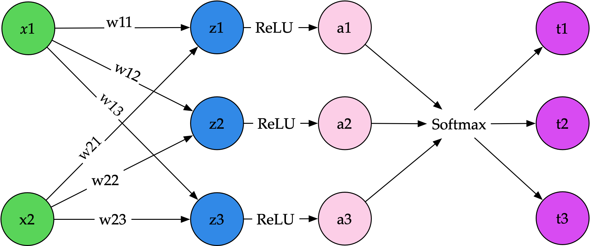

从左往右看，最左边是输入，通常使用 $x$ 作为标记：

$$
x = \begin{pmatrix} x_1 \\ x_2 \end{pmatrix}
$$

这里我们用两个值 $x_1$ 和 $x_2$，它们通常是浮点数。

接下来，从 $x$ 到 $z$ 的连线，比如 $w_{11}$，就是神经网络中的中间层，可以表示为下面的矩阵，其中每个元素都是一个浮点数，这个矩阵属于**模型参数**。

$$
W = \begin{pmatrix}
w_{11} & w_{12} & w_{13} \\
w_{21} & w_{22} & w_{23}
\end{pmatrix}
$$

输入向量乘以这个矩阵后得到输出，使用下面的计算方法：

$$
z_1 = x_1 w_{11} + x_2 w_{21}
$$

$$
z_2 = x_1 w_{12} + x_2 w_{22}
$$

$$
z_3 = x_1 w_{13} + x_2 w_{23}
$$

通过相乘和相加，得到 $z_1$ 到 $z_3$ 的中间结果，然后再经过 ReLU 激活函数。ReLU 这个函数的实现非常简单，就是 `max(0, x)`，数值小于 0 的部分变成 0。除了 ReLU，还可以用其他函数，比如 Llama 使用的 SwiGLU。

经过 ReLU 激活函数后，得到 $a_1$ 到 $a_3$ 的值，这些值也称为**激活值**，是模型运行过程的中间状态。后面还会提到，在长文本训练时，它将占用大量显存。激活值最后经过一个 `softmax` 函数，这个函数的作用是将结果变成总和为 1 的数字，其中每个数字大于 0 且小于 1，比如 `[0.7, 0.2, 0.1]`。

如果是语言模型，最后这些 $t_1$ 到 $t_3$ 对应的就是每个词（token）的概率，然后可以根据这个概率取其中某个词作为模型的输出结果。

### 训练神经网络

那么训练是怎么回事呢？训练实际上就是修改前面提到的 $W$ 矩阵里的值。为了简化前面的例子，这里只讨论一个矩阵，但在大模型中通常会有很多层矩阵前后连接。

训练前，先用随机数对 $W$ 进行初始化，比如按正态分布生成随机数。

训练时，首先将用户输入转换成一组数字，也就是前面的 $x_1$ 到 $x_3$，然后通过模型计算出最终的 $t_1$ 到 $t_3$，例如 `output = [0.7, 0.2, 0.1]`。而我们期望的输出是某个词，对应的期望输出就是这个词为 1，其它都为 0 的数组，比如 `y = [0, 1, 0]`。接着，使用交叉熵计算它们之间的差距，再通过反向传播算法更新 $W$ 矩阵里的值。这就是整个计算过程，具体如何自动计算导数可以参考后面的章节，这里先不展开。

整个训练过程可以简化为下面的伪代码：

```python
for _ in range(epoch):
    # 对训练数据进行随机排序
    random.shuffle(data)
    # 根据 batch_size 遍历所有数据
    for i in range(0, len(data), batch_size):
        # 取出一部分数据
        batch_data = data[i:i + batch_size]
        # 输入文本
        x = batch_data.x
        # 期望输出
        y = batch_data.y
        # 大模型计算
        output = llm(x)
        # 计算结果和期望输出之间的差距 loss
        loss = cross_entropy(output, y)
        # 根据 loss 计算梯度
        grad = gradient(loss)
        # 根据梯度更新模型参数，这里简化了，实际一般用 cosine 动态调整学习率
        weight -= learning_rate * grad
```

其中有几个关键的变量，对应着在训练过程中的几个重要超参数：

**迭代轮次（epoch）**：每完成一次对所有数据的遍历就代表一个 epoch，因此 2 个 epoch 意味着相同数据会被训练两次。这个值过大会导致模型过拟合，一般不超过 4，但在 OpenAI 的论文中提到，他们使用的竟然是 16 [^ouyangTrainingLanguageModels2022]，过拟合反而能提升后续训练奖励模型的效果。

**批量大小（batch size）**：每次训练更新梯度计算时提供多少条数据。通常推荐使用 8 的倍数，包括 Nvidia 官方也是这样建议的 [^LinearFullyConnectedLayers]，原因是 Nvidia 的 GPU 设计通常使用 8 的倍数，比如 A100 的 Tensor Core 每个时钟周期能执行 256 个 FP16 数字的乘加操作。

[^LinearFullyConnectedLayers]: <https://docs.nvidia.com/deeplearning/performance/dl-performance-fully-connected/index.html>

设置较大批量大小的优点是：

- **训练速度快**：因为通常情况下性能瓶颈是显存带宽，具体如何分析可以查看 [推理场景下的性能瓶颈] 一节，而需要传输的数据大部分为模型参数，增大批量不会增加多少数据传输量。例如，假设隐藏层是 4096 的情况，输入只有一个批次，文本长度是 128 个 token，中间进行的计算将会是一个 `[128, 4096]` 维度的矩阵乘以一个 `[4096, 4096]` 的矩阵，矩阵的数据量是 `128 * 4096 + 4096 * 4096 = 17301504`。如果批次增加到 4，则变成了 `4 * 128 * 4096 + 4096 * 4096 = 18874368`，整体数据量只增加 10%。因此在带宽是瓶颈的情况下，增加批次对性能影响不大，但可以降低总步数，从而显著提升训练速度。
- **训练会更稳定**：模型训练过程不易受到某个异常数据的影响。

但批量大小过大带来的缺点是：

- **内存占用过大**：尤其是激活值导致的显存占用，可能会导致显存不足报错。
- **可能会降低模型泛化性**：这一观点源于人们在深度学习卷积网络中的发现，比如来自 Intel 的研究 [^keskarLargeBatchTrainingDeep2017]，但这方面也有人质疑，比如 Google 认为只要其它超参数和训练步骤足够，任何批量大小都能得到相同性能。

[^keskarLargeBatchTrainingDeep2017]: <http://arxiv.org/abs/1609.04836>

笔者认为，批量大小只需根据硬件资源设置最大值即可。具体估算方法在 [微调所需资源] 中有介绍，但最简单的办法就是多试几次找到不超显存的值，不用担心降低泛化性，目前在大模型的训练中还没有人发现批量大小对模型效果有明显影响。

**学习率（learning rate）**：每次反向传播时更新参数的比例，这个设置是为了避免参数变动过于剧烈而无法收敛。学习率的设置也和数据量及批量大小有关：

1. 学习率的设置与数据量有关。如果有大量训练数据，这个值可以设得低一些，但太低会导致收敛过慢，训练效果不佳。一个简单的判断方法是观察训练过程中的 loss，如果 loss 下降很慢，说明学习率太小；如果 loss 反复波动，说明学习率太大。
2. 比较新的研究 [^malladiSDEsScalingRules2024] 认为，批量大小扩大 $n$ 倍时，学习率应该扩大 $\sqrt{n}$ 倍。有些著名的模型使用了这个规则，比如 OpenAI 的 InstructGPT [^ouyangTrainingLanguageModels2022]。

[^malladiSDEsScalingRules2024]: <http://arxiv.org/abs/2205.10287>

[^ouyangTrainingLanguageModels2022]: <http://arxiv.org/abs/2203.02155>

### 自动求导

训练神经网络的核心原理是自动反向求导，即便不清楚具体计算细节也不影响后面的学习和使用，但了解它能让我们更清楚训练细节，因此本节将简单介绍反向传播的原理。

反向传播计算的基本原理是链式法则，来自 `George F. Simmons` 的直观解释是，如果汽车的速度是自行车的 2 倍，自行车的速度是走路的 4 倍，那么汽车的速度是走路的 `2 × 4 = 8` 倍。因此，我们可以将复合函数的导数拆分为各个函数导数的乘积。

$$
\frac{\partial z}{\partial x} = \frac{\partial z}{\partial x} \cdot \frac{\partial x}{\partial y}
$$

如果输入是向量，求导则是一个雅可比矩阵，因为我们需要计算每个输出对应输入的偏导数：

$$
\begin{pmatrix}
  \dfrac {\partial y_{1}}{\partial x_{1}} & \cdots & \dfrac {\partial y_{1}}{\partial x_{n}} \\
  \vdots & \ddots & \vdots \\
  \dfrac {\partial y_{m}}{\partial x_{1}} & \cdots & \dfrac {\partial y_{m}}{\partial x_{n}}
\end{pmatrix}
$$

雅可比矩阵的计算比较繁琐，本书不是专门的数学书，这里只介绍单个值的情况（也叫标量），使用一个简单的例子来说明原理（示例来自 CS231n）。真正的矩阵相乘求导计算虽然繁琐，但原理是一样的。假设我们有如下函数：

$$
  f(x, y, z) = (x + y)z
$$

如果要计算这个函数的导数，假设输入值是 `x = -2`，`y = 5`，`z = -4`，计算过程如下：

1. 为了方便描述，先定义一个中间变量 `q`，它等于 `q = x + y`，因此函数 `f` 可以写成 `f = q * z`。
2. 从后往前，初始函数计算结果的梯度是 1。要计算 `f` 的梯度，它等于 `f = q * z`，因此梯度等于 $\frac{\partial f}{\partial q} * \frac{\partial f}{\partial z}$。
3. 先计算 z 的梯度，根据基本导数公式得到 $\frac{\partial f}{\partial z} = q$，因此 $\frac{\partial f}{\partial z} = (x + y) = (-2 + 5) = 3$。
4. 然后计算 q 的梯度，根据基本导数公式得到 $\frac{\partial f}{\partial q} = z$，因此 $\frac{\partial f}{\partial q} = -4$。
5. 接下来继续往前计算 y 的梯度，它等于 $\frac{\partial f}{\partial y} = \frac{\partial f}{\partial q} * \frac{\partial q}{\partial y}$，其中前面计算过了 $\frac{\partial f}{\partial q} = -4$，而根据公式 $\frac{\partial q}{\partial y} = 1$，因此 $\frac{\partial f}{\partial y} = -4 * 1 = -4$。
6. 最后计算 x 的梯度，它等于 $\frac{\partial f}{\partial x} = \frac{\partial f}{\partial q} * \frac{\partial q}{\partial x}$，其中前面计算过了 $\frac{\partial f}{\partial q} = -4$，而根据公式 $\frac{\partial q}{\partial x} = 1$，因此 $\frac{\partial f}{\partial x} = -4 * 1 = -4$。

整个计算过程比较繁琐，好在现在深度学习框架都可以自动化实现，比如 PyTorch 等框架的原理是利用 Python 的操作符重载功能。当我们编写 `a + b` 计算时，实际上是调用了 `__add__` 函数。利用这一点，Python 在运行前向计算时就自动计算出对应的反向传播方法，因此开发时只需要编写前向计算公式。下面是一个简单的示例，核心代码来自 micrograd 项目。

```python
class Value:
    def __init__(self, data, _children=(), _op=''):
        self.data = data
        self.grad = 0
        self._backward = lambda: None
        self._prev = set(_children)
        self._op = _op

    def __add__(self, other):
        """
        重载加法操作符
        """
        out = Value(self.data + other.data, (self, other), '+')

        # 定义加法的反向传播方法
        def _backward():
            self.grad += out.grad
            other.grad += out.grad
        out._backward = _backward

        return out

    def __mul__(self, other):
        """
        重载乘法操作符
        """
        out = Value(self.data * other.data, (self, other), '*')

        # 定义乘法的反向传播方法
        def _backward():
            self.grad += other.data * out.grad
            other.grad += self.data * out.grad
        out._backward = _backward

        return out

    def backward(self):
        topo = []
        visited = set()
        # 构建计算图
        def build_topo(v):
            if v not in visited:
                visited.add(v)
                for child in v._prev:
                    build_topo(child)
                topo.append(v)
        build_topo(self)
        self.grad = 1
        # 反向遍历计算图，执行 _backward 方法
        for v in reversed(topo):
            v._backward()

    def __repr__(self):
        return f"Value(data={self.data}, grad={self.grad})"

# 使用方法
x = Value(-2)
y = Value(5)
z = Value(-4)
result = (x + y) * z
result.backward()
print(x, y, z, result)
```

这个简单的实例代码只实现了乘法和加法的反向传播。在 PyTorch 中，需要实现大量基础操作符对应的反向传播方法，而且是使用 C++ 实现的，具体细节超出了本书的范畴。最重要的是了解以下两点：

1. 每个参数都有对应的梯度值，这个值用于更新参数，这些梯度值需要占用显存，数量与参数量有关。
2. 反向传播计算依赖前向计算时输出的值，这个值一般会经过激活函数，所以也叫激活值。比如前面简单示例中的 `x + y` 计算结果 `q`，需要用在 $\frac{\partial f}{\partial z} = q$ 中。因此，训练过程还需要保存这些中间输出结果，这将占用大量显存，这些激活值的数量与训练文本长度有关（因为每个 token 的计算过程都会产生中间值）。

### 训练中的优化器

优化器是在训练时控制如何更新参数的模块。回忆一下前面提到的模型训练过程，如下代码所示：

```python
for inputs, labels in get_data():
    preds = model(inputs)
    loss = loss_fn(preds, labels)
    loss.backward()
    # 优化器更新参数
    optimizer.step()
```

在模型运行一次并计算损失梯度后，最后会调用优化器来更新参数。最简单的更新方法是参数减去梯度乘以学习率，如下代码所示：

```python
weight -= learning_rate * grad
```

但这个简单的方式需要设置合适的学习率。学习率太大容易造成模型无法收敛，而学习率太小又会导致收敛过慢，容易陷入局部最优。因此，后来出现了其他改进策略，比如增加动量（momentum），在计算梯度时参考之前的值，类似加上惯性，让参数变化更为平衡。

目前，大模型通常使用 AdamW [^loshchilovDecoupledWeightDecay2019] 优化器，它也需要参考之前的梯度值。它的主要计算公式如下：

[^loshchilovDecoupledWeightDecay2019]: <http://arxiv.org/abs/1711.05101>

$$
m_t = \beta_1 m_{t-1} + (1 - \beta_1) g_t
$$

$$
v_t  = \beta_2 v_{t-1} + (1-\beta_2) g^2_t
$$

$$
\widehat{m_t} =   m_t/\big(1-\beta_1^t \big)
$$

$$
\widehat{v_t} =   v_t/\big(1-\beta_2^t \big)
$$

$$
\theta_t = \theta_t - \gamma \widehat{m_t}/
              \big(\sqrt{\widehat{v_t}} + \epsilon \big)
$$

其中 $\beta_1$、$\beta_2$ 和 $\epsilon$ 是固定值，$g_t$ 是梯度。这个公式主要关注以下两点：

- **$m_{t-1}$** 是上一次运行的一阶指数平滑值，**$v_{t-1}$** 是上一次运行的二阶指数平滑值。因此，训练过程中需要一直保持这个值。这个值是每个参数都需要的，而为了精度通常需要保存 F32 精度，因此会占用大量显存。例如，对于 7B 的模型，这两个值就需要 $2 * 4 * 7 = 56 \text{ GB}$ 显存。
- 最后一行是参数更新的计算方法，**$\theta_t$** 是模型参数，**$\gamma$** 是学习率。从这个计算可以看到，参数更新与历史一阶指数平滑值成正比，与历史二阶指数平滑值成反比。

如果不习惯看公式，可以参考如下 PyTorch 的代码：

```python
# 获取历史 m_t 和 v_t
m_t, v_t = optimizer.state['m_t'], optimizer.state['v_t']
# 计算新的 m_t 和 v_t
m_t = beta1 * m_t + (1 - beta1) * grad
v_t = beta2 * v_t + (1 - beta2) * torch.square(grad)
# 计算 m_t 和 v_t 的修正值
m_t_corr = m_t / (1 - beta1 ** t)
v_t_corr = v_t / (1 - beta2 ** t)
# 更新参数
p -= lr * m_t_corr / (torch.sqrt(v_t_corr) + eps)
```

前面提到的 AdamW 中的 $\beta_1$、$\beta_2$ 和 $\epsilon$ 是固定值，通常情况下不需要修改。但之前有人通过调整它们来小幅提升 CNN 模型的效果 [^choiEmpiricalComparisonsOptimizers2020]。笔者建议只有在最后没有可调参数时才考虑调整这些参数，因为它们对结果的影响很小。

[^choiEmpiricalComparisonsOptimizers2020]: <http://arxiv.org/abs/1910.05446>

## 指令微调

### 什么是指令微调

指令微调的作用是让大模型从补全转变为问答。如果直接问基础模型问题，它可能不会给出答案，而是补充更多问题。例如，问模型「如何减少空气污染？」时，它可能会这样回答：

```txt
如何减少空气污染?____
A. 提倡使用新能源
B. 将垃圾堆放在路边
C. 少开空调
答案:

A

下列叙述正确的是____
A. 淀粉在水溶液里发生水解生成葡萄糖和果糖
B. 植物油不能发生水解反应
C. ...
```

看起来是训练数据里有类似的选择题，因此模型变成了续写考卷。为了使模型能够回答问题，我们需要准备问题和回答的文本，例如如下所示：

```txt
如何减少空气污染？

减少空气污染是一个需要政府、企业和个人共同努力的长期过程。以下是一些减少空气污染的有效措施：

1. 减少汽车排放
   - 推广公共交通：鼓励人们使用公共交通工具而不是私家车，减少交通拥堵和尾气排放。
   - 电动汽车：提倡电动汽车或其他低排放车辆的使用，减少燃油车对空气的污染。
   - 共享出行：鼓励拼车或共享出行，这样可以减少道路上的车辆数量。
...
```

通过训练，使模型能够遵循指令而不是续写，因此这种方法也被称为指令微调。

### 指令微调的文本格式

指令微调数据是由「问题」和「回答」组成，它们要如何拼接成文本？拼接通常由三部分组成：

```txt
{系统提示词}
{问题}
{回答}
```

其中系统提示词有些模型，比如 Alpaca，使用了如下内容：

```txt
Below is an instruction that describes a task, paired with an input that provides further context. Write a response that appropriately completes the request.
```

但我们实践发现这个系统提示词**对最终效果没有影响**，后来 Llama 3 直接简化成了 `You are a helpful assistant.`，所以建议使用这个简单的，或者不使用系统提示词。

而问题和回答要怎么拼接也有多种方式，最简单的是类似下面的：

```markdown
### Instruction:

{问题}

### Response:

{回答}
```

这样做的坏处是回答部分也可能出现 `### Instruction:` 这样的内容，如果是多轮对话，模型会以为新开启了一轮对话。为了解决这个问题，通常会使用特殊字符来进行分隔，比如下面是 Llama 3 的拼接方法：

```txt
<|start_header_id|>user<|end_header_id|>
{问题}<|eot_id|>

<|start_header_id|>assistant<|end_header_id|>
{回答}<|eot_id|>
```

其中 `<|start_header_id|>`、`<|end_header_id|>` 和 `<|eot_id|>` 是特殊 token，在 [Token] 里有介绍，它们不会出现在训练文本中，因此不会造成混淆。

训练时建议使用模型自带的格式。如果使用 Huggingface 的 transformers，可以通过以下简化的方法实现：

```python
from transformers import AutoTokenizer
tokenizer = AutoTokenizer.from_pretrained("{本地 llama 路径}")

chat = [
   {"role": "user", "content": "问题 1"},
   {"role": "assistant", "content": "回答 1"}
]

tokenizer.apply_chat_template(chat, tokenize=False)
```

它会自动查找模型中的模板配置，然后进行拼接，只要是新的模型基本都支持。

### 指令微调的标签

标签是指训练目标，有了目标才能通过反向传播计算梯度来优化模型。

大模型的预训练标签是预测下一个词，指令微调也是一样的，只是计算损失时屏蔽输入部分。

如果不看实际代码，前面这句话很难理解，所以本节我们通过代码来解释这句话是什么意思。

首先，我们的预训练格式是一段文本，比如「从前有座山」，而微调格式是输入和输出对，比如：

```json
{
  "input": "从前有座什么？",
  "output": "山"
}
```

对于微调格式，我们首先将它格式化为一段完整的文本。前面介绍过，这段文本转成了如下形式：

```markdown
### Instruction:

从前有座什么？

### Response:

山
```

微调训练时就使用类似这段文本进行训练，这时微调和预训练数据是一样的，都是一段文本，只不过加了 `### Instruction:` 这样的分隔符。

接着使用 [token] 介绍的方法将文本转成 token，比如：

```python
from transformers import AutoTokenizer
tokenizer = AutoTokenizer.from_pretrained("/模型本机目录/")
input = tokenizer(gen_prompt("从前有座什么？", "山"))
# input 的内容是 [14711, 30151, 512, 46281, ...]
```

这样我们就得到了模型输入 `input`，而输出就是复制一份 `output` 并做一下位移。

```python
output = input['input_ids'][1:]
# output 的内容是 [30151, 512, 46281, 25580,...]
```

因此，大模型训练就是根据之前文本预测下一个词：

- 输入：「从」，标签：「前」
- 输入：「从前」，标签：「有」
- 输入：「从前有」，标签：「座」

从训练目标上看，预训练和微调是一样的，唯一不同的是微调的 output 加了类似如下代码：

```python
# 计算一下不带 output 的 token 长度
input_only = len(tokenizer(gen_prompt("从前有座什么？", ""))['input_ids']) - 1
# 将这些 token 都设置为 -100
output[0:input_only] = [-100] * input_only
# output 内容变成了 [-100, -100, -100, ..., 58911]
```

模型训练在计算损失时使用交叉熵（Cross-Entropy）函数，它可以设置 ignore_index，在反向传播时忽略这些 token：

```python
loss = nn.CrossEntropyLoss(ignore_index = -100)
```

这就是预训练和微调最大的不同。不过，现在有人认为不屏蔽提示词效果更好 [^shiInstructionTuningLoss2024]，尤其是在输入提示词比较长的情况下。如果不屏蔽，预训练和指令微调从代码层面就没有区别了，只是训练文本不同。

[^shiInstructionTuningLoss2024]: <http://arxiv.org/abs/2405.14394>

注意，前面的示例为了方便介绍原理做了简化，实际训练时模型输入是批量形式，有多个 input，还会加上 pad token 来保持长度一致，方便进行矩阵相乘。而且使用 `DataCollatorForLanguageModeling` 类会自动实现位移一位来得到标签，无需像前面那样手动复制一份。

默认在许多微调工具里都不会计算输入部分，但部分工具可以通过配置开启，比如 LLaMA-Factory 可以通过 `train_on_prompt=True` 开启。

## LoRA 训练

在资源有限的情况下，推荐使用 LoRA 微调。虽然除了 LoRA 外还有其它高效微调方法，但 LoRA 是目前最主流的。2023 年曾经短暂火过的 `P-Tunning` 等技术现在已经很少有人使用。相比其它高效微调方案，LoRA 的主要优点是：

- **训练效果好**，许多测试都表明目前 LoRA 是效果最好的高效微调方案 [^lialinScalingScaleGuide2024]。
- **适用广**，LoRA 的原理使得它能支持任意矩阵微调，因此不仅能用于语言模型，还能用于微调文生图等其它模型。
- **生态完善**，许多推理框架只支持 LoRA。

[^lialinScalingScaleGuide2024]: <http://arxiv.org/abs/2303.15647>

### LoRA 的实现原理

LoRA 的原理是在原先矩阵的旁边加上由两个小矩阵相乘得到的矩阵，如下图所示：


左侧是原始矩阵，右侧是新加的两个小矩阵。训练时，左侧原始矩阵保持不变，只更新右侧的两个小矩阵。可以看到，左侧原始矩阵有 $6 \times 6 = 36$ 个值，而右侧两个小矩阵有 $2 \times 2 \times 6 = 24$ 个值，比原始权重数量少。

如果矩阵维度大，它们之间的差异会更明显。以 Llama 3 8B 为例，`gate_proj` 矩阵的参数量是 $4096 \times 11008 = 45,088,768$。如果用秩为 8 的小矩阵相乘，第一个 $4096 \times 8 = 32,768$，第二个是 $8 \times 11008 = 88,064$，总参数量是 $32,768 + 88,064 = 120,832$，只有之前的千分之 2。每个参数在训练时需要额外 12 倍的显存存储中间状态，因此使用 LoRA 可以大幅减少训练所需的显存。

除了训练所需资源更少，LoRA 相比全参数还有以下几个好处：

- **减少灾难性遗忘现象**。有人测试过代码微调，使用全参数的方式会导致其它任务能力明显下降，而使用 LoRA 训练后下降很小 [^bidermanLoRALearnsLess2024]。
- **支持多租户使用**。可以为每个用户训练单独的 LoRA，部署时所有用户共享原始模型权重，可以大幅减少显存占用。
- **存储体积小**。LoRA 文件只有几十 MB，训练多次也不会占用太多空间。

[^bidermanLoRALearnsLess2024]: <http://arxiv.org/abs/2405.09673>

LoRA 相比全参数的缺点是部分场景下的训练表现不佳，主要是在编程和数学方面 [^bidermanLoRALearnsLess2024]。同时，LoRA 对学习率比较敏感，比如下图所示：


使用 LoRA 训练时，一定要**测试不同学习率**下的效果，可以缓慢提升学习率来找到对应任务的最佳值。

LoRA 训练有一些特定的超参数，包括如下：

- **R**，小矩阵的秩，一般取 8 或 16。16 不会比 8 效果好多少，但训练速度会变慢。注意加大这个值的同时需要加大 `lora_alpha`，但也有人研究表明加大这个值可以提升模型的泛化能力 [^shuttleworthLoRAVsFull2024]。
- **target_modules**，决定训练哪些矩阵。这个参数对结果影响很大，建议配置为 `all-linear`，以训练所有线性层，虽然会稍微增加显存占用。
- **lora_alpha**，用于计算缩放比，小矩阵相乘的结果会乘以缩放比，可以看后面的代码了解。
- **lora_dropout**，丢弃部分参数，用于减少过拟合。笔者只试过默认的 `0.05`，如果模型过拟合比较严重，可以试着调大这个值。
- **loraplus_lr_ratio**，是 LoRA+ [^hayouLoRAEfficientLow2024] 中提出的优化方法，训练时对 B 矩阵配置了更大的学习率。根据论文里的建议，设置为 16，这个配置只提升 `1-2%` 的效果，不算明显。

[^hayouLoRAEfficientLow2024]: <http://arxiv.org/abs/2402.12354>

LoRA 的代码实现非常简单，简化一下就是类似下面的代码，可以通过这个代码了解前面几个关键参数的作用：

```python
def __init__():
    self.lora_A = nn.Linear(in_dim, rank)
    self.lora_B = nn.Linear(rank, out_dim)

def forward(x):
    # 根据 lora_alpha 和 R 算出缩放比
    scaling = lora_alpha / R
    # x 是输入，weight 是模型权重，算出原本模型的计算结果
    result = F.linear(x, weight)
    # 加上 LoRA 对原本结果的影响
    result += (lora_dropout(x) @ self.lora_A @ self.lora_B) * scaling
    return result
```

其中 `lora_alpha` 是用来决定 scaling 的。如果希望 scaling 为 2，在 `R` 为 8 的时候，`lora_alpha` 就应该设置为 16。不过，`scaling` 太大可能会导致过拟合。

如何知道一个模型里有哪些模块可以使用 LoRA？可以打印模型架构，然后找到其中的 `Linear` 层，这些都是可以作为 `target_modules` 的，比如 `q_proj` 和 `k_proj`，或者按照前面的建议使用 `all-linear` 来自动附加到所有线性层上。

为什么 LoRA 效果好？根据 LoRA 作者之一的分析 [^fomenkoNoteLoRA2024]，LoRA 比其它方案效果好的原因可能是因为它不增加深度，因为增加深度会导致训练不稳定。另外，有人通过理论分析证明了只要秩（R）足够大 [^zengExpressivePowerLowRank2024]，LoRA 就能适用于任意全连接神经网络。

[^fomenkoNoteLoRA2024]: <http://arxiv.org/abs/2404.05086>

[^zengExpressivePowerLowRank2024]: <http://arxiv.org/abs/2310.17513>

### QLoRA 低显存优化

训练显存不足时，可以使用 QLoRA 微调。QLoRA 的原理是将模型参数量化到 4 位 NF4 格式，因此这部分所占显存仅为 FP16 的 1/4。使用 QLoRA 训练时，只需在加载模型时添加一个配置：

```python
model = AutoModelForCausalLM.from_pretrained(
    "llama3.1-8B",
    load_in_4bit=True,  # 使用 4 位量化加载模型
)

trainer = SFTTrainer(
    model
    # 其它参数与前面相同
)
```

NF4 只能表示 16 个数字，分别是以下这些：

```txt
-1.0
-0.6961928009986877
-0.5250730514526367
-0.39491748809814453
-0.28444138169288635
-0.18477343022823334
-0.09105003625154495
0.0
0.07958029955625534
0.16093020141124725
0.24611230194568634
0.33791524171829224
0.44070982933044434
0.5626170039176941
0.7229568362236023
1.0
```

使用 QLoRA 可以显著降低显存需求，适用于显存较小的情况下训练大模型。原本 24G 显存只能微调 7B 大小的模型，但使用 QLoRA 后，24G 显存可以微调 33B 大小的模型。需要注意的是，这会增加训练时间，因为 GPU 不支持 NF4 计算，必须进行反量化转换为 BF16 才能进行计算。根据 Sebastian Raschka 的测试 [^PracticalTipsFinetuning]，QLoRA 可以节省 33% 的显存，但训练时间增加了 39%。

[^PracticalTipsFinetuning]: <https://magazine.sebastianraschka.com/p/practical-tips-for-finetuning-llms>

另外，QLoRA 除了量化参数外，还支持对缩放系数进行量化，以进一步减少显存消耗。具体什么是缩放系数，请参考 [模型量化]。

从训练效果来看，测试了 7B、13B、33B 和 65B 的模型。从 MMLU 指标看，使用 QLoRA 微调和使用 BF16 微调的效果相近，因此 QLoRA 非常适合在 4090 下训练 13B 模型。虽然 33B 也能训练，但 33B 模型的推理成本较高。

QLoRA 的底层量化基于 bitsandbytes 实现，因为 QLoRA 的作者正是 bitsandbytes 的作者。然而，bitsandbytes 相关的代码较为复杂，因为 CUDA 原生不支持 NF4 计算，因此需要通过位比较将其转换为浮点数进行计算。以下是来自 bitsandbytes 项目 `kernels.cu` 文件的一部分代码：

```c
__device__ float dDequantizeNF4(unsigned char val)
{
  if((val & 0b1000) == 8)
    if((val & 0b0100) == 4) // 1
      if((val & 0b0010) == 2) // 11
        if((val & 0b0001) == 1) // 111
          return 1.0f;
        else
          return 0.7229568362236023f;
      else
        if((val & 0b0001) == 1) // 110
          return 0.5626170039176941f;
        else
          return 0.44070982933044434f;
  ...
```

该 `kernels.cu` 文件有 4000 多行，相关代码较长且难以理解，超出了本书的范畴，且没有相关文档，感兴趣的读者需自行研究。

### LoRA-GA 初始参数优化

LoRA-GA 是一种优化 LoRA 初始参数的方法，因为只是调整初始参数，所以 LoRA-GA 很容易接入。

前面提到默认 LoRA 的 $A$、$B$ 两个矩阵初始值 $A$ 是随机数、$B$ 是 0，这样它们相乘的结果是 0，和模型权重相加能保证初始值不变。

模型训练的每一步通过更新 LoRA 来模拟更新模型权重，假设初始权重是 $W$，$W_1$ 代表第一步参数更新：

$$
  W_1 = W + A_1 B_1
$$

LoRA-GA 的思路是让第一步模型权重更新的值 $A_1 B_1$ 尽可能接近全参数第一步的更新值，使得 LoRA 微调效果接近模型全参数微调。它的做法是用训练数据来初始化 $A$ 和 $B$，具体如何计算的原理篇幅较长，这里不展开，感兴趣的读者可以阅读原论文。

LoRA-GA 相比 LoRA 效果平均提升 5.69%，效果接近全参数微调，同时没有明显缺点，是一种值得使用的优化方法。不过，目前这个技术出现不久，PEFT 等微调工具还不支持，只能使用作者修改过的 PEFT 版本。

LoRA-GA 能提升效果的一个重要启示是，模型初始训练时接近全参数对效果有帮助。这意味着如果资源允许，我们可以**先用全参数微调几步，然后再用 LoRA 微调**，这样成本不会太高，效果又能接近全参数微调，但缺点是全参数训练的模型无法被多个 LoRA 共享。

### 其它 LoRA 优化方法

LoRA 的成功吸引了许多相关研究，除了前面提到的 `QLoRA` 和 `LoRA-GA`，最近还出现了几个新的优化方法，以下是简单描述：

- rsLoRA [^kalajdzievskiRankStabilizationScaling2023]，将前面 scaling 的计算方法从 `python lora_alpha / R` 改成了 `python lora_alpha / math.sqrt(R)`，理论上可以通过加大 `lora_alpha` 来实现类似效果。
- DoRA [^liuDoRAWeightDecomposedLowRank2024]，英伟达提出了一种优化方法，号称比 LoRA 更好，更接近全参数微调的效果。其原理是向量可以分解成大小（Magnitude）和方向（Direction），微调时使用起来相对简单，比如在 `LLaMA-Factory` 中只需加个 `use_dora` 参数，但它和一般的 LoRA 在结构上不同，因此目前 vLLM 等推理框架都还不支持。
- QA-LoRA [^xuQALoRAQuantizationAwareLowRank2023]，在训练时就进行量化，这样可以提升后续量化的效果。如果最终部署需要使用 4 位量化，这是一种提升效果的方法，但看起来似乎提升不太大。

[^kalajdzievskiRankStabilizationScaling2023]: <http://arxiv.org/abs/2312.03732>

[^liuDoRAWeightDecomposedLowRank2024]: <http://arxiv.org/abs/2402.09353>

[^xuQALoRAQuantizationAwareLowRank2023]: <http://arxiv.org/abs/2309.14717>

另外，今年还出现了几种显存需求与 LoRA 相近但效果更接近全参数微调的方法，如 LISA [^panLISALayerwiseImportance2024]、GaLore [^zhaoGaLoreMemoryEfficientLLM2024] 和 BAdam [^luoBAdamMemoryEfficient2024]。它们都能在 24G 显存下微调 7B 模型，但都不能像 LoRA 那样支持动态加载。

[^panLISALayerwiseImportance2024]: <http://arxiv.org/abs/2403.17919>

[^zhaoGaLoreMemoryEfficientLLM2024]: <http://arxiv.org/abs/2403.03507>

[^luoBAdamMemoryEfficient2024]: <http://arxiv.org/abs/2404.02827>

整体而言，这些新优化方法对效果提升很小，远不如优化数据质量带来的收益大，建议只在微调数据构造遇到瓶颈时才尝试。

### 将 LoRA 合并到原始模型

少数推理框架不支持动态加载 LoRA，比如 Ollama。在这些框架上运行时，需要将 LoRA 权重和模型权重合并。具体合并方法可以使用如下代码，这段代码可以在 CPU 上运行：

```python
from transformers import AutoModelForCausalLM, AutoTokenizer
from peft import PeftModel

# 模型路径
model_name_or_path = "llama3"
# LoRA 文件路径
peft_model_path = "llama3_lora"
# 输出路径
output_dir = "llama3_merge"

base_model = AutoModelForCausalLM.from_pretrained(
    model_name_or_path
)

model = PeftModel.from_pretrained(base_model, peft_model_path)
model = model.merge_and_unload()

tokenizer = AutoTokenizer.from_pretrained(model_name_or_path, padding_side="right")

model.save_pretrained(output_dir, max_shard_size="10GB")
tokenizer.save_pretrained(output_dir)
```

如果使用 LLaMA-Factory，可以不写代码实现合并，只需修改 `examples/merge_lora/llama3_lora_sft.yaml` 配置为对应的模型及 LoRA 路径，然后使用如下命令进行合并：

```bash
llamafactory-cli export examples/merge_lora/llama3_lora_sft.yaml
```

## 训练超参数配置

### 常见超参数说明

本节汇总一些常见的训练参数说明。

**梯度累加（gradient accumulate）**：前面提到批量大小越大越好，但会导致超出内存，累加梯度的做法是等几个批次处理好后再更新，从而做到小内存也能模拟大批次的效果。整体效果相当于批量大小乘以累加梯度，比如批量是 4，梯度累加也是 4 的话，相当于批量为 16 的效果。

结合代码来理解，默认情况下训练是类似下面的代码：

```python
# 加载数据
for inputs, labels in get_data():
    # 运行模型
    preds = model(inputs)
    # 计算损失
    loss = loss_fn(preds, labels)
    # 反向传播
    loss.backward()
    # 更新参数
    optimizer.step()
    # 清空梯度
    optimizer.zero_grad()
```

而梯度累加的训练代码如下所示：

```python
# 设置累积梯度次数
accumulation_steps = 4

# 加载数据，并得到每次递增的 batch_idx
for batch_idx, inputs, labels in get_data(data):
    # 运行模型
    preds = model(inputs)
    # 计算损失
    loss = loss_fn(preds, labels)
    # 损失除以累积梯度次数
    loss = loss / accumulation_steps
    # 计算反向传播
    loss.backward()
    # 达到累积梯度次数时再更新参数和清空梯度，也就是每 4 次更新一次参数
    if ((batch_idx + 1) % accumulation_steps == 0) or (batch_idx + 1 == len(data)):
        optimizer.step()
        optimizer.zero_grad()
```

梯度累加的主要作用是在有限内存下模拟更大批的效果，但同样可能导致降低泛化性，因此建议不要设置过大值，一般 4 就够了。

需要注意的是，旧版 Transformers 4.45.2 版本之前的实现有问题，导致梯度累加的效果不如更大批次的效果，尤其是在文本较长时。解决这个问题需要升级到新版本 [^FixingGradientAccumulation]。

[^FixingGradientAccumulation]: <https://huggingface.co/blog/gradient_accumulation>

**精度**：训练时使用的精度，通常默认是 FP16 或 FP32。FP32 对显存要求高，7B 模型就需要 32 G 显存，而 FP16 在训练时很容易出现 loss 忽然降为 0 等精度问题，因此一般建议使用 BF16（除非是 V100 之类的老 GPU）。

**检查点（checkpoint）**：定期保存训练中间状态，包括权重和运行时参数，可以配置每几步保存一次。它可以用于选择出现过拟合之前的模型，也用于在训练出故障时恢复后继续训练。如果是全参数训练，每次保存检查点会占用较多空间。

**template**：构造训练文本使用的模板，请参考 [指令微调的文本格式]。

**训练长度**：不同工具有不同叫法，比如 `cutoff_len` 或 `max_seq_length`，它会对过长文本进行截断，默认值可能只有 1024，训练长文本时需要调大这个值。

**学习率调度器（learning rate scheduler）**：控制学习率在每轮（epoch）后如何下降的算法，参考如下代码：

```python
# 设置学习率调度器
scheduler = CosineAnnealingLR(optimizer)

for epoch in range(num_epochs):
    for inputs, labels in get_data():
        preds = model(inputs)
        loss = loss_fn(preds, labels)
        loss.backward()
        optimizer.step()
        optimizer.zero_grad()
    # 每个 epoch 结束后调用学习率调度器
    scheduler.step()
```

大模型训练通常使用 cosine，学习率会类似余弦曲线一样下降，另外还有一个常见配置是 linear，指线性下降，它们的区别如下图所示：

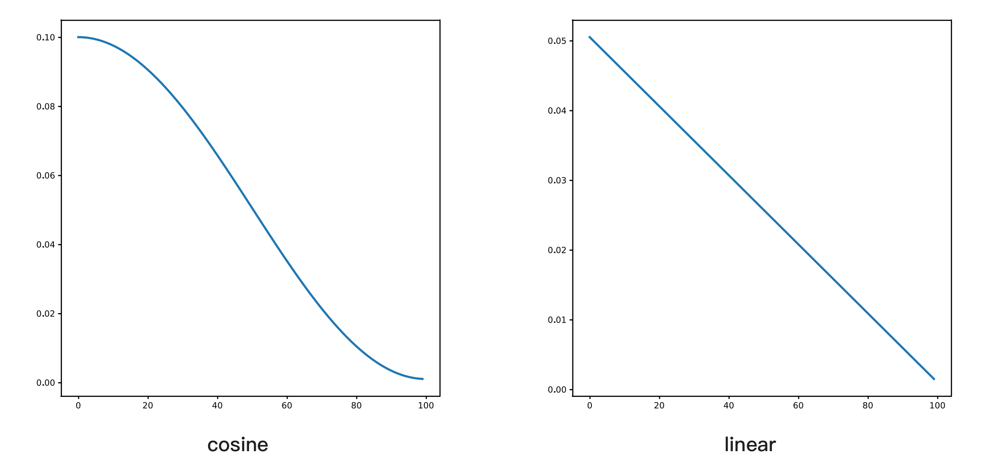

**学习率预热（warmup）**：让模型的学习率从 0 逐渐达到预设值，比如设置为 5，那前 5 个轮次的学习率是从 `lr/5` 开始逐步达到所设置的学习率，如下图所示：

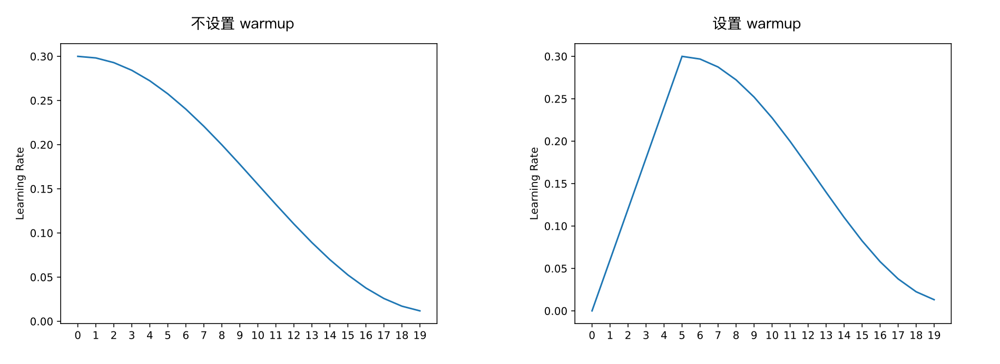

如果设置了 warmup，学习率会先上升再下降，这个配置主要用于模型预训练。如果微调任务和预训练差异较大，初始训练不稳定，也可以尝试设置这个。

需要注意的是，有些框架，比如 Transformers，设置的是 `num_warmup_steps`，所以是每个批次时更新学习率，而不是每个轮次（epoch）。

### 如何配置训练超参数

超参数的配置没有固定规则，这也是训练被称为炼丹的原因。通常有以下两种方法查找参数：

- **通过排列组合查找**：可以设置一些参数范围，比如学习率从 1e-5 到 1e-4，批量大小从 4 到 16，然后用排列组合的方式找到最佳参数。这个方法比较耗时，需要编写自动化脚本，有些工具提供了自动查找功能，比如 Optuna 和 Ray Tune。
- **参考其他人的经验**：本书 [微调实践] 章节介绍了许多微调实践，其中大部分都提供了超参数信息。

在排列组合方面可以参考 IBM 的例子，他们进行了 1 万多次实验 [^halfonStayTunedEmpirical2024]，测试了两个模型、全参数和 LoRA、以及不同任务、不同数据库、不同超参数的效果，具体组合细节如下图所示：

[^halfonStayTunedEmpirical2024]: <http://arxiv.org/abs/2407.18990>

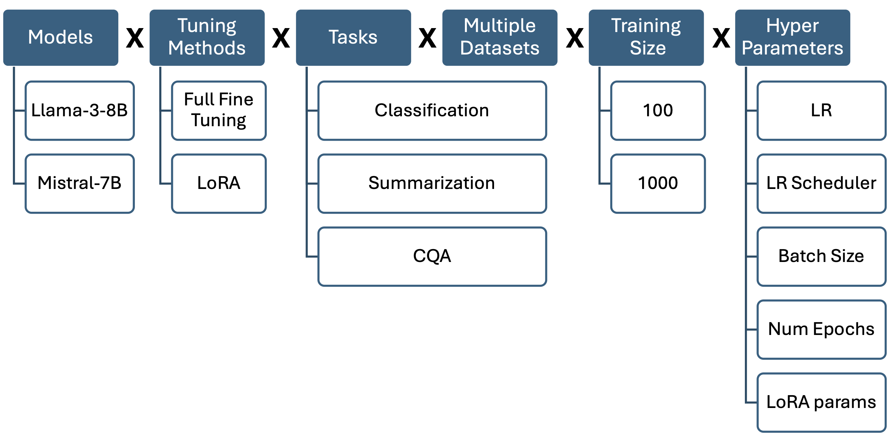

最终实验效果最好的组合如下面表格所示，其中 LoRA $a$ 是指 LoRA 的 alpha，而 LoRA $r$ 是指 LoRA 的 Rank。

| 模型       | 训练方法 | 学习率 | 批量大小 | Epoch | LoRA $a$ | LoRA $r$ |
| ---------- | -------- | ------ | -------- | ----- | -------- | -------- |
| Mistral-7B | 全参数   | 5e-06  | 8        | 5     | -        | -        |
| Mistral-7B | LoRA     | 5e-05  | 32       | 5     | 128      | 128      |
| Llama-3-8B | 全参数   | 1e-05  | 8        | 5     | -        | -        |
| Llama-3-8B | LoRA     | 5e-05  | 8        | 5     | 32       | 128      |

详细结果可以参考原论文，可以发现超参数的效果有一定随机性，比如批量增大和 LoRA 的秩加大效果不一定更好，而且和模型有关，因此没有一个通用的最佳参数。

### 大模型训练的调参和之前深度学习的不同点

本节内容主要来自 DeepMind 的研究 [^xiaoRethinkingConventionalWisdom2024]。这个研究认为，在之前深度学习训练主要关注泛化能力，而大模型训练关注扩展（scale），因此之前机器学习的调参经验不再适用，主要有以下两点不同。

[^xiaoRethinkingConventionalWisdom2024]: <http://arxiv.org/abs/2409.15156>

**学习率**：之前的深度学习认为学习率越大越好，最好设置到能稳定训练的最大值。但在大模型下，学习率和 Loss 的关系是 U 形曲线，如下所示：


大模型下的最佳学习率低于传统深度下的最优学习率。随着学习率增大，模型 loss 降低后又会上升，因此大模型训练时需要小心设置学习率，建议从小到大逐渐增大，找到最佳值。

**批量大小**：之前的深度学习认为批越小越好，类似下面的图，使用深度学习下经典的 ImageNet 数据训练：

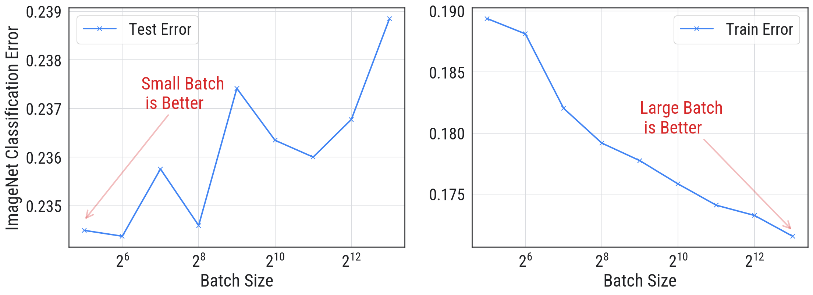

这个图左侧是测试损失，右侧是训练损失。随着批量大小增加，训练损失会降低，但测试损失会上升，说明模型过拟合了。因此，传统深度学习认为批量大小越小越好，越小泛化性越强。

而在大模型场景下，批量大小和验证损失的关系也是 U 形曲线，如下图所示：


可以看到，不是批量大小越小越好，也不是越大越好，最佳值在中间。

最后，作者还测试了不同学习率和不同批量大小下 151M 参数模型的表现，如下图所示：


综合来看，批量大小能决定模型效果的上限，而学习率也对结果有较大影响，这两个值都得仔细寻找最佳组合。

不过这篇作者使用的是 151M 参数模型，对于大部分读者来说主要使用 7B 模型，由于显存限制，批量大小不能太大，因此笔者还是建议优先将批量大小加到显存能支持的最大值，然后再调整学习率测试效果。这样只需测试一个参数，可以节省时间。

### LLaMA-Factory 中的超参数说明汇总

前面已经介绍了所有训练时的关键超参数，但涉及到的篇幅较多不好查找，因此本节总结了 LLaMA-Factory 中的超参数说明及建议，方便快速查阅。因为它使用 Transformers 库训练，所以许多配置项命名来自 TrainingArguments，因此更详细的配置说明还可以参考 Huggingface Trainer 的文档。

- **template**：构造提示词的模板，根据模型选择，比如 llama3，参考 [指令微调的文本格式]，注意在推理时需使用同样的模板。
- **cutoff_len**：训练最大文本 token 数量，可以配置为模型最大支持上下文长度以避免截断。
- **max_samples**：每个数据集的最大样本数，主要用于测试，示例中的默认值是 1000，需要改成大于训练数据量或不设置。
- **per_device_train_batch_size**：每张显卡的批量大小，越大越好，多试几次直到不报内存不足。
- **learning_rate**：学习率，对效果影响很大，要多试不同的值，太低训练速度变慢，甚至会因为精度损失导致不更新，而太高会导致训练不稳定，表现为 loss 波动很大。
- **gradient_accumulation_steps**：梯度累积步数，用于模拟更大批量的效果，适用于显存较小的情况，可以设置为 4。
- **num_train_epochs**：训练轮次，每遍历一次所有训练数据为一轮，太大容易过拟合，建议设置为 2 或 3。
- **lr_scheduler_type**：学习率调度器，通常使用 cosine，对模型训练影响不大。
- **warmup_ratio**：学习率预热比例，用于解决训练初期不稳定问题，建议设置为 0.1。
- **bf16**：使用 BF16 训练，建议开启，除非使用老显卡，比如 V100。
- **deepspeed**：DeepSpeed 配置文件路径，配置后将使用 DeepSpeed 训练。
- **lora 相关的**：参考 [LoRA 训练]。
- **save_steps**：多少步保存一次模型，可用于避免过拟合。
- **验证相关**：比如 eval_strategy 和 eval_steps，可以用于尽早停止来避免过拟合。

## 计算微调所需资源

本节介绍如何计算微调训练所需资源。

### 全参数微调所需显存

大模型微调的主要硬件限制是显存，训练时显存占用主要由以下五部分组成，其中 $𝛹$ 代表模型参数量，使用 FP16 精度，以 13B 的模型为例：

- 参数使用显存 $2𝛹$，大约占用 26GB 显存。
- 梯度值 $2𝛹$，我们要计算每个参数更新时的梯度，因此这个显存占用和参数占用一样，按前面的例子也是 26GB。
- 优化器使用的显存，以 AdamW 为例，它每个参数需要保存三个值，这些值都需要使用 FP32 精度存储，因为用 FP16 很容易因为精度不够导致性能损失，而 FP32 需要占用 4 个字节，因此相当于 12 乘以模型参数量，13B 模型一共需要 `3*4*13=156GB` 显存，这三个值分别是：
  - 梯度指数平滑值，也叫动量参数。
  - 梯度平方指数平滑值，也叫动量二阶矩参数。
  - 模型参数的 FP32 精度值，也叫 master-weight，以避免使用 FP16 计算时精度不足。
- 激活值是模型每一层前向计算时的中间结果，在反向传播时需要用这个值来计算梯度。激活值的显存占用估算比较复杂，后面会列出计算公式，它与批量大小及文本长度有关，并且接近文本长度的平方。文本长度如果增大 2 倍，所需显存就增大 4 倍。
- 其它显存，包括：
  - 临时缓存区 (Temporary buffers)，用于临时存储中间结果申请的显存。
  - PyTorch 使用的显存缓存机制，比如创建了一个 2MB 体积的张量，PyTorch 可能会申请 20MB 显存，这样做可以在后续创建新张量的时候直接使用已经申请的显存，避免频繁申请，但导致了部分显存浪费。
  - 显存碎片，和操作系统中的内存类似，显存的申请也是按页方式，因此会有显存碎片。

其中，优化器从 AdamW 换成 SGD 可以不用保存两个平滑值，从而节省 `2*4*13=104GB` 显存，但使用 SGD 有两个问题：

1. 对学习率敏感，需要多尝试找到更适合的学习率。
2. 训练出来的模型效果不佳，有人 [^zhaoDeconstructingWhatMakes2024] 测试过 SGD 是所有优化器中效果最差的，也有人 [^zhangWhyTransformersNeed2024] 从海森矩阵视角解释了为什么大模型更适合使用 AdamW。

[^zhaoDeconstructingWhatMakes2024]: <http://arxiv.org/abs/2407.07972>

[^zhangWhyTransformersNeed2024]: <http://arxiv.org/abs/2402.16788>

因此，大模型几乎都使用 AdamW 优化器。在这个优化器下，大模型前三部分需要 $16𝛹$ 的显存，但激活值所需显存的计算比较复杂，它的计算公式是

$$
  length * batch * hidden * (34 + 5 * header * \frac{length}{hidden}) * layer
$$

其中 $length$ 是序列长度，$batch$ 是批数量，$hidden$ 是隐藏层维度，$header$ 是 attention 的头数量，$layer$ 是层数。比如 Llama 13B 模型在长度 1024、批量为 1 时需要 14.4GB 显存；如果长度是 2048，需要 44GB 显存；如果训练长度是 4096，则需要 151GB 显存。可以看到，随着长度变长，激活值占用的显存大幅增加。

我们可以通过后面分析工具来查看，比如使用 finetune 开启内存分析后，会生成 `memory-timeline.html` 文件，用浏览器打开会是类似下图：

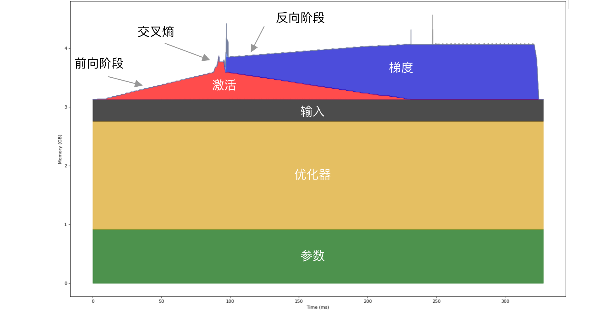

这个示例使用 Qwen2.5 0.5B 模型，使用全参数训练。可以看到显存占用主要由参数、输入和激活组成。这个示例执行了两次前向和反向传播，在前向运行过程中激活值使用的显存逐渐变大，因为每执行一层就需要记录下对应的输出激活值，所以看起来像一个个小台阶。如果你仔细数一下，会发现有 24 个小台阶，正好对应了 Qwen2.5 0.5B 模型有 24 个解码层（Qwen2DecoderLayer）。最后有个突增是交叉熵导致的，将在[交叉熵优化 CCE]中介绍，而在反向传播阶段是逐层更新参数，并逐步释放显存。

当文本变长时，激活所占的显存越来越大，下图是文本长度 1024 和 2048 时的显存占用对比：

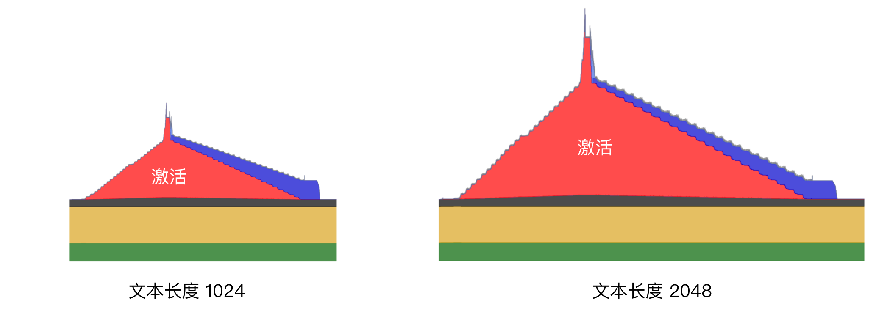

可以看到，当文本长度变长时，激活超过了其它部分的显存占用。

本节介绍的是单卡训练的情况，如果有多张卡，就能将一些部分分摊到其它卡，我们将在下一小节介绍。

### 多卡全参数训练的显存计算

多卡训练框架主要有两个：DeepSpeed 和 Megatron-LM，其中 DeepSpeed 使用简单，而 Megatron-LM 比较复杂，但它能支持更大模型。

如果模型不大于 13B，更推荐使用 DeepSpeed。DeepSpeed 的核心原理是 ZeRO [^rajbhandariZeROMemoryOptimizations2020] 优化。通常训练时每个 GPU 都要加载前面提到的优化器及模型参数，导致显存占用很高。ZeRO 优化所做的事情是每个 GPU 只保留部分数据，以 `ZeRO-1` 为例，它根据 GPU 数量将优化器分成 N 份，训练时会经过以下步骤：

[^rajbhandariZeROMemoryOptimizations2020]: <http://arxiv.org/abs/1910.02054>

- 将数据分为 N 份，在每个 GPU 独立运行前向和反向传播，得到梯度。
- 然后每个 GPU 搜集其它 GPU 的梯度，得到累积梯度，使用 allReduce 操作。
- 因为每个 GPU 只有部分优化器状态，因此只能根据梯度更新一部分参数。
- 从其它 GPU 获取其它部分更新的参数，使用 allGather 操作。

运行流程如下图所示：


ZeRO 一共有三种方案，它们所需显存如下所示，N 是卡数量：

- `ZeRO-1`，分割优化器，每张 GPU 前三部分所需显存为 $(2 + 2) * 𝛹 + 12 * \frac{𝛹}{N}$。
- `ZeRO-2`，在 ZeRO-1 基础上分割梯度，每张 GPU 前三部分所需显存为 $2 * 𝛹 + \frac{(2 + 12) * 𝛹}{N}$。
- `ZeRO-3`，在 ZeRO-2 基础上分割模型参数，内存减少与数据并行度和复杂度成线性关系，每张 GPU 前三部分所需显存为 $\frac{(2 + 2 + 12) * 𝛹}{N}$，但通信量增加 50% 导致训练速度变慢。

用图形化表示如下图所示：

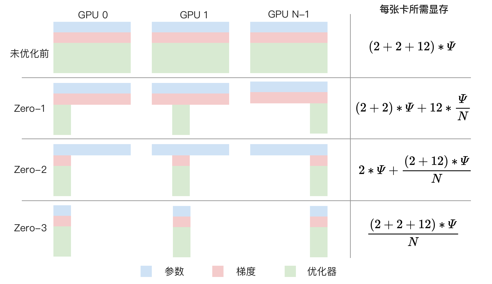

以 8 卡训练 8B 模型为例，不使用 ZeRO 每张卡需要 256GB 显存，ZeRO-1 每张卡需要 44GB 显存，ZeRO-2 每张卡需要 30GB 显存，ZeRO-3 每张卡需要 16GB 显存。

结合前一节内容，可以看到 ZeRO 算法优化降低的是前三部分的显存，通常优先使用 ZeRO-2，因为它的训练速度不会显著降低，而 ZeRO-3 虽然能进一步降低显存，但它会导致训练速度变慢。

如果忘了计算方法，有个更简单的方式是使用 DeepSpeed 中的评估工具，代码如下：

```python
from transformers import AutoModel
from deepspeed.runtime.zero.stage_1_and_2 import estimate_zero2_model_states_mem_needs_all_live
from deepspeed.runtime.zero.stage3 import estimate_zero3_model_states_mem_needs_all_live

model = AutoModel.from_pretrained("Meta-Llama-3.1-8B")

estimate_zero2_model_states_mem_needs_all_live(model, num_gpus_per_node=8, num_nodes=1)
estimate_zero3_model_states_mem_needs_all_live(model, num_gpus_per_node=8, num_nodes=1)
```

以 8B 模型为例的运行结果是 ZeRO-2 所需显存为：

| 每张卡的显存需求 | 配置项                 |
| ---------------- | ---------------------- |
| 13.98 GB         | offload_optimizer=cpu  |
| 29.71 GB         | offload_optimizer=none |

和前面计算的 30 GB 基本一致。另外，ZeRO-2 还支持将优化器显存卸载到 CPU 上，进一步降低显存需求。

而 ZeRO-3 所需显存为：

| 每张卡的显存需求 | 配置项                                     |
| ---------------- | ------------------------------------------ |
| 1.96 GB          | offload_param=cpu, offload_optimizer=cpu   |
| 3.70 GB          | offload_param=none, offload_optimizer=cpu  |
| 17.68 GB         | offload_param=none, offload_optimizer=none |

相比 ZeRO-2，ZeRO-3 可以选择是否将参数卸载到 CPU 上来进一步降低显存。

注意，ZeRO 不支持分割激活值显存，为什么？因为 ZeRO 是一种数据并行的方法，通过前面的运行流程可以看到每个 GPU 运行不同的数据，所以每个 GPU 上的激活值都不同，不像参数那样在每个 GPU 上都是一样的，因此无法分割激活值。

对于长文本训练，激活值会占据大量显存，分析过 13B 模型 4096 长度时需 151GB 显存，要降低激活值显存，目前只能卸载到 CPU 或使用后面提到的激活检查点技术。

### DeepSpeed 使用方法

前面介绍了 DeepSpeed 的原理，本节介绍具体如何使用。DeepSpeed 多卡训练使用起来比较简单，因为 Transformers 框架已经集成了，因此只需要编写一个 JSON 配置文件。目前在 LLaMA-Factory 项目中的 `examples/deepspeed` 目录里提供了参考配置，比如 ZeRO-2 的配置文件如下所示：

```javascript
{
  // 批设置
  "train_batch_size": "auto",
  "train_micro_batch_size_per_gpu": "auto",
  // 梯度相关设置
  "gradient_accumulation_steps": "auto",
  "gradient_clipping": "auto",
  // 是否允许使用不支持的优化器，目前大模型常用的 AdamW 是支持的，所以这个配置项并不需要，具体支持哪些优化器可以参考源码中的 ZERO_SUPPORTED_OPTIMIZERS
  "zero_allow_untested_optimizer": true,
  // FP16 设置，这个配置项也不需要，因为我们主要用 BF16 训练
  "fp16": {
    "enabled": "auto",
    "loss_scale": 0,
    "loss_scale_window": 1000,
    "initial_scale_power": 16,
    "hysteresis": 2,
    "min_loss_scale": 1
  },
  "bf16": {
    "enabled": "auto"
  },
  // ZeRO 相关的配置项，这里很关键
  "zero_optimization": {
    // 表明使用的是 ZeRO-2
    "stage": 2,
    // 是否将优化器卸载到 CPU 上，减小显存占用但大幅降低训练速度
    // "offload_optimizer": {
    //   "device": "cpu",
    //   "pin_memory": true
    // },
    // 是否将参数卸载到 CPU 上，减小显存占用但大幅降低训练速度
    // "offload_param": {
    //   "device": "cpu",
    //   "pin_memory": true
    // },
    // 是否允许重叠通信，通过增加显存来降低 allreduce 时间，可以改成 false 来减小显存占用
    "overlap_comm": true,
    // 这些配置项的值越小显存占用越小，但通讯越慢，建议先用这些默认值
    "allgather_bucket_size": 5e8,
    "reduce_bucket_size": 5e8,
    // 下面是 DeepSpeed 运行时的一些配置项，大部分是默认值一般不用修改
    "allgather_partitions": true,
    "reduce_scatter": true,
    "contiguous_gradients": true,
    "round_robin_gradients": true
  }
}
```

因为我们使用 Transformers 框架训练，它会自动配置一些 DeepSpeed 参数，加上大部分 DeepSpeed 配置只需要默认值就好，因此需要关注的配置项并不多，主要关注的点是 3 个：

- **bf16**：使用 BF16 能让训练更稳定，除了 V100 之类的老显卡都应该开启。
- **stage**：ZeRO 阶段，通常用 1 或 2，显存太小才使用 3。
- **offload_optimizer** 和 **offload_param**：是否将优化器和参数卸载到 CPU 内存上，减小显存占用但大幅降低训练速度。

然后修改 `llama3_lora_sft.yaml` 里的 `deepspeed` 为 JSON 配置文件路径，然后和前面一样的命令启动训练即可。

如果使用 torchtune 微调，它使用的是 PyTorch 里的 FullyShardedDataParallel 数据并行功能，默认相当于 DeepSpeed 的 ZeRO-3（可以通过 ShardingStrategy 配置项改成 ZeRO-2 模式），同时还支持张量并行，而且无需额外配置，只需运行时使用类似 `tune run lora_finetune_distributed` 的命令。

## 降低显存占用

本节汇总一些降低显存的方法。在介绍各种方法前，我们再回顾一下各个部分的显存占用情况，尤其是全参数和 LoRA 训练有重要区别，如下图所示，其中横坐标是时间，纵坐标是内存使用。


可以看到，LoRA 几乎没有梯度和优化器显存，因为这部分只和 LoRA 的小矩阵大小有关，可训练的参数量很少，因此优化点主要是参数和激活。

### 降低精度

降低精度是一种常见的减少显存的方法，训练和推理中都有使用。之前的 QLoRA 训练中就是在模型参数部分使用 NF4 来取代 BF16 精度。

除了参数部分，对于全参数微调，状态器也会大量占用显存，这部分显存也可以通过降低精度来减少，常见的是 8 位 Adam 优化器。

目前在 LLaMA-Factory 项目中，只有 GaLore 微调训练支持 8 位 Adam 优化器，而如果使用 torchtune，可以通过修改配置来实现，比如默认配置是：

```yaml
optimizer:
  _component_: torch.optim.AdamW
  lr: 2e-5
```

将其中的 `torch.optim.AdamW` 改为 `torchao.prototype.low_bit_optim.AdamW8bit` 即可。它的原理是在显存中存储 8 位的数字，计算时先反量化转成 FP32，计算完后又量化回 8 位，这样可以避免精度损失导致无法更新参数。如果全是 INT8 计算，在更新梯度时可能是类似这样的计算 `10 - 0.1 * 1 = 9.9`（其中 10 是参数、0.1 是学习率、1 是梯度），四舍五入转成 INT8 后还是 10，参数没更新。

量化和反量化虽然增加了计算量，但减少了数据传输量，使得整体训练时间反而更快了。

### 激活检查点

激活检查点（Activation Checkpointing 或 Gradient Checkpointing）[^chenTrainingDeepNets2016] 技术可以减少激活值的显存占用。它的原理是丢弃部分激活值，需要的时候再根据之前的值做一次前向计算得到，也就是通过牺牲算力来节省显存。比如下图是一个简化的示例：


在上图的示例中，模型计算经过了两次，每层都有输出激活值。我们可以在计算完「激活 2」之后立刻释放，在反向计算时根据「激活 1」重新计算一次得到「激活 2」，从而节省了一半的激活值显存占用。

下图是笔者使用 Qwen2.5 0.5B 模型全参数微调的显存占用对比，激活部分的显存占用几乎可以忽略，只剩下交叉熵部分。


前面提到过，激活部分的显存是文本长度的平方，因此文本越长占用显存越多。而这个技术可以大幅减少这部分的显存占用（这个示例是使用 torchtune 里默认配置，会计算所有激活值，计算量很大）。

但因为要重新执行前向计算，因此会降低训练速度，下图是使用分析工具查看的对比：

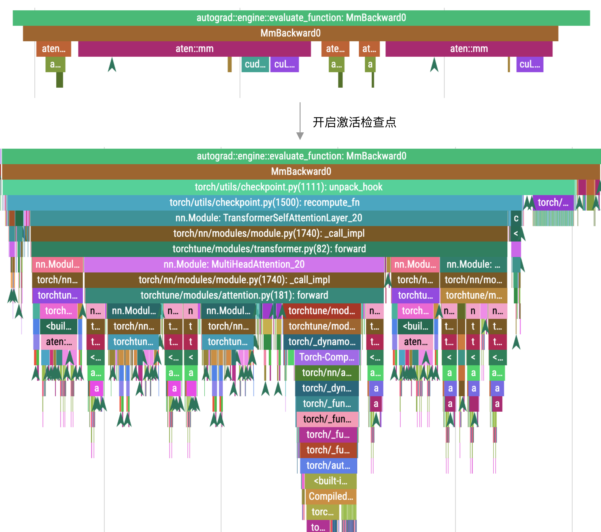

图片上方是未开启时的调用栈，下方是开启后的调用栈。在开启之后，计算量增加了。在这个示例中，原本计算时间是 141 纳秒，开启后变成了 5 毫秒。

虽然显著降低了训练速度，但在长文本下，激活部分的显存占比较高，因此我们可以使用更大的批次，从而提升整体训练速度。比如下表是来自 [^zhangDissectingRuntimePerformance2023] 的测试结果：

| 训练方法            | 批次大小 | 每张卡所需显存 | 吞吐速度 Token/s |
| ------------------- | -------- | -------------- | ---------------- |
| ZeRO-2              | 8        | 58.0 GB        | 21481            |
| ZeRO-2 + 激活检查点 | 64       | 45.9 GB        | 22608            |

使用激活检查点后，批次大小从 8 增加到 64，吞吐速度从 21481 增加到 22608，提升了 5%。

因此建议开启这个技术，它在 LLaMA-Factory 项目中默认是开启的。

在 torchtune 项目中，需要使用 `enable_activation_checkpointing: True` 配置项开启。此外，torchtune 还支持通过配置 `enable_activation_offloading: True` 来将剩下的一些激活显存卸载到 CPU，以进一步降低显存占用。底层它使用了 CUDA stream 技术来并行加载，减少卸载导致的性能损失。

除此之外，torchtune 还支持通过配置 `ac_option` 来控制重计算的层，比如设置为 2 就每两层开启。通过这个配置项可以权衡显存占用和训练速度，不过目前这个配置项还没有文档，属于实验性功能，后续可能有变动，尤其是在 PyTorch 2.4 之后，有个实验性功能 `activation_memory_budget` 可以自动根据显存来调整激活检查点，将会是更好的方案。

### 交叉熵计算分块

前面提到激活检查点后，虽然大幅降低了激活显存，但在前向计算结束时会有个突增无法降低，如下图所示，这是 Qwen2.5 0.5B 模型开启激活检查之后的显存使用情况，文本长度为 2048。


这个突增的主要原因是大模型为了支持更多语言，词表变得越来越大，Qwen2.5 的词表大小是 151K，目前词表量最多的模型 Gemma 2 达到了 256K。

而大模型最后一层计算需要输出每个词的概率，是一个 `seq_len * hidden_size` 的矩阵乘以 `hidden_size * vocab_size` 的矩阵，得到一个 `seq_len * vocab_size` 的矩阵。其中 `seq_len` 是文本长度，`hidden_size` 是隐层维度，`vocab_size` 是词表大小。因此计算结果需要存储文本长度乘以词表大小的矩阵，文本长度越长及词表长度越大，对显存要求就越高。比如，16K 文本长度和 256K 词表大小，在 FP32 精度（需要使用这个精度来减少误差）下就需要 16GB 显存。

优化这部分的显存可以使用分块技术，将它们分块计算，而不需要在显存中存下完整的 `seq_len * vocab_size` 矩阵。原理类似 Flash Attention，这样做还可以将分块放入 SRAM 中，从而减少访问显存来提速。下面是来自 torchtune 简化后的实现代码。

```python
import torch.nn.functional as F

num_output_chunks = 8  # 分段数
# 这些标签不参与损失计算，主要用于屏蔽提示词，在「指令微调的标签」一章中有提到
ignore_index = -100

total_elements = (labels != ignore_index).sum()

# 将输出目标 label 和 logits 分段
labels = [
    target_chunk.reshape(-1)
    for target_chunk in labels.chunk(num_output_chunks, dim=1)
]
logits = [
    logit_chunk.reshape(-1, logit_chunk.size(-1)) for logit_chunk in logits
]

# 每次只计算一个分段
total_loss = 0.0
for logits_chunk, labels_chunk in zip(logits, labels):
    total_loss += F.cross_entropy(
        # 将 logits 转换为 FP32 精度来提升准确性
        logits_chunk.float(), labels_chunk,
        ignore_index=ignore_index, reduction="sum"
    )

return total_loss / total_elements
```

目前在后面会介绍的 Liger Kernel 及 Unsloth 项目中都有实现，因此在 LLaMA-Factory 项目只需使用 `enable_liger_kernel: True` 或 `use_unsloth: True` 配置项就能开启。

如果使用 torchtune 项目，它目前的默认配置就是分段计算，无需额外配置。

### 即时释放梯度

如果不使用累积梯度，我们还可以通过释放梯度来节省内存。它的原理是在计算出梯度之后立刻使用优化器更新参数，然后释放对应的梯度，节省梯度不断增加的显存占用。开启后的效果如下图所示：


可以看到，默认情况下，我们需要一直保持梯度，等更新完参数后再统一释放。而如果使用梯度累积，这部分的显存不能释放，因为累积梯度是进行几步计算之后再更新参数的。

而如果不使用梯度累积，我们就能在每一层使用完对应的梯度之后立刻释放，从而降低整体显存占用，避免超出显存限制。

实现这个功能的代码比较简单，可以使用 PyTorch 2.1 的 `register_post_accumulate_grad_hook` 回调，它会在梯度计算完后进行回调，核心代码如下：

```python
# 每个参数都有一个对应的优化器
optimizer_dict = {p: torch.optim.Adam([p], foreach=False) for p in model.parameters()}

# 每个参数执行参数更新并清理梯度
def optimizer_hook(parameter) -> None:
    optimizer_dict[parameter].step()
    optimizer_dict[parameter].zero_grad()

# 每个参数在计算完梯度后调用 optimizer_hook 方法
for p in model.parameters():
    p.register_post_accumulate_grad_hook(optimizer_hook)
```

目前在 LLaMA-Factory 项目中，只有使用 GaLore 微调训练时才支持这个功能，配置是 `galore_layerwise`。而在 torchtune 项目，所有微调方法都支持这个功能，只需用 `optimizer_in_bwd: True` 配置项开启即可，注意需要使用 `gradient_accumulation_steps: 1` 将累积梯度设置为 1。

### 张量并行

如果显存不够又不想卸载到 CPU，还可以使用 Megatron-LM 或 Megatron-DeepSpeed 的张量并行（也叫模型并行）技术来进行多卡训练。张量并行的原理是将大矩阵相乘拆分为小矩阵相乘，比如按列拆分，如下图所示：


从图中的示例可以看到，两个 GPU 中的 A 矩阵是原先的 1/2，因此减少了显存占用，这样就能训练更大的模型。

除了矩阵拆分，我们还能利用 Transformers 的特点，比如多头注意力机制下每个头独立计算，因此可以将每个头拆分到不同的 GPU 上，如下图所示，来自 Megatron-LM [^shoeybiMegatronLMTrainingMultiBillion2020]。

[^shoeybiMegatronLMTrainingMultiBillion2020]: <http://arxiv.org/abs/1909.08053>


但 Megatron-LM 配置比较复杂，还需要转换模型格式，适用的场景是大于 30B 模型或超过 1000 张卡，不是本书的目标读者，所以不再详细介绍。

另外需要注意张量并行的通信成本很高，如果要多机并行需要使用 InfiniBand 网络，因此通常只用于单机多卡的情况。

### CPU 卸载

如果显存实在不够，还可以将部分数据卸载到 CPU 上，需要的时候再取回来。但卸载到 CPU 会严重降低性能，下面是来自 [^zhangDissectingRuntimePerformance2023] 的测试数据，测试机器是 8 卡 A800，使用 FP16 精度，批量为 1，文本长度是 1024。

[^zhangDissectingRuntimePerformance2023]: <http://arxiv.org/abs/2311.03687>

| 模型大小 | 训练方法           | 每张卡所需显存 | 吞吐速度 Token/s |
| -------- | ------------------ | -------------- | ---------------- |
| 7B       | 不使用 ZeRO        | 66.7 GB        | 7488             |
| 7B       | ZeRO-2             | 37.8 GB        | 6101             |
| 7B       | ZeRO-2 offload CPU | 32.8 GB        | 393              |
| 7B       | ZeRO-3             | 30.5 GB        | 5491             |
| 7B       | ZeRO-3 offload CPU | 10.4 GB        | 271              |
| 13B      | ZeRO-2             | 71.4 GB        | 3234             |
| 13B      | ZeRO-3             | 48.9 GB        | 3670             |

这个表格可以得出以下几个结论：

- ZeRO-2 和 ZeRO-3 都会少量降低训练速度。
- 卸载会显著降低训练速度，比如 ZeRO-2 降低到之前的 1/15，这是因为从内存中取数据受限于内存带宽，这个带宽远小于显存带宽。
- ZeRO-3 在 7B 模型下训练速度变慢，但在 13B 模型下速度反而更快，这点比较反常。

因此，一般推荐使用 ZeRO-2 和 ZeRO-3，只有显存实在太小才考虑卸载到 CPU，比如用 4090 训练 13B 模型。

如果是单卡训练，还可以使用 bitsandbytes 中的 PagedAdamW 优化器，它可以将优化器所使用的显存卸载到 CPU 内存中。原理类似操作系统中的内存分页机制，将参数先放在 CPU 内存中，需要的时候再取回来，同样会影响训练速度，但大幅减少显存占用，下一节将在 torchtune 中使用它。

### 在 48G 显存上全参数微调 7B 模型

不少显卡有 48G 显存，比如面向桌面的 A6000 和面向服务器的 L40S/L20，这些显卡的售价在 2-5 万之间，相对于 A100 和 H100 要便宜得多。如果能使用它们做全参数微调，可以降低成本。

但前面分析过，如果要全参数微调 7B 模型，不包含激活部分就需要 `16 * 7 = 112GB` 显存，是无法训练的。但如果用上前面提到的各种显存优化技术，就可以做到。

这里以 Qwen2.5 7B 模型为例，使用 torchtune 项目，需要先 `pip install bitsandbytes` 安装 bitsandbytes 库，然后使用如下命令生成初始配置：

```bash
tune cp qwen2_5/7B_full_single_device qwen2_5_7b_full.yaml
```

默认情况下，这个配置自动加上了前面提到的显存优化，但最好确认一下，主要是以下几个配置：

```yaml
optimizer:
  # 使用分页 adamw 优化器
  _component_: bitsandbytes.optim.PagedAdamW
  lr: 5e-6
optimizer_in_bwd: True # 优化梯度显存
gradient_accumulation_steps: 1 # 累积梯度只能是 1
enable_activation_checkpointing: True # 激活检查点
compile: True # 使用 PyTorch 编译提升性能
```

然后使用如下命令进行微调：

```bash
tune run full_finetune_single_device --config qwen2_5_7b_full.yaml
```

微调时大概需要 46GB 显存，因此正好能在单张 A6000 或 L20 上运行。虽然运行速度较慢，每一步要 7-10 秒，但至少是可行的，可以用于 LoRA 微调效果不好的场景。

如果是用 LLaMA-Factory 项目，可以使用 GaLore 微调方法，它包含了许多显存优化技术，甚至能在 24G 显存上微调 7B 模型，配置是 `use_galore: True`。

## 提升训练速度

### Flash Attention

FlashAttention [^daoFlashAttentionFastMemoryEfficient2022] 是一种 attention 计算优化方法，它计算结果与原先的 attention 一样，但优化了访问显存模型，使得计算更快。本节内容涉及一些硬件知识，不理解也没关系，可以跳过，只需知道在训练时最好开启，开启后可以提升性能并降低显存占用。

[^daoFlashAttentionFastMemoryEfficient2022]: <http://arxiv.org/abs/2205.14135>

理解 FlashAttention 首先需要了解内存的硬件特点，以 40GB PCIe 接口的 A100 为例，如下图所示：


想要进行 GPU 计算，就得将数据搬运到 GPU 上，这个过程要经历以下几个步骤：

- 从最左侧开始，首先是 CPU 内存，它容量很大，可以大于 1TB，但带宽只有 25 GB/s（DDR4）。
- 接下来是 GPU 显存，A100 使用的 HBM2 显存容量是 40GB，带宽是 1.5 TB/s。
- 然后是 L2 缓存，它有 40MB，读取速度是 5120 Bytes/clk，clk 是时钟周期，A100 GPU 的频率是 1410 MHz，换算后是 6.5 TB/s。L2 缓存由硬件管理，无法用代码控制。
- L2 缓存之后是 L1 缓存，是基于 SRAM 实现的，这是最接近 GPU 计算的缓存，只有 192KB，但它的读取速度最快。笔者没有查到 A100 的官方说明，这里按 FlashAttention 论文里的说法是 19 TB/s，L1 缓存可以在代码中控制。
- 最后，数据从 L1 缓存拷贝到寄存器中，执行计算指令，比如 `add.f32 %f3, %f1, %f2`。寄存器是最快的存储单元，和芯片物理上在一起，速度很快，因此它的延迟可以忽略。

可以看到不同存储介质之间的带宽差异很大。如果能多利用最快的 L1 缓存，就能提升计算速度。接下来我们分析一下 attention 计算过程中的内存访问情况，以前面看到过的代码为例：

```python
scaled = Q.matmul(K.T) / math.sqrt(d_model)
attention = torch.softmax(scaled, dim=0)
output = attention.matmul(V)
```

在硬件层面执行过程是这样的：

- 从 HBM 读取 Q 和 K 矩阵。
- 计算 Q 和 K 转置的相乘，并除以维度的开方，得到 scaled。
- 将 scaled 写入 HBM。
- 从 HBM 中读取 scaled，计算 softmax 得到 attention。
- 将 attention 写入 HBM。
- 从 HBM 读取 attention 和 V。
- 计算 attention 和 V 的相乘，得到 output。
- 将 output 写入 HBM。

由于大模型中的 Q 和 K 矩阵都很大，而且与文本长度有关，由于放不进 L1 缓存中，导致整个过程需要反复读写 HBM，整个过程的主要瓶颈是 HBM 带宽。

FlashAttention 的核心原理是将 Q、K 和 V 进行分块，首先加载一部分 K 和 V 矩阵，然后加载一部分 Q 矩阵，这些矩阵都先加载到 L1 缓存中，然后单独计算这一部分的 attention，再写回 HBM，如下图所示：


图中为了简化画的是一行和一列，实际是多行多列，具体行列数取决于对应 GPU 可用的 L1 缓存大小。通过这种分块的方式，我们将大部分读写操作从 HBM 转移到了 L1 缓存，因此可以大幅减少 HBM 的读写量。以 GPT-2 文本长度 1024 为例，使用 FlashAttention 可以将 HBM 读写量从 40.3GB 减少到 4.4GB。

下面是部分代码示例，来自 [^flash-attention-minimal] 项目：

[^flash-attention-minimal]: <https://github.com/tspeterkim/flash-attention-minimal>

```c
// 通过 __shared__ 关键字使用共享内存，属于 L1 缓存的一部分
extern __shared__ float sram[];
// 定义每个块的大小
int tile_size = Bc * d;
float* Qi = sram;
float* Kj = &sram[tile_size];
float* Vj = &sram[tile_size * 2];
float* S = &sram[tile_size * 3];
// Tc 是 K 和 V 矩阵的块数
for (int j = 0; j < Tc; j++) {
  // 加载一部分 K 和 V 矩阵到共享内存
  for (int x = 0; x < d; x++) {
    Kj[(tx * d) + x] = K[qkv_offset + (tile_size * j) + (tx * d) + x];
    Vj[(tx * d) + x] = V[qkv_offset + (tile_size * j) + (tx * d) + x];
  }

  // Tr 是 Q 矩阵的块数
  for (int i = 0; i < Tr; i++)  {
      // 加载一部分 Q 矩阵到共享内存
      for (int x = 0; x < d; x++) {
        Qi[(tx * d) + x] = Q[qkv_offset + (tile_size * i) + (tx * d) + x];
      }
      // 接下来就是执行 attention 计算和写入 HBM，这里省略
  }
}
```

示例中使用 `__shared__` 关键字申请共享内存，在 V100 之后共享内存和 L1 缓存合并在一起了，所以可以当做前面提到的 L1 缓存，读写速度快得多。而且共享内存的物理原理和显存不一样，缓存使用的是 SRAM 技术，即便是按列读取速度也很快，不需要像显存那样最好按行顺序读取，因此更适合矩阵乘法，因为矩阵乘法需要读取右边矩阵的列。

具体计算细节还包括如何对 softmax 进行分块，介绍起来比较复杂，好在这些细节即便不了解也不影响微调。感兴趣的读者可以阅读原论文中的计算过程描述。

总结一下 FlashAttention 的优点是：

- **效果无损**，FlashAttention 的计算结果与原先一样。
- **提升训练速度**，FlashAttention 减少读写 HBM 量，从 $N d + N^2$ 降低到 $N^2 d^2 M^{-1}$，其中 $M$ 是 L1 缓存大小。在 GPT-2 medium 模型下，训练时间从 21 天减少到 6.9 天。
- **减少显存占用**，标准 Attention 计算中的 Q 和 K 转置相乘结果需要保存成临时变量，它的大小是 $N^2$，$N$ 是文本长度，而 FlashAttention 可以将显存占用减少到 $N$，使得文本越长越节省显存，在 4096 长度下能减少到之前的 1/20。

FlashAttention 的缺点是不保留中间结果，在反向传播时需要重新计算，增加了计算量。但因为整个过程的瓶颈在显存，所以整体性能有提升，因此模型训练时最好开启。

### 使用 BF16 精度

模型训练通常使用浮点数，因为计算过程中有除法，不可避免会有小数。常见的浮点数是 16 位浮点数 FP16 和 32 位浮点数 FP32。FP16 显存占用只有 FP32 的一半，更适合用来训练大模型，但现在大模型训练一般建议使用 BF16，FP16 和 BF16 有什么区别？

首先简单介绍一下浮点数的原理，浮点数要解决的问题是用少量的数字来表达更大范围。比如如果只有 3 位，那只能表示 8 个数字 1-8。如果想表达更大范围，可以将部分数字作为基数，部分数字作为指数，使用计算公式 ${基数} \times 10^{指数}$，比如下面两种做法：

- 如果前一位作为基数，范围是 1 和 2，后两位作为指数，范围是 0-3，那能表示的数字是 [1, 2, 10, 20, 100, 200, 1000, 2000]。
- 如果前两位作为基数，范围是 1-4，后一位作为指数，范围是 0-3，那能表示的数字是 [1, 2, 3, 4, 10, 20, 30, 40]。

可以看到，指数大能表达的范围越大，但精度降低。比如 1000 到 2000 之间的数字都无法准确表示，200 + 1000 的结果就只能是 2000。而基数大粒度越细，精度损失越少。比如第二个方法最大值只有 40，但只是 30 到 40 之间的数字无法准确表示。

现代计算机里的浮点数的细节和前面提到的有些不同，但基本原理是一样的。浮点数由 3 部分组成：符号位、指数 E 和分数 M，计算方法如下：

$$
  M \times 2^E
$$

因此同样的原理可以得知，指数部分越多，数值范围越大；分数部分越多，数字越精确。

具体来说，FP16 由 1 个符号位、5 位指数和 10 位分数组成，它能表示的数字最大值为 $(2−2^{−10}) \times 2^{15} = 65504$。


而 BF16 有 1 个符号位、8 位指数和 7 位分数组成，普通 BF16 数的最大正值为 $3.4 \times 10^{38}$，它能表示的数字范围更大，等同于 FP32 的数字范围，但也导致精度降低。

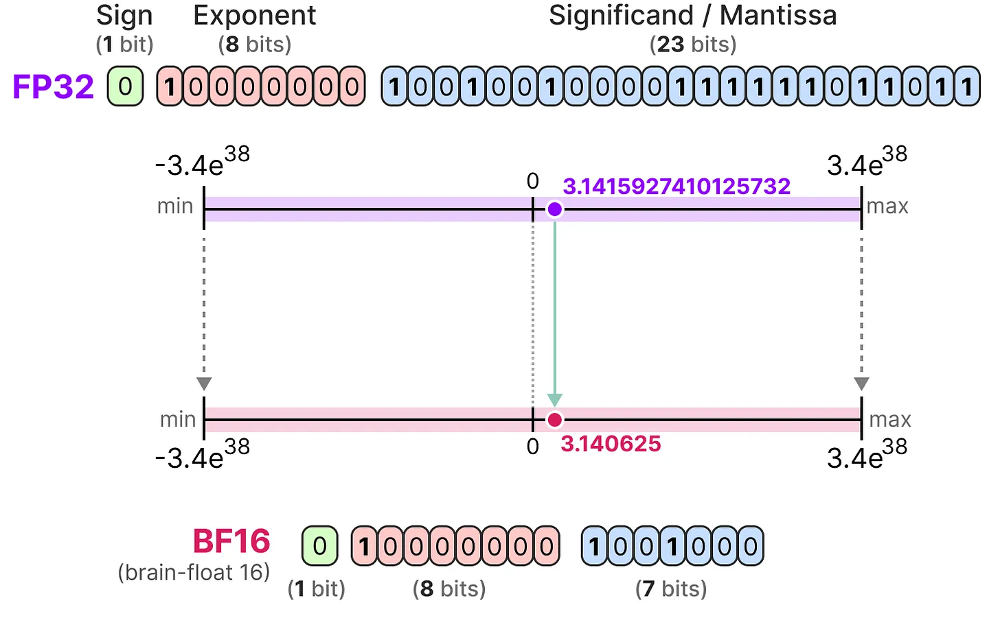

关于精度降低可以做个简单的实验，比如下面这个例子：

```python
>>> torch.tensor(1/3, dtype=torch.bfloat16)
tensor(0.3340, dtype=torch.bfloat16)
>>> torch.tensor(1/3, dtype=torch.float16)
tensor(0.3333, dtype=torch.float16)
```

可以看到，1/3 在 BF16 下变成了 0.334，而在 FP16 则是更接近的 0.333。因此，FP16 表示的数字比 BF16 更精确。

但大模型需要运行大矩阵乘法，比如 LLama 3 13B 的维度是 5120，有 5120 组数字相乘后相加。虽然最新的模型会在每一层做归一化，但数字变多后依然可能出现比较大的值，容易超出 FP16 最大能表示的 65504。一旦溢出，计算结果就是错的，相比精度损失的后果更严重。

这方面有个真实例子是 BLOOM 的训练，最开始使用 FP16，训练很不稳定，部分 loss 损失如下图所示：


训练过程中的 loss 下降很不稳定，经常突然提升，这可能就是溢出导致的问题。后来改成 BF16 后的 loss 则是类似下面的曲线：


在 BF16 下训练稳定了很多，因此大模型最好用 BF16，除非是使用较老的硬件，比如 V100 不支持 BF16。

需要注意，即便是使用 FP16 或 BF16，实际在训练时为了避免精度损失，部分计算使用 FP32 精度，比如 AdamW 优化器所使用的动量和原始参数使用 FP32 精度，这点在[全参数微调所需显存]中有介绍，因此也叫混合精度训练。

### 使用 FP8 精度

FP8 [^micikeviciusFP8FormatsDeep2022] 是 8 位浮点数，显存占用只有 BF16 的一半，主要有两种格式：

[^micikeviciusFP8FormatsDeep2022]: <http://arxiv.org/abs/2209.05433>

- E4M3，由 1 个符号位、4 位指数和 3 位分数组成，能表示的最大值是 448，最小值是 $2^{-6}$。
- E5M2，由 1 个符号位、5 位指数和 2 位分数组成，能表示的最大值是 57344，最小值是 $2^{-14}$。

这两个格式的区别就像 FP16 和 BF16，E4M3 精度高，E5M2 数值范围大，所以训练时推荐权重和激活使用 E4M3，梯度使用 E5M2。

来自微软的研究表明，使用 FP8 混合精度训练大模型可以降低 39% 显存，提升 75% 运行速度，模型效果与 BF16 一样 [^pengFP8LMTrainingFP82023]，因此是更适合大模型训练的格式。在最新的 FlashAttention-3 [^shahFlashAttention3FastAccurate2024] 中已经开始使用。

[^pengFP8LMTrainingFP82023]: <http://arxiv.org/abs/2310.18313>

[^shahFlashAttention3FastAccurate2024]: <http://arxiv.org/abs/2407.08608>

除了训练之外，FP8 也适用于推理，相比 INT8 能更接近 FP16 的效果。下面是 GPT-3 不同版本的困惑度结果（越低越好）：

| 模型       | FP16  | INT8  | FP8 E4M3 |
| ---------- | ----- | ----- | -------- |
| GPT-3 126M | 19.01 | 28.37 | 19.43    |
| GPT-3 1.3B | 10.19 | 12.74 | 10.29    |
| GPT-3 6.7B | 8.51  | 10.29 | 8.41     |

另外，根据 DeepSeek-V3 中的消融实验，FP8 和 BF16 的训练损失差异只有 0.25%。

因此，FP8 是大模型训练领域最有前景的格式，甚至后续也很难再出现更好的格式了，因为进一步降低到 4 位的 FP4/NF4 只能表示 16 个数字，精度丢失比较多，笔者认为不适合用来训练 30B 以下的模型。

但 FP8 训练的主要问题有两个：

- **硬件支持较少**，只有英伟达的 Hopper 和 Ada 以上架构支持，对应的是 H100 卡，这个卡在国内禁售，正规渠道只能买特供的 H20。
- **主流训练框架未支持**，本书介绍的训练框架只有 NeMo 支持使用 FP8 训练，其它工具都需自己实现。

因此国内目前还很少模型使用 FP8 训练，笔者知道的只有 Yi-Lightning [^aiYiLightningTechnicalReport2024] 和 DeepSeek-V3 两个项目，但后续随着软件的成熟，FP8 训练会越来越多。

[^aiYiLightningTechnicalReport2024]: <http://arxiv.org/abs/2409.15156>

在推理方面，除了专业显卡，消费级显卡 RTX 4090 的 Ada 架构在硬件层面支持 FP8，但在软件层面 CUDA 一直不支持，所以没法使用。根据 Nvidia 内部人员的说法 [^ItDoesntSupport]，具体原因是 Ada 架构的实现和 Hopper 架构不同，优先支持了 Hopper 架构，直到 2023 年 6 月的 CUDA 12.1.1 版本才正式支持 Ada 架构，而 RTX 4090 是 2022 年 10 月就发布的。由于长期不能用 FP8，导致目前许多人都还认为 RTX 4090 不支持 FP8。

[^ItDoesntSupport]: <https://github.com/NVIDIA/TransformerEngine/issues/15>

但高通的研究人员曾经详细对比过 FP8 和 INT8 在推理场景下的表现 [^baalenFP8INT8Efficient2023]，得到以下结论：

- FP8 的计算效率比 INT8 低 50% 到 180%。
- 在模型效果方面，FP8 和 INT8 差异不大，部分场景甚至不如 INT8，效果较好的 FP8 格式是不常见的 E2M6 格式。

[^baalenFP8INT8Efficient2023]: <http://arxiv.org/abs/2303.17951>

因此，笔者认为 FP8 在推理场景下优势不大，后续可能不会普及。

最后，FP8 再往下就是 FP4，在最新的 Blackwell 架构中支持，预计后续的 RTX 5090 也会支持。如果训练效果得到广泛验证，将会是未来更有前景的训练优化技术。

### 使用 Liger Kernel 内核优化

Liger Kernel [^hsuLigerKernelEfficient2024] 是 Linked 基于 Triton [^IntroducingTritonOpensource] 实现的内核，宣称能提升 20% 的吞吐量并降低 60% 的显存，可以支持更长文本训练。

[^hsuLigerKernelEfficient2024]: <http://arxiv.org/abs/2410.10989>

[^IntroducingTritonOpensource]: <https://openai.com/index/triton>

Liger Kernel 使用 Triton 实现了 RMSNorm、RoPE、SwiGLU、CrossEntropy 等模块，这些模块原先在 Transformers 中是使用 PyTorch 实现的，底层调用 GPU 内核。Triton 底层也是调用 GPU 内核，为什么它能做到性能更好、显存占用更少呢？具体原理将在下一小节介绍。

虽然 Liger Kernel 底层实现细节比较难懂，但使用起来很简单，只需一行代码就能自动动态替换 Transformers 里的模块：

```python
import transformers
from liger_kernel.transformers import apply_liger_kernel_to_llama

apply_liger_kernel_to_llama()
```

这段代码背后是将原本模型里的模块换成 Liger Kernel 里实现的模块。因为 Python 是动态语言，可以轻松实现替换。比如下面这段代码示例，替换了模型里的 RMSNorm 和 CrossEntropy 模块：

```python
from liger_kernel.transformers.layer_norm import LigerLayerNorm
from liger_kernel.transformers.cross_entropy import LigerCrossEntropyLoss

modeling_llama.LlamaRMSNorm = LigerRMSNorm
modeling_llama.CrossEntropyLoss = LigerCrossEntropyLoss
```

因为需要替换模型实现，使得它需要实现模型里原本 PyTorch 的功能，因此目前支持的模型不多，但包括几个最常用的模型，比如 LLama 2/3、Mistral、Gemma 1/2 和 Qwen2。

如果使用 LLaMA-Factory，只需在配置里加上 `enable_liger_kernel: true` 就能开启。

Liger Kernel 的显存优化的原理类似之前介绍的[交叉熵优化 CCE]，开启后可以显著降低长文本训练时的显存使用。下表是不同文本长度下的交叉熵占用对比，使用的词表大小是 128K，隐藏层维度是 4096：

<!-- https://colab.research.google.com/drive/1Z2QtvaIiLm5MWOs7X6ZPS1MN3hcIJFbj?usp=sharing#scrollTo=8KXVDlKnHGgO -->

| 文本长度 | Huggingface 显存占用 | Liger Kernel 显存占用 |
| -------- | -------------------- | --------------------- |
| 1024     | 8.3GB                | 7.9GB                 |
| 2048     | 8.9GB                | 8.0GB                 |
| 4096     | 11.9GB               | 8.2GB                 |

可以看到，随着文本长度的增加，Liger Kernel 显存占用增加较少，但 Huggingface 显存占用增加较多，因此 Liger Kernel 能显著降低显存使用。

需要注意，Liger Kernel 是专门针对 Transformers 模型的，无法在 torchtune 中使用，但 torchtune 中实现了许多类似的优化，因此并不需要。

### 内核优化的原理

Liger Kernel 是一种内核优化，那什么是内核呢？为什么 Liger Kernel 能比基于 PyTorch 实现的同样代码性能更好？

内核在这里是指一段 GPU 中运行的代码，比如下面是一段简单的内核示例：

```cpp
#include <iostream>
#include <math.h>
// 内核函数，将两个数组相加
__global__ void Add(float *A, float *B, float *C)
{
    int i = threadIdx.x;
    C[i] = A[i] + B[i];
}

int main(void)
{
    // 定义数组长度
    int N = 8;
    float *A, *B, *C;

    // 分配统一内存，可从 CPU 和 GPU 访问，这样就不需要手动来回拷贝了
    cudaMallocManaged(&A, N * sizeof(float));
    cudaMallocManaged(&B, N * sizeof(float));
    cudaMallocManaged(&C, N * sizeof(float));

    // 初始化数组，这里简化了，通常需要从硬盘加载模型参数
    for (int i = 0; i < N; i++)
    {
        A[i] = 1.0f;
        B[i] = 2.0f;
        C[i] = 0.0f;
    }

    // 在 GPU 上运行内核，使用 1 个线程块，N 个线程
    Add<<<1, N>>>(A, B, C);

    // 等待 GPU 完成，因为 GPU 是异步执行的
    cudaDeviceSynchronize();

    // 打印结果
    for (int i = 0; i < N; i++)
        std::cout << C[i] << std::endl;

    // 释放内存
    cudaFree(A);
    cudaFree(B);
    cudaFree(C);
}
```

这段代码可以通过 `nvcc add.cu -o add` 命令编译，然后通过 `./add` 运行，运行结果为 C 数组中每个元素的值都是 3.0。

这段代码中 `main` 函数运行在 CPU 上，主要工作是从硬盘中加载数据到 GPU，然后调用内核代码，也就是 `Add` 函数。这个函数看起来是普通 C 语言代码，但它实际执行时是编译成 GPU 指令后在 GPU 上运行的，比如在 Nvidia 显卡中，它会先编译成 PTX 中间格式，一种类似 LLVM-IR 的底层虚拟指令，然后再编译成 SASS 汇编。比如前面这个简单例子的 PTX 中间格式如下所示（可以使用 `nvcc -ptx add.cu` 命令生成），很像 CPU 中的汇编代码：

```asm
;加载参数地址到寄存器 %rd1、%rd2、%rd3
ld.param.u64    %rd1, [Add(float*, float*, float*)_param_0];
ld.param.u64    %rd2, [Add(float*, float*, float*)_param_1];
ld.param.u64    %rd3, [Add(float*, float*, float*)_param_2];
;将地址转成全局地址
cvta.to.global.u64      %rd4, %rd3;
cvta.to.global.u64      %rd5, %rd2;
cvta.to.global.u64      %rd6, %rd1;
;获取 threadIdx.x 存入寄存器 %rd7
mov.u32         %r1, %tid.x;
mul.wide.s32    %rd7, %r1, 4;
;加载 A[i] 和 B[i]
add.s64         %rd8, %rd6, %rd7; 计算 A[i] 偏移地址
ld.global.f32   %f1, [%rd8]; 加载 A[i] 到寄存器 %f1
add.s64         %rd9, %rd5, %rd7; 计算 B[i] 偏移地址
ld.global.f32   %f2, [%rd9]; 加载 B[i] 到寄存器 %f2
;计算 A[i] + B[i]，存入寄存器 %f3
add.f32         %f3, %f1, %f2;
;将结果存入 C[i] 并返回
add.s64         %rd10, %rd4, %rd7; 计算 C[i] 偏移地址
st.global.f32   [%rd10], %f3; 存入 C[i]
ret;
```

这个 `Add` 函数就叫内核，GPU 中的内核可以并行执行。每个内核执行时会得到一个专属的 `threadIdx` 变量，这是自动分配的。这个简单的示例只用了一个线程块，如果使用多个线程块，还需使用 `blockIdx` 和 `blockDim` 来获取不同块的数据。本书不是 CUDA 教程，所以不再展开，这里只是为了说明内核的基本原理。

如果使用 PyTorch 实现，它的执行过程是将操作拆分成一个个小单元，也叫算子，每个算子对应一个独立的内核。比如两个向量相加，底层就有对应的 CUDA 相加内核。这样做的好处是实现起来很通用，可以支持多种算法，也能方便实现不同硬件的支持，新的加速硬件只需实现一些基础算子即可。

但这样拆分算子带来的问题是大量 CUDA 调用，而且每次都要读写显存，导致性能下降。而 Liger Kernel 的实现原理就是将 RMSNorm 等算法直接实现在一个内核中，避免了调用大量内核，而且还能更好地利用缓存，减少读写显存的次数，提升性能。

以 RMSNorm 为例，之前 Transformers 里的实现是分别调用 `pow`、`mean` 和矩阵乘法。

```python
variance = hidden_states.pow(2).mean(-1, keepdim=True)
hidden_states = hidden_states * torch.rsqrt(variance + self.variance_epsilon)
return self.weight * hidden_states
```

即便是调用 PyTorch 内置的 `torch.nn.RMSNorm` 函数，它目前（PyTorch 2.4）的实现也是拆分成一个个小算子计算，比如：

```cpp
Tensor rqrst_input = rsqrt(at::pow(upcasted_input, 2).mean(dims_to_reduce_ref, true).add_(eps_val));
Tensor result = upcasted_input.mul(rqrst_input).type_as(input);
```

上面是 PyTorch 中 C++ 部分的代码，代码在 `aten/src/ATen/native/layer_norm.cpp` 中。我们不用关心它的代码细节，只需知道它调用了许多算子，每个算子都需要调用对应的 GPU 内核执行，比如 `rsqrt` 对应的是 `rsqrt_kernel_cuda` 内核。因此，执行这个 RMSNorm 计算需要运行多个内核。

而自定义内核就能在一个内核里实现这个功能，这样一方面可以减少调用次数导致的额外损耗，另一方面还能减少读写 HBM 次数，还能进行更细粒度的优化。比如下面是基于 Triton 实现的 RMSNorm 内核部分代码：

```python
@triton.jit
def _rms_norm_forward_kernel(...):
    """
    前向传播的内核，省略了大部分代码，主要是加载数据相关的
    """
    # 计算均方值
    mean_square = tl.sum(X_row * X_row, axis=0) / n_cols
    # rsqrt 是平方根的倒数，计算结果就是 RMS 的倒数
    rstd = rsqrt(mean_square + eps)
    # 缓存 RMS 的倒数用于反向传播
    tl.store(RSTD_ptr, rstd)

@triton.jit
def _rms_norm_backward_kernel(...):
    """
    反向传播的内核，省略了大部分代码
    """
    # 获取缓存的 RMS 值的倒数
    rstd_row = tl.load(RSTD_ptr)
```

其中 `tl.store(RSTD_ptr, rstd)` 存下了 RMS 值的倒数，这样在反向传播计算时就不需要再重复计算 `rstd` 了，减少了 `*`、`/`、`sum`、`sqrt` 四次计算操作。不过这样会增加显存使用，可以看到使用 Triton 能实现更细致的优化。

这里简单介绍一下 Triton 的使用，前面 CUDA 实现的版本换成 Triton 代码如下：

```python
import torch

import triton
import triton.language as tl

@triton.jit
def add_kernel(a_ptr, b_ptr, c_ptr, n_elements, BLOCK_SIZE: tl.constexpr):
    pid = tl.program_id(axis=0)
    block_start = pid * BLOCK_SIZE
    offsets = block_start + tl.arange(0, BLOCK_SIZE)
    mask = offsets < n_elements # 避免越界访问
    # 加载 a 和 b 的向量
    a = tl.load(a_ptr + offsets, mask=mask)
    b = tl.load(b_ptr + offsets, mask=mask)
    output = a + b
    # 将结果写入 c 中
    tl.store(c_ptr + offsets, output, mask=mask)

def add(a: torch.Tensor, b: torch.Tensor):
    c = torch.empty_like(a) # 创建一个和 a 形状相同的空张量
    n_elements = c.numel() # 获取元素数量
    grid = lambda meta: (triton.cdiv(n_elements, meta['BLOCK_SIZE']), ) # 设置每个线程块的大小为 4
    add_kernel[grid](a, b, c, n_elements, BLOCK_SIZE=4) # 调用内核
    return c

size = 8 # 生成 8 个随机数字
a = torch.rand(size, device='cuda')
b = torch.rand(size, device='cuda')
output_triton = add(a, b)
print(output_triton)
```

Triton 和前面 CUDA 最大的不同是 CUDA 是操作一个个数据里的数据，而 Triton 是操作一个数组。比如前面的例子中，我们设置每个线程块的大小为 4，而一共要处理 8 个数值的相加，因此会启动两个内核，第一个处理 `[0:4]` 的数据，第二个处理 `[4:8]` 的数据，其中的 `output = a + b` 是操作数组，而不是一个个数据。

Triton 的开发成本低于 CUDA，因为简化了共享内存管理、线程同步等功能，而且使用 Python 语法上手简单。

另外，Triton 还有一个优点是不受 CUDA 许可的限制，可以支持 AMD 及国产的天数和摩尔线程等 GPU，因此成为了目前高性能计算领域很有前景的技术。感兴趣的读者推荐看看 FlagGems 项目，它实现了大量基础算子。

但目前 Triton 性能不如 CUDA，根据 PyTorch 的测试，在推理场景下使用 Triton 的性能是 CUDA 的 80% [^cudaFree]，因此目前 Triton 主要用在训练场景中优化显存占用。

[^cudaFree]: <https://pytorch.org/blog/cuda-free-inference-for-llms/>

### PyTorch 编译优化

PyTorch 2.0 中引入了编译技术，只需一行代码 `torch.compile` 就能自动优化模型实现。在 CUDA 下，它的原理是生成基于 Triton 编写的内核。

我们还是以之前的 RMSNorm 为例，测试代码如下：

```python
import torch
torch.set_float32_matmul_precision('high') # 开启 TensorFloat32 提升性能
rms_norm = torch.nn.RMSNorm([2, 3]).to('cuda')
rms_norm = torch.compile(rms_norm) # 开启自动编译
rms_norm(torch.randn(2, 2, 3).to('cuda'))
```

然后通过如下方式运行：

```bash
TORCH_COMPILE_DEBUG=1 python rms_norm.py
```

运行后在当前目录下会生成一个 `torch_compile_debug` 目录，里面记录了编译详情，关键的生成代码在 `torchinductor/model__0_forward_1.0/output_code.py` 文件中，生成的代码较长，以下是部分代码示意：

```python
@triton.jit
def triton_poi_fused_add_mean_pow_rsqrt_0():
    # 省略了大部分
    tmp1 = tmp0 * tmp0
    tmp3 = tmp2 * tmp2
    tmp4 = tmp1 + tmp3
    tmp6 = tmp5 * tmp5
    tmp7 = tmp4 + tmp6
    tmp9 = tmp8 * tmp8
    tmp10 = tmp7 + tmp9
    tmp12 = tmp11 * tmp11
    tmp13 = tmp10 + tmp12
    tmp15 = tmp14 * tmp14
    tmp16 = tmp13 + tmp15
    tmp17 = 6.0
    tmp18 = tmp16 / tmp17
    tmp19 = 1.1920928955078125e-07
    tmp20 = tmp18 + tmp19
    tmp21 = libdevice.rsqrt(tmp20)
```

这段代码将原本的 `pow`、`mean`、`add` 和 `rsqrt` 的调用合并到一个内核里了，比较难懂，训练时如果开启就会发现原先的代码替换成了类似下图的调用：


那个 `/tmp/torchinductor_root/` 目录里的文件就是编译后的代码。

我们可以在 `torchtune` 中通过 `compile: True` 配置项开启编译功能。开启后首次运行速度较慢，但后续运行速度会变快。比如前面 Qwen2.5-0.5B 全参数微调的示例，之前是每秒 4 步，显存使用 8.56 G，开启后每秒 5 步，显存使用 6.46 G。因此，开启后既能提升速度，又能降低显存占用，因此建议开启此配置。

不过在 LLaMA-Factory 项目中，笔者并未找到开启的配置，但如果使用后面提到的 Unsloth 内核优化，它的内部实现会调用 `torch.compile` 来优化模型，因此也能达到类似的效果。

### Unsloth 内核优化

Unsloth 是另一个使用 Triton 开发的训练内核优化，和前面介绍的 Liger Kernel 类似，它诞生时间更早，因此在 Liger Kernel 项目中有些代码是参考它的，比如 `rms_norm` 的实现。因此它的优化原理也是一样的，主要是算子融合和分块计算来提升性能和降低显存。

Unsloth 的功能比 Liger Kernel 更完整，你可以不安装 LLaMA-Factory 项目，直接使用 Unsloth 的接口来微调，并支持直接输出 llama.cpp 所需的 GGUF 格式。

在性能方面，笔者测试的情况是 Unsloth 比 Liger Kernel 更快，显存占用也更少，主要原因可能是 Unsloth 针对 LoRA 训练做了特殊优化，用 Triton 实现了 LoRA 的前向和反向传播，而这方面 Liger Kernel 还没做。因此，如果主要使用 LoRA 训练，推荐试试 Unsloth。在 LLaMA-Factory 项目中只需使用 `use_unsloth: True` 配置项开启即可。

但 Unsloth 的缺点是不支持多 GPU 训练，这个功能目前放在收费的 Unsloth Pro 版本中，而 Liger Kernel 则没有这个限制。主要原因是 Unsloth 是由 Daniel Han 两兄弟成立的小公司开发的，相比之下 Liger Kernel 是由 LinkedIn 工程团队开发的，本身没有盈利压力。

笔者个人更喜欢用 Liger Kernel，因为它在工程方面做得更好，整个项目有一半代码是单元测试，保证了项目后续质量，而 Unsloth 几乎没有单元测试，而且 git 提交信息也写得很随意，代码质量不如 Liger Kernel。

### 样本打包

微调训练时每次是分批进行训练，我们需要将一个批次内的文本长度补齐，构造成矩形来用于后续计算，如下图所示：


图上的示例以最长文本长度为基准，将其它文本长度补齐，不够的部分通过添加一个特殊的 EOS token 来填充，这个 token 在 Qwen 中的文本形式是 `<|endoftext|>`。

我们可以用 Tokenizer 来实现这个功能，代码如下所示：

```python
import torch
from transformers import AutoTokenizer

model_path = "/path/to/Qwen2.5-0.5B"
tokenizer = AutoTokenizer.from_pretrained(model_path)
sequences = [
  "从前有座山",
  "山上有",
]
batch = tokenizer(sequences, padding=True)
print(batch)
```

输出结果如下：

```python
{
  'input_ids': [
    [109924, 18830, 99579, 57811],
    [57811, 106500, 151643, 151643]
  ],
  'attention_mask': [
    [1, 1, 1, 1],
    [1, 1, 0, 0]
  ]
}
```

其中 `151643` 就是 EOS token，而 `attention_mask` 是用来标记哪些 token 是有效的，哪些是填充的。

然而，这种补全方式有两个缺点：

- **不能充分利用显存**，因为训练文本长度不一致导致每个批次所需显存不一致。比如，假设绝大部分指令长度是 100，使用批次为 8 时显存刚好够用，但如果有 1 个指令长度是 200，批次就只能设置为 4，大部分指令在训练时不能充分利用显存。
- **浪费计算资源**，假设有一个批次里某个指令很长，其它指令都很短，就需要填充大量 EOS token，这些 token 在计算时会浪费计算资源。

有什么更好的方式吗？有的，就是本节介绍的指令打包技术（packing），它将多个指令打包成最大长度，如下图所示：

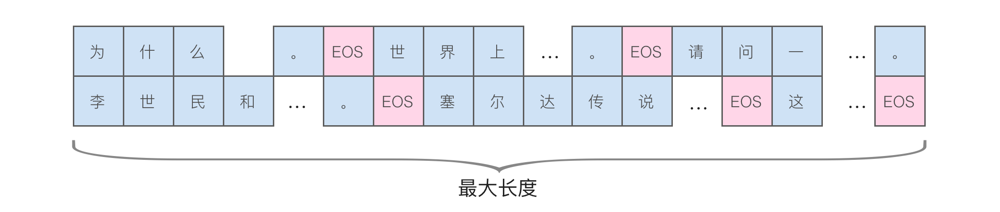

原先每行文本只有一个指令，这种方式可以放下多个指令，从而能充分利用显存。因此，本书推荐开启这个配置来提升训练速度。根据笔者的经验，开启后通常能提升 3-4 倍的训练速度，具体提升多少取决于训练文本长度。

另外，开启这个配置最好同时开启[激活检查点]来降低显存占用，否则在长文本训练时会大量占用显存，导致显存不足。

在 LLaMA-Factory 中开启这个配置很简单，只需要将 `packing` 设置为 `true` 即可，其它工具也是类似的配置项。

如果想了解具体实现代码，可以参考 TRL 项目里的 `ConstantLengthDataset`，下面的代码是对其进行了适当删减以便于阅读：

```python
class ConstantLengthDataset(IterableDataset):
  def __iter__(self):
    # 创建数据集的迭代器
    iterator = iter(self.dataset)
    more_examples = True
    while more_examples:  # 外层循环，只要还有样本就继续
      # 初始化 buffer 用于收集样本
      buffer, buffer_len = [], 0
      while True:
        if buffer_len >= self.max_buffer_size:
          break  # 如果 buffer 达到最大长度就退出
        try:
          # 获取下一个样本并添加到 buffer
          buffer.append(next(iterator))
          buffer_len += len(buffer[-1])  # 更新 buffer 长度
        except StopIteration:  # 如果迭代到数据集末尾
          more_examples = False  # 否则标记没有更多样本
          break

      # 使用 tokenizer 进行分词
      tokenized_inputs = self.tokenizer(
        buffer,
        add_special_tokens=self.add_special_tokens,
        truncation=False
      )["input_ids"]

      # 收集所有 token ID
      all_token_ids = []
      for tokenized_input in tokenized_inputs:
        # 在每个输入后添加 EOS token
        tokenized_input = tokenized_input + [self.eos_token_id]
        all_token_ids.extend(tokenized_input)

      # 将 token 序列切分成固定长度的样本
      examples = []
      for i in range(0, len(all_token_ids), self.seq_length):
        input_ids = all_token_ids[i : i + self.seq_length]
        if len(input_ids) == self.seq_length:
          examples.append(input_ids)

      # 输出打包后的样本用于训练
      for example in examples:
        self.current_size += 1
        yield {
          "input_ids": torch.LongTensor(example),
          "labels": torch.LongTensor(example),
        }
```

你可能会好奇，这样拼接到一起难道不会相互影响吗？答案是确实有可能，但模型可以通过 EOS token 来区分。为了避免相互影响，需要通过修改遮罩来让注意力计算限制在一个指令内，如下图所示：


目前，torchtune 和 NeMo 都默认支持，而 LLaMA-Factory 需要通过 `neat_packing` 配置项来开启。

## 不同训练优化方法的对比

<!-- https://www.youtube.com/watch?v=43X9E25-Qg0 -->

下表是来自 torchtune 的测试，具体模型未知，使用 QLoRA 训练，训练数据有 5.2 万（Alpaca），单个 GPU，批次是 2。

| 方法                                           | 显存占用 | 总时间   |
| ---------------------------------------------- | -------- | -------- |
| 默认                                           | 6.8 GB   | 358 分钟 |
| PyTorch 编译                                   | 6.4 GB   | 115 分钟 |
| 样本打包（2048）                               | 9.8 GB   | 91 分钟  |
| 样本打包（8192）                               | 22.5 GB  | 65 分钟  |
| PyTorch 编译，样本打包（2048）                 | 8 GB     | 51 分钟  |
| PyTorch 编译，样本打包（8192）                 | 14.6 GB  | 46 分钟  |
| PyTorch 编译，样本打包（2048），关闭激活点检查 | 39.2 GB  | 36 分钟  |

可以看到，使用 PyTorch 编译可以显著提升速度并降低显存，而关闭激活点检查也能提升速度，但会占用较多显存。因此，需要根据自己的硬件情况进行取舍。如果有 40GB 显存，我们就能将原先需要 6 小时的训练缩短到半小时，大幅提升效率。

## 基础模型增强

本节介绍两种基础模型增强方法：继续预训练和词表扩充。

### 继续预训练

如果微调的领域有大量专有名词或特定写法，可能会导致微调效果不佳。这时，可以对预训练模型进行二次预训练，这称为继续预训练或增量预训练。它的训练过程与预训练相同，但使用的是垂直领域的文本。

不少垂直领域的模型微调实践都进行了继续预训练，包括法律、电信等领域，并验证了继续预训练能够提升微调效果。因此，如果能找到大量相关文本，推荐进行继续预训练。

继续预训练需要准备相关领域的大量文本，文本越多越好。许多论文中使用了上百 GB 的文本，但我们尝试过使用十几 MB 的小量文本也能提升后续微调效果。不过，当文本较少时，相应的学习率需要提高。

继续预训练的参数与微调相同，也可以使用 LoRA 来降低显存需求，但需要根据数据量调整学习率等参数。

具体如何进行？这里以 LLaMA-Factory 为例，首先修改 `data/dataset_info.json` 文件，添加一个新的数据源，如下所示：

```json
  "pretrain_data": {
    "file_name": "pretrain_data.json",
    "columns": {
      "prompt": "text"
    }
  },
```

其中的 `pretrain_data.json` 文件就是预训练文本。在 `data` 目录下创建这个文件，内容如下所示，是一个 JSON 数组，每个对象中的 `text` 是预训练文本：

```json
[{"text": "文本 1"}, {"text": "文本 2"}]
```

然后修改代码中的 `examples/train_lora/llama3_lora_pretrain.yaml` 文件，将其中的 `c4_demo` 改成 `pretrain_data`，然后运行下面的命令进行训练：

```bash
llamafactory-cli train examples/lora_single_gpu/llama3_lora_pretrain.yaml
```

这个命令是使用 LoRA 训练，得到的训练后的 LoRA 可以与模型权重合并，得到新的模型用于后续微调。

需要注意的是，使用 LoRA 进行增量预训练的效果可能不如全参数预训练。如果发现训练 Loss 降低缓慢，可以调大学习率，或者使用全参数预训练。

### Llama 中的预训练技术

虽然绝大部分读者不会从零训练自己的模型，但微调有时需要进行继续预训练，因此了解预训练中的技术对微调也有帮助，尤其是如何过滤重复和低质量数据。因此，本节将介绍 Llama 3 预训练的数据处理技术。

Llama 3 没有详细介绍数据来源，这可能是出于版权问题，但在最早的 LLaMA 论文中列出了数据来自以下几部分，其他许多大模型也使用类似的数据来源：

| 来源          | 抽样比例 | Epoch | 磁盘空间 |
| ------------- | -------- | ----- | -------- |
| CommonCrawl   | 67.0%    | 1.10  | 3.3 TB   |
| C4            | 15.0%    | 1.06  | 783 GB   |
| Github        | 4.5%     | 0.64  | 328 GB   |
| Wikipedia     | 4.5%     | 2.45  | 83 GB    |
| Books         | 4.5%     | 2.23  | 85 GB    |
| ArXiv         | 2.5%     | 1.06  | 92 GB    |
| StackExchange | 2.0%     | 1.03  | 78 GB    |

其中，CommonCrawl 是目前最大的网页抓取数据，C4 是 Google 基于 CommonCrawl 清理后的数据。这些数据经历了以下清洗过程：

**删除有害域名**：根据域名移除一些包含色情、有害内容及个人信息的站点。

**文本提取和清理**：对 HTML 进行解析，提取出主体内容，包括数学公式及图片的 alt 属性，移除所有 markdown 标记，因为发现 markdown 标记会影响模型训练效果。

**去重**：在 URL、文档、行级别进行去重。

- **URL 级别去重**：因为不同数据集可能包含相同网页，所以只保留每个 URL 的最新版本。
- **文档级别去重**：对文档使用 MinHash 算法移除相近的内容。
- **行级别去重**：在每 3000 万文档中，如果发现有出现 6 次以上相同的多行，就认为是重复的。这种去重不仅能去掉重复文档，还可以去掉页面中与内容不相关的重复内容，比如导航栏、cookie 提醒等。

**启发式过滤**：使用启发式方法取出低质量、异常、包含过多重复内容的文档，例如：

- 使用重复 n-gram 覆盖率来去除有重复内容组成的行，比如日志或错误信息。这些行仅靠内容无法去重，但通常包含大量相同的词汇。
- 使用“脏词”计数来过滤成人内容。
- 使用基于 token 分布的 KL 散度（Kullback-Leibler）来过滤包含过多异常 token 的文档。

这里解释一下 KL 散度，它可以用来衡量两个概率分布之间的差异，计算公式为：

$$
D_{KL}(P||Q) = \sum_{x}P(x)\log\frac{P(x)}{Q(x)}
$$

其中 $P(x)$ 和 $Q(x)$ 分别表示 $x$ 在 $P$ 和 $Q$ 中的概率。计算结果越大，说明两个概率分布之间的差异越大。

**使用模型进行质量过滤**：使用两种方法，一个是基于 fastText 训练的分类器，另一个是基于 Llama 2 模型训练的分类器对文档进行打分。

**代码和推理数据**：使用 Llama 2 训练的分类器来提取页面中的代码和推理信息，因为这些推理信息对提升模型思考能力有帮助。

以上就是 Llama 3 在数据处理中使用的技术，这些技术通用性强，也可以应用于垂直领域的预训练数据。

### 扩充词表

在 [Token] 中介绍过大模型的输入和输出都是 token，这些 token 来自模型内部词表。以 LLaMA 2 为例，它的词表大小为 32000，但这个词表中只有几百个中文，不在这个词表中的中文会转成 UTF-8 字符。例如，“哲学”经过编码后变成了“`<0xE5><0x93><0xB2>学`”。由于词表中没有“哲”这个字，就只能用它的 UTF-8 字节来表示。

这会带来两个问题：

- **增加计算时间**：因为每次只能输出一个 token，所以原本的 2 个字变成了 4 个 token，速度减慢了一倍。
- **影响准确率**：输出时每个 token 都是按概率选择，由于一个字变成了 3 个 token，而且都是 UTF-8 字符，导致有可能选错，最后输出的是乱码。

为了解决 LLaMA 词表中中文数量太少的问题，有一个专门优化的 Chinese-LLaMA 项目，其实现步骤如下：

**第一步，收集中文文本**：有两个版本，一个是 20G 的版本，包括 Chinese BERT-wwm、MacBERT 和 LERT，另一个是 120G 的版本，额外包含了来自 CommonCrawl 和百科。

**第二步，计算中文词表**：使用 SentencePiece 基于前面的文本训练词表，训练方法是使用下面的命令行：

```bash
spm_train --input=data.txt --model_prefix=zh_bpe --vocab_size=20000 --model_type=bpe
```

具体执行过程在 [bpe] 中介绍过，其中 20000 是要得到的词表大小。

**第三步，将中文词表合入 LLaMA 的词表**：接下来是将这些新的词合入 LLaMA 的词表。实现代码如下，这里代码做了部分删减以方便阅读，实际使用时请使用项目中的完整代码：

```python
from transformers import LlamaTokenizer
from sentencepiece import sentencepiece_model_pb2 as sp_pb2_model
import sentencepiece as spm

llama_tokenizer_dir = '<llama 原先的 token 路径>'
chinese_sp_model_file = '<新的 token 路径>'

# 加载这两个 token
llama_tokenizer = LlamaTokenizer.from_pretrained(llama_tokenizer_dir)
chinese_sp_model = spm.SentencePieceProcessor()
chinese_sp_model.Load(chinese_sp_model_file)

# 初始化模型
llama_spm = sp_pb2_model.ModelProto()
llama_spm.ParseFromString(llama_tokenizer.sp_model())
chinese_spm = sp_pb2_model.ModelProto()
chinese_spm.ParseFromString(chinese_sp_model)

# 将新的 token 添加到 llama_spm 中
llama_spm_tokens_set = set(p.piece for p in llama_spm.pieces)
for p in chinese_spm.pieces:
    piece = p.piece
    # 如果不在就添加
    if piece not in llama_spm_tokens_set:
        new_p = sp_pb2_model.ModelProto().SentencePiece()
        new_p.piece = piece
        new_p.score = 0
        llama_spm.pieces.append(new_p)

# 保存新的 token
with open('<合并后的 token 路径>/chinese_llama.model', 'wb') as f:
    f.write(llama_spm.SerializeToString())
```

最终得到了新的词表，在 Chinese LLaMA 中词表扩充到了 49953，新的词表中包含了大量中文短语，比如前面提到的“哲学”变成了 1 个 token，减少了文本所需的 token 数量。作者还用 Wikipedia 中文内容做过测试，文件大小为 1.7G，新模型的 token 数量减少了 43.9% [^cuiEfficientEffectiveText2024]。

[^cuiEfficientEffectiveText2024]: <http://arxiv.org/abs/2304.08177>

**最后一步，模型二次预训练**：模型内部不认识这些新的词表，因此还需要进行二次预训练以调整模型参数。

Chinese LLaMA 中的做法是分成两步训练。第一阶段只训练嵌入层，也就是模型中的 `embed_tokens`，第二阶段使用 LoRA 训练模型的大部分参数及嵌入层，尤其是需要训练 `embed_tokens` 和 `lm_head`，它们是 LLaMA 中的嵌入层和最后输出层。可以通过打印模型架构看到，如下所示：

```python
LlamaForCausalLM(
  (model): LlamaModel(
    (embed_tokens): Embedding(32000, 4096)
    (layers): ModuleList(
      (0-31): 32 x LlamaDecoderLayer(
        ...忽略
      )
    )
    (norm): LlamaRMSNorm()
  )
  (lm_head): Linear(in=4096, out=32000, bias=False)
)
```

最终经过二次预训练的模型在 C-Eval 测试集上的得分如下：

| 模型                   | Zero-Shot 得分 | Few-Shot 得分 |
| ---------------------- | -------------- | ------------- |
| LLaMA-7B               | 26.7           | 27.8          |
| Chinese LLaMA-Plus-7B  | 26.8           | 28.4          |
| LLaMA-13B              | 28.5           | 29.6          |
| Chinese LLaMA-Plus-13B | 27.8           | 33.3          |

相比原版 LLaMA，Chinese LLaMA 在 Few-Shot 能力上有小幅提升。

### 为什么不建议扩充词表

前面介绍了如何扩充模型词表，LLaMA 在扩充词表后中文能力得到了提升，并减少了 token 数量，从而提升了模型运行性能。这看起来很有必要，尤其是垂直领域中有些专有名词在模型中不存在。但随着模型内置词表的增强，目前是否仍需要扩充词表？

根据 Chinese Mixtral [^cuiRethinkingLLMLanguage2024] 中的测试，扩充词表后在 C-Eval、CMMLU 和 MMLU 上的得分反而下降，如下表所示：

[^cuiRethinkingLLMLanguage2024]: <http://arxiv.org/abs/2403.01851>

| 模型                     | 词表大小 | C-Eval | CMMLU | MMLU |
| ------------------------ | -------- | ------ | ----- | ---- |
| Chinese-Mixtral          | 32,000   | 54.2   | 51.0  | 67.1 |
| Chinese-Mixtral 扩充词表 | 55,296   | 48.9   | 46.5  | 65.8 |

尤其是 C-Eval 和 CMMLU 都是中文任务，扩充中文词表反而在中文任务下效果变差，这与我们期望的结果相反。具体原因尚不明确，也可能是作者的训练数据和算力不足所致，但至少说明扩充词表不一定会提升中文效果。

这导致扩充词表的收益仅限于减少 token 数量，但最新的 LLaMA 3 词表已经从 3.2k 扩充到 128k，因此在 LLaMA 3 下没有必要再扩充词表。新的 Chinese-LLaMA-Alpaca-3 项目也不再扩充词表。

笔者认为，除非是非常特殊的垂直领域，比如有大量专业名词在网上很少出现，否则不应扩充词表。自行扩充词表后的模型可能还不如原版。笔者曾使用过 Chinese LLaMA 模型进行微调，发现最终效果还不如使用原版 LLaMA 模型微调。

## 训练技巧

### 多种类型任务的训练

如果有多种任务是否能一起训练？答案是可以，比如 SUP-NATINST [^wangSuperNaturalInstructionsGeneralizationDeclarative2022] 同时训练了 1616 种任务。

[^wangSuperNaturalInstructionsGeneralizationDeclarative2022]: <http://arxiv.org/abs/2204.07705>

如果有多种不同类型的任务，一般做法是使用固定的不同指令，也就是在提示词中加入固定的描述，比如「请翻译以下文本」、「请对以下文本进行摘要」。但这种做法只能做到「期望」大模型能理解不同任务是不一样的。实际上，由于需要更新大量参数，没人知道这些参数的作用，因此不同任务一起训练理论上会相互影响，尤其是当不同任务的问题描述比较相似时。

如果要同时训练，最好将任务随机打散混在一起训练，这样比逐个任务训练效果好，因为逐个训练会导致训练新任务时遗忘过去的任务，而混合训练反而能提升模型的泛化性。

另外，有一种两阶段训练策略 [^dongHowAbilitiesLarge2024]，第一阶段先训练专有领域任务，第二阶段在训练通用任务时加入少量专有领域任务。这种方式使得相互之间的影响变小，适用于训练聊天机器人。

[^dongHowAbilitiesLarge2024]: <http://arxiv.org/abs/2310.05492>

如果发现不同任务间相互影响较大，有个更彻底的解决方案是使用 LoRA 针对不同任务单独训练，在推理阶段动态加载不同的 LoRA，实现彻底隔离。目前 vLLM 和 TGI 都支持动态加载多个 LoRA，以 vLLM 为例，只需要在启动时配置多个 LoRA：

```bash
vllm serve Llama-3.1-8B --enable-lora --lora-modules sql_lora={sql_lora_path} other_lora={other_lora_path}
```

在推理请求中指定对应的模块就行：

```bash
curl http://localhost:8000/v1/completions \
    -H "Content-Type: application/json" \
    -d '{
        "model": "sql-lora",
        "prompt": "Hello"
    }'
```

笔者建议多个任务单独训练，这样当某个任务效果不好时可以单独训练这个任务，训练起来更便捷。

### 如何避免模型过拟合

过拟合是指模型在训练集上表现良好，但在验证时表现差，模型实际上是记住了答案而不是真正理解问题，缺乏泛化能力，无法在实际场景中使用。

大模型训练如果出现过拟合要如何处理？由于无法调整模型结构，通常有以下几种做法：

- **换小一点的模型**，通常认为小一点的模型更不容易过拟合，但小语言模型的幻觉现象会更严重。
- **增加训练数据**，增加训练数据是提升泛化性的最好办法，除此之外，还有另一种情况是部分类型的数据过多导致过拟合，需要删减。
- **调整超参数**，可以尝试的有：
  - 降低学习率。
  - 使用 LoRA 训练，相比全参数微调，LoRA 训练更不容易过拟合。
  - LoRA 的 rank 越小越不容易过拟合。
  - 设置 LoRA 的 dropout，它会忽略一部分参数，让模型更不容易记住。
  - 使用 NEFTune 训练方案来提升泛化性。
- **尽早停止**，在训练过程中观察验证损失，如果验证损失不降反增，说明模型已经过拟合，这时应该停止训练。

下面介绍一下尽早停止的方法。我们可以在训练时配置验证数据集（比如 `eval_dataset`），这个数据集应该不在训练数据集中，数量不需要太多，100 条就行，可以从训练数据中抽取，有多种类抽取方法：

- **完全随机抽取**，大部分时候使用这种方法。
- **按分类抽取**，如果有一些分类下数据相对较少，为了保证每个分类都有数据可以按分类随机抽取。
- **按时间抽取**，如果训练数据有较强的时间特性，比如金融相关的，可以按时间抽取，测试模型在新数据下的效果，这样更接近真实环境。

什么时候运行验证集呢？通常有两种运行策略：

- **每个轮次运行一次**，查看每个轮次后的模型效果，适用于训练轮次比较多的情况。
- **每几步运行一次** (eval_steps)，比如每 200 步运行一次，这个数量应该和多少步保存一次模型（save_steps）一致，这样我们就能得到使用过拟合前的模型。

配置验证数据集的主要作用是观察是否过拟合，正常的曲线如下所示：


训练损失和验证损失都在下降，说明模型效果在提升。

而如果看到类似下面的曲线，训练损失下降，而验证损失上升，说明模型过拟合了，这时应该停止训练，使用验证损失上升前的模型。


### 使用 NEFTune 提升泛化能力

NEFTune [^jainNEFTuneNoisyEmbeddings2023] 是一种训练优化技术，它的原理是在词嵌入中加入噪声。前面提到过，词嵌入反映了词之间的距离，如果只是随机少量改其中的值，这个词就和原先词汇差异不大。它的核心代码只有两行：

[^jainNEFTuneNoisyEmbeddings2023]: <http://arxiv.org/abs/2310.05914>

```python
# 生成噪声范围
noise = torch.zeros_like(input_embeddings).uniform_(-mag_norm, mag_norm)
# 输入词嵌入加上这个噪声
input_embeddings = input_embeddings + noise
```

根据原先论文中的测试，使用这个技术可以提升约 10% 的性能。

在 LLaMA-Factory 中使用这个技术只需要配置 `neftune_alpha` 这个值，这个值越大噪声就越大，过大的噪声会导致模型训练缓慢。

### 跟踪训练效果

训练模型时经常要调整参数和训练数据，最好将这些细节记录下来，便于后续对比。这方面有个常用工具是 wandb，Huggingface 的 transformers 库已经内置了这个工具，只需要简单配置环境变量就能自动上报，非常方便。

如果担心信息泄露或无法联网，我们需要手动记录这些信息，可以包括以下内容：

- **基本信息**，包括名称、时间、作者等。
- **基础模型**，使用的基础模型是什么。
- **训练超参数**，包括学习率、批量大小、epoch 数等。
- **训练数据**，训练数据是什么，多少条。
- **硬件资源**，GPU 内存占用情况、执行总时间等。
- **模型存放位置**，训练后的模型存放在哪里。
- **训练效果**，如果有自动评分规则，使用这个规则计算模型效果。

这些记录初期可以手动记录，后续实验次数较多时建议开发训练平台来自动记录。
