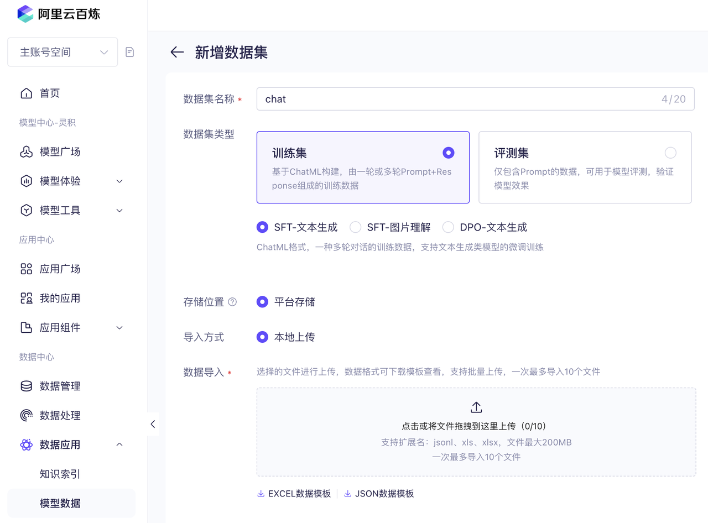
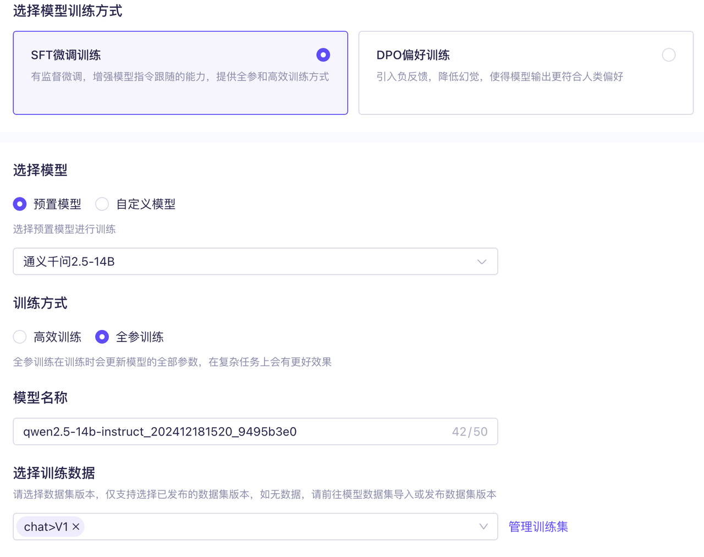
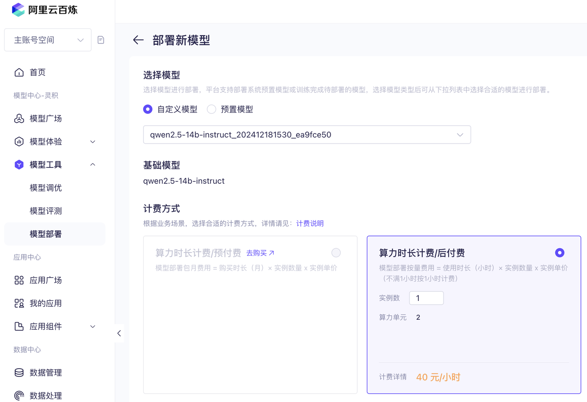

# 大模型微调入门

本章将通过实践入门大模型微调。大模型微调是一项实践性很强的科学，笔者建议首先进行几次实际操作，获得初步体验后再学习理论知识，这样效果会更好。

## 有哪些大模型微调方法

大模型微调有多种实现方法，从简单到复杂，主要包括以下几种：

1. **使用公有云平台微调**，如 OpenAI 的 Fine-tuning、百度的千帆、阿里的百炼等。这是最简单的方式，只需准备数据并上传到云平台后运行，支持少量超参数配置。
2. **使用 torchtune 或 LLaMA-Factory 等工具进行微调**，这些工具只需准备数据和硬件即可微调大模型，无需开发成本，仅需了解超参数配置。
3. **使用 Transformers 库**，相比于 LLaMA-Factory 更为底层，需要编写训练相关的代码。由于屏蔽了过多细节，不适合用来深入理解微调原理。
4. **使用 PyTorch 实现大模型**，需要从零实现大模型架构，开发成本较高，但非常适合用来学习大模型原理。通常，了解原理到这一层就足够了，因此本书在介绍原理时会采用这种方式。
5. **使用 C++/CUDA 实现大模型**，这是最底层的实现，开发成本最高，但性能也最好，通常用于对性能要求高的推理场景。需要掌握硬件知识，本书不涉及此部分，推荐通过 llm.c 和 ZhiLight 项目进行学习。

接下来，本章将介绍如何使用公有云平台及 LLaMA-Factory 进行微调。

## 使用公有云平台进行微调

微调最简单的方法是使用公有云平台。目前国内许多模型厂商都开放了大模型微调能力，其中比较著名的是百度千帆和阿里百炼。与其他大模型创业公司相比，这两个平台支持的模型数量较多，功能也较为全面。

这两个平台的功能对比如下：

- 支持微调的模型
  - 百度千帆
    - 文心系列，包括 Turbo、Speed、Lite 等
    - Llama 2、Llama 3 的 8B、13B 等
    - Mixtral-8x7B
    - SQLCoder-7B
    - ChatGLM-2 和 ChatGLM3 的 6B
    - Baichuan2-7B
    - CodeLlama-7B
    - BLOOMZ-7B
  - 阿里百炼
    - 通义千问开源模型的 7B、14B、72B
    - 通义千问闭源模型 Turbo、Plus
    - Baichuan2-7B
    - Llama 2 的 7B 和 13B
    - ChatGLM 2 的 6B
- 训练方法
  - 百度千帆
    - 增量预训练
    - 指令微调
    - 偏好对齐：KTO、SimPO、DPO、RLHF
  - 阿里百炼
    - 指令微调
    - 偏好对齐：DPO
- 数据处理
  - 百度千帆
    - 数据增强
    - 人工标注服务（众测）
    - 数据回流
  - 阿里百炼
    - 数据增强
    - 数据清洗

从对比可以看出，在微调方面百度千帆功能最为丰富，支持的模型和微调方法也最多。然而，其中许多模型目前已经被淘汰（例如 BLOOMZ 和 SQLCoder-7B）。因此，这两个平台最大的差异在于专有模型的支持，只有千帆支持文心模型，只有百炼支持通义千问模型。与文心模型相比，通义千问有开源版本，我们不仅能在百炼上进行训练，还能在本机上训练。为了后续章节的一致性，这里将使用百炼平台作为示例进行介绍，百度千帆的操作方法也类似。

首先，创建数据集，访问「数据中心」-「模型数据」。



点击底部的「JSON 数据模板」可以下载 JSONL 示例，这是名为 ChatML 的格式，最早在 OpenAI 中使用。每一行内容如下所示：

```json
{
  "messages": [
    {
      "role": "system",
      "content": "You are a helpful assistant"
    },
    {
      "role": "user",
      "content": "谁在文艺复兴时期绘制人体?"
    },
    {
      "role": "assistant",
      "content": "文艺复兴时期是一个关于艺术、文化和学术的复兴运动，在这个时期，许多艺术家都绘制了人体。"
    },
    {
      "role": "user",
      "content": "那雕塑方面如何呢？"
    },
    {
      "role": "assistant",
      "content": "文艺复兴时期的雕塑也非常有名，几位世界级的雕塑大师都出自于这个时期。"
    }
  ]
}
```

上面的内容是两轮对话数据。为了简化，这里我们不对示例数据进行修改，直接将下载后的文件上传，这时就具备了首个训练数据。上传后的数据可以进行二次编辑，但要想用这个数据进行微调，需要先点击「发布」，如下图所示。


接下来，进入「模型工具」-「模型调优」界面进行微调，预制模型使用「通义千问 2.5-14B」，训练数据使用刚才发布的 V1 版本。



然后点击「开始训练」即可。这个简单的示例只有 55 条（其中大部分是重复的），训练耗时半小时，花费不到 1 元。

训练之后的模型可以在「模型工具」-「模型部署」页面进行部署，如下图所示。



可以看到，使用平台进行微调非常简单，甚至完全不懂技术的人也能操作。只需使用 Excel 编辑训练数据，然后上传到平台后就能进行训练。

## 本地微调工具选型

虽然使用平台微调工具很简单，但也有不少缺点：

- **价格较贵**：相比于自己部署，平台的价格更高，毕竟平台需要通过差价来弥补研发成本。例如，在阿里百炼上部署每月的费用是 20000 元，但如果购买单卡 A10 GPU 的 ECS 实例只需不到 5000 元，这样的配置足以运行 7B 模型。
- **不支持私有部署**：训练好的模型无法下载，大部分平台不支持私有部署，即便支持，售价也很高。
- **模型有限**：只能使用平台提供的模型，数量较少。
- **可控性低**：可调的超参数较少，比如 OpenAI 只允许设置 3 个超参数。

我们完全可以用开源工具实现相同功能，甚至可能做得更好。那么有哪些本地微调工具值得关注呢？以下是笔者认为值得关注的 4 类工具：

- **TRL**：由 Hugging Face 维护的微调工具，支持指令微调、SFT、RLHF、DPO 等方法，核心开发者预计不超过 10 人。

  - 优点：功能全面，几乎支持所有模型，生态完善，许多新的微调技术会优先在 TRL 项目中实现。
  - 缺点：较为底层，许多功能需要编写代码实现，并且依赖 Transformers 项目的模型实现，导致难以对单个模型做特殊优化，例如后面提到的打包多个指令的注意力优化。

- 基于 Transformers 及 TRL 生态扩展的 **LLaMA-Factory**、**Axolotl**、**Firefly**、**unsloth** 和 **ms-swift** 等工具，它们的特点是在 SFT 微调上进行了自我实现，而 DPO、PPO 则是基于 TRL 项目改造。原因是早期 TRL 库的定位仅限于强化学习，未实现 SFT 微调。

  - 优点：继承了 TRL 的优点，相较于 TRL 更加上层，提供基于配置文件的微调，使用起来更简单，无需编写代码，并且集成了许多优化以提升训练性能。
  - 缺点：随着 TRL 功能的完善，这些库的优势会逐渐减小。此外，这些库的开发人员相对较少，大多只有 1-2 名主力开发者，其它人的代码贡献量较小，且以学生为主，毕业后是否继续维护存在不确定性。为了实现部分优化，这些库需要对 Transformers 中的模型进行修改（主要是注意力机制），因此对 Transformers 版本进行了限制，难以使用最新版本。

- **torchtune**：由 PyTorch 官方维护的微调工具，支持大部分微调方法，核心开发者预计不到 10 人。

  - 优点：代码精简，外部依赖少，技术实力强，已实现大量显存优化技术，灵活性高，除了可以通过配置方式使用外，还可以通过编写代码来完全控制训练过程。
  - 缺点：使用人数不多，对新微调技术的支持较慢，因为需要自行实现。

- **NeMo**：由 NVIDIA 维护的微调工具，预计至少有 50 位全职开发者。
  - 优点：开发者众多，技术实力最强，该项目的 Python 代码有 43 万行，是其它几个项目的十倍以上，在一些细节实现方面做得更好，是这些工具中唯一支持 FP8 训练的。
  - 缺点：与其它生态割裂，需要先将模型转换为特殊格式，支持的模型数量较少。作为 NVIDIA 的项目，官方不会支持其它显卡。

长期来看，笔者认为：

- **NeMo** 适合对性能和稳定性要求高的大型企业。它的开发者数量最多且是全职的，后续发展有保证，但支持的模型和技术较少，生态相对封闭。
- **TRL** 适合大多数中小公司，它依赖庞大的 Transformers 社区，有许多第三方工具支持，例如 DeepSpeed，支持最多的模型和训练方法，因此将会长期存在。
- **torchtune** 介于两者之间，使用简单，其中的模型架构是自行实现的，因此能够像 NeMo 那样做许多优化，不过这也导致模型数量较少。

因此，笔者建议可以先使用 TRL 及相关的库进行实验，尝试多种微调方法，等效果稳定后再迁移到 torchtune 或 NeMo 上以提升性能。

因此，本书主要使用更为流行的 LLaMA-Factory 工具，同时也会介绍 torchtune 中的相关配置。

## 使用 LLaMA-Factory 在本地微调大模型

本节将介绍 LLaMA-Factory 的基本使用方法，它是目前最流行的微调工具，提供了大量微调所需的功能，包括：

- 支持多种模型：包括语言模型、MoE 模型、多模态模型。
- 支持全流程训练：继续预训练、指令微调、奖励模型、DPO、ORPO 等。
- 多种 LoRA 优化方法，比如 LoRA+、DoRA、QLoRA 等。
- 集成了多种优化训练性能的方法：FlashAttention-2、Liger Kernel。

运行 LLaMA-Factory 需要安装 Python 环境，具体请参考本书[Python 环境安装]，接下来是操作步骤。

### 下载模型

本书建议使用 modelscope.cn 快速下载模型，先安装 `pip install modelscope`，然后使用如下命令下载到本地：

```bash
modelscope download --model Qwen/Qwen2.5-0.5B-Instruct --local_dir Qwen2.5-0.5B-Instruct
```

这里我们选择 0.5B 参数量的 Qwen2.5 模型，使用它的最大好处是体积小，使得即使没有 GPU，我们也能直接使用 CPU 来运行和微调。本地操作更利于学习，后面我们将介绍如何通过断点方式学习模型架构。

### 安装 LLaMA-Factory

使用如下命令安装：

```bash
git clone https://github.com/hiyouga/LLaMA-Factory.git
cd LLaMA-Factory
pip install -e .[torch,metrics]
```

### 准备微调数据

创建一个新目录，比如 `my_train`，将 `data` 目录中的 `dataset_info.json` 和 `identity.json` 文件拷贝到其中。

接下来编辑 `identity.json` 文件，修改其中的 `{{name}}` 和 `{{author}}` 为你想要的名字，比如：

```txt
You may refer to me as {{name}}, an AI assistant developed by {{author}}.
```

改成：

```txt
You may refer to me as mychat, an AI assistant developed by nwind.
```

创建一个新文件，名字是 `train_qwen_lora.yaml`，内容如下所示：

```yaml
# 前面下载的模型路径
model_name_or_path: /Volumes/ai/models/Qwen2.5-0.5B-Instruct

stage: sft
do_train: true
finetuning_type: lora
lora_target: all

dataset: identity
dataset_dir: my_train # 前面创建的目录
template: qwen
cutoff_len: 32768
max_samples: 1000
overwrite_cache: true
preprocessing_num_workers: 16

output_dir: qwen_train_test # 输出 LoRA 文件的目录
logging_steps: 10
save_steps: 500
plot_loss: true
overwrite_output_dir: true

per_device_train_batch_size: 1
gradient_accumulation_steps: 4
learning_rate: 1.0e-4
num_train_epochs: 3.0
lr_scheduler_type: cosine
warmup_ratio: 0.1
bf16: true
ddp_timeout: 180000000

val_size: 0.1
per_device_eval_batch_size: 1
eval_strategy: steps
eval_steps: 500
```

然后运行如下命令进行微调：

```bash
llamafactory-cli train train_qwen_lora.yaml
```

即使没有 GPU，这个任务也能在 CPU 上进行训练，只需将配置文件中的 `bf16: true` 改成 `bf16: false` 即可。由于模型小且任务简单，所以即使是 CPU 也只需几分钟就能完成训练，训练后的文件将在 `qwen_train_test` 目录中。

这样你就拥有了第一个自己训练的大模型，但要怎么运行呢？

### 运行模型

创建一个新文件 `chat_qwen.yaml`，内容如下，注意修改其中的模型路径：

```yaml
model_name_or_path: /Volumes/ai/models/Qwen2.5-0.5B-Instruct
adapter_name_or_path: qwen_train_test # 需要和之前的一致
template: qwen
infer_backend: huggingface
```

然后通过如下命令就能开启模型对话了：

```bash
llamafactory-cli chat chat_qwen.yaml
```

你可以问它一句“你是谁？”虽然我们前面的训练例子是英文，但它还是能用中文回答，如下所示：

```txt
User: 你是谁？
Assistant: 您好，我是 mychat，一个由 nwind 开发的人工智能助手。我旨在提供有用的回答和帮助，解答用户的问题并解决难题。
```

整个过程虽然操作比前面使用平台要繁琐些，但并不复杂，只需了解简单的命令行基础知识即可。

不过你可能会有很多疑问，比如：

- 在 YAML 文件里还有很多参数，它们的具体作用是什么？
- LoRA 是什么？
- 训练过程中输出的 loss、learning rate 都是什么意思？
- 训练完后模型如何部署？

本书后续章节将会解答这些疑问，让你全面了解大模型微调相关技术。

除了 LLaMA-Factory 之外，另一个笔者推荐的微调工具是 PyTorch 官方的 torchtune。它的优点是没有外部依赖，更适合研究实现原理，而且是由 PyTorch 团队维护，后续持续更新更有保障。但它目前还在开发中，功能相对 LLaMA-Factory 较少，配置格式也经常变。

## 大模型微调可以做的事情

大模型微调是优化大模型在垂直领域能力的重要手段，得到了广泛应用，包括但不限于以下领域：

- **教育**：EduChat [^danEduChatLargeScaleLanguage2023]、Taoli [^Taoli2024] 实现了教育领域的问答、作业批改等功能。
- **金融**：FinMA [^xiePIXIULargeLanguage2023]、FinGPT [^yangFinGPTOpenSourceFinancial2023]、Instruct-FinGPT [^zhangInstructFinGPTFinancialSentiment2023] 等模型实现了金融领域的问答功能。
- **医疗**：ChatDoctor [^liChatDoctorMedicalChat2023]、DoctorGLM [^xiongDoctorGLMFinetuningYour2023]、Med-PaLM [^singhalLargeLanguageModels2023] 实现了医疗领域的问诊功能。
- **法律**：LawGPT [^zhouLawGPTChineseLegal2024]、ChatLaw [^cuiChatLawOpenSourceLegal2023] 及 DISC-LawLLM [^yueDISCLawLLMFinetuningLarge2023] 等项目实现了法律领域的咨询功能。
- **写作**：Writing-Alpaca-7B [^zhangMultiTaskInstructionTuning2023] 及 CoEdIT [^rahejaCoEdITTextEditing2023] 写作辅助工具，实现了语法纠错、简化和改写功能。
- **软件开发**：Copilot [^GitHubCopilotYour2024]、Code Llama [^roziereCodeLlamaOpen2024]、WizardCoder [^luoWizardCoderEmpoweringCode2023] 等实现了根据问题生成代码的功能。
- **调用工具**：Gorilla [^patilGorillaLargeLanguage2023]、GPT4Tools [^yangGPT4ToolsTeachingLarge2023] 及 ToolLLM [^qinToolLLMFacilitatingLarge2023] 等实现了让模型调用工具来完成任务的功能。

[^danEduChatLargeScaleLanguage2023]: <http://arxiv.org/abs/2308.02773>

[^Taoli2024]: <https://github.com/blcuicall/taoli>

[^xiePIXIULargeLanguage2023]: <http://arxiv.org/abs/2306.05443>

[^yangFinGPTOpenSourceFinancial2023]: <http://arxiv.org/abs/2306.06031>

[^zhangInstructFinGPTFinancialSentiment2023]: <http://arxiv.org/abs/2306.12659>

[^liChatDoctorMedicalChat2023]: <http://arxiv.org/abs/2303.14070>

[^xiongDoctorGLMFinetuningYour2023]: <http://arxiv.org/abs/2304.01097>

[^singhalLargeLanguageModels2023]: <https://www.nature.com/articles/s41586-023-06291-2>

[^zhouLawGPTChineseLegal2024]: <http://arxiv.org/abs/2406.04614>

[^cuiChatLawOpenSourceLegal2023]: <http://arxiv.org/abs/2306.16092>

[^yueDISCLawLLMFinetuningLarge2023]: <http://arxiv.org/abs/2309.11325>

[^zhangMultiTaskInstructionTuning2023]: <http://arxiv.org/abs/2305.13225>

[^rahejaCoEdITTextEditing2023]: <http://arxiv.org/abs/2305.09857>

[^GitHubCopilotYour2024]: <https://github.com/features/copilot>

[^roziereCodeLlamaOpen2024]: <http://arxiv.org/abs/2308.12950>

[^luoWizardCoderEmpoweringCode2023]: <http://arxiv.org/abs/2306.08568>

[^patilGorillaLargeLanguage2023]: <http://arxiv.org/abs/2305.15334>

[^yangGPT4ToolsTeachingLarge2023]: <http://arxiv.org/abs/2305.18752>

[^qinToolLLMFacilitatingLarge2023]: <http://arxiv.org/abs/2307.16789>

而且，ChatGPT 也是通过微调获得了问答能力，因此所有能用提示词实现的功能都可以通过微调实现。同时，它的能力上限更高，可以充分发挥模型的潜力。

不过，也有一些场景不适合进行微调。笔者认为以下三种场景不建议进行微调：

- **信息变化快的场景**，例如针对文档的问答。微调训练需要时间，无法做到实时更新，这种场景更适合使用 RAG（检索增强生成）。
- **较为通用的场景**，比如聊天、工具调用和代码生成等。并不是说这些功能无法微调，而是因为这些功能是基础模型的优化重点。例如，Llama 3 为了训练代码相关任务构造了 270 万条数据，我们自己进行微调的效果不一定更好，即便成功微调，也很可能在几个月后被新版的基础模型超越。
- **有条件部署 DeepSeek V3/R1 模型**，DeepSeek V3/R1 的出现让开源模型赶上了闭源模型，它在许多场景下只需提示词就能达到微调小模型的效果，所以如果有条件部署，笔者推荐优先尝试通过提示词来实现。

## 微调成本估算

前面的微调实践表明，微调模型的成本不高，但部署成本较高。除此之外，是否还有其他成本？在这里，我们综合分析一下微调所需的成本，主要包括以下四个方面：

- **准备数据的人力成本**：这部分成本取决于数据的量和质量。初期准备 1000 条数据的人力成本可以控制在两周以内，但数据量较大时，所需的人力成本会显著增加。

- **数据存储成本**：存储成本主要包括以下三部分：

  - **指令微调数据**：这部分的数据量不大，几乎可以忽略，前期可以放在一个 Excel 文件中。
  - **继续预训练文本**：如果需要进行继续预训练，可能需要存储超过 100G 的文本，具体取决于领域。
  - **模型存储成本**：微调后的模型需要存储，每个 13B 参数量的模型需要 26GB 的存储空间。如果进行 100 次实验，总存储需求将达到 2.6TB。然而，如果使用 LoRA 进行训练，这部分存储需求可以忽略，因为每个模型只需十几 MB。

- **训练硬件成本**：虽然训练可以使用 CPU，但非常耗时，最好使用 GPU 进行训练。使用 GPU 的最低成本方法是临时租用，例如在 autodl 等平台上，4090 显卡的租用价格每小时只需 2 元。训练 1000 条数据的时间不会超过半小时，即便训练 20 次，成本也不到 40 元。因此，训练时的硬件成本不高，主要是这段时间内的人力成本。

- **推理硬件成本**：推理硬件需要持续运行，因此这部分的成本较高，具体成本与部署方式有关，主要有以下三种方案：
  - **租用云 GPU 服务器**：最低配置的 A10 显卡每个月需要约 4000 元，可以运行 7B 参数的模型或量化后的 14B 模型。
  - **ServerLess GPU**：少量云厂商提供函数计算 GPU 服务，按量使用。如果使用频率低，成本会比租用服务器低很多，但缺点是大模型的启动时间较长，首次调用延迟高，只适合离线类的任务。
  - **购买消费级显卡 RTX 4090**：整机配置在 2 万到 3 万元之间，但这类显卡不支持在数据中心使用，只适合办公网内使用。

综合来看，如果是请求量不大的垂直领域应用，微调的主要成本是人力和推理硬件。

## 微调与 RAG 的对比

现阶段大模型应用最常见的方案是 RAG。RAG 的原理是先检索出与问题最相关的知识，然后将这些知识放入提示词中，让大模型根据知识进行回答。RAG 之所以有效，有一部分原因是它似乎可以看作是一种隐式微调 [^daiWhyCanGPT2023]，它们的注意力层输出结果与微调后的模型有一定相似性。那么，实际应用中究竟应该使用 RAG 还是微调？我们可以对比一下这两种方案的优缺点。

[^daiWhyCanGPT2023]: <http://arxiv.org/abs/2212.10559>

### RAG 的优势

- 开发成本低，因为无需训练，可以快速支持不同场景，适合项目初期验证。
- 效果不差，如果底层模型能力强，通过 Few-Shot 方式，效果并不比微调差太多，甚至在某些任务下的效果还更好。
- 使用成本低，可以使用模型厂商提供的 API，无需部署和运维，使用成本很低。最新的大模型 API 百万 token 的价格都降到 1 元以下，甚至有的模型还提供免费版本，对于没有大量文本的场景，这个成本几乎可以忽略。
- 数据实时更新，只要检索结果实时更新，就能保证回答的实时性。

### RAG 的缺点

- 检索召回有一定失败率，如果找不到相关文本，大模型肯定无法正确回答。
- 对底层模型要求高，开源模型做得好的极少。
- 受限于模型训练时的价值观，模型训练的对齐取决于训练的人员，导致每个模型必然有偏见，比如：
  - 偏向于冗长的回答，模型训练人员可能更喜欢长篇输出，因此很多大模型会生成大量冗余信息。
  - 偏向保守的回答，模型的回答可能倾向于四平八稳，文字缺乏张力。
  - 拒绝某些问题，模型训练为了避免风险会拒绝政治等相关敏感问题，但在某些场景下是需要的，比如小说写作。
- 对于调用大模型厂商 API 的方式，会存在安全和稳定性等问题，包括：
  - 隐私问题，需要将数据发往第三方，无法保证数据安全，这对隐私要求高的企业（如银行、医疗等）不太适合。
  - 稳定性难以保证，例如 OpenAI 的接口经常出故障，导致许多基于它的应用无法使用。
  - 可能会由于厂商升级导致能力下降。由于成本考虑，模型厂商不可能保留所有模型的历史权重，新版模型可能在特定任务上不如旧版。例如，有人使用 GPT-3.5-turbo 升级版本后效果下降了 10% [^HowMuchChatGPT]。
- 当上下文较长时，首 token 的速度较慢，且会占用较多的 KV 缓存。

[^HowMuchChatGPT]: <https://www.voiceflow.com/blog/how-much-do-chatgpt-versions-affect-real-world-performance>

### 微调的优势

- **上下文 token 数量少**，不需要写较长的提示词，这也使得首个 token 延迟更低，具体性能取决于部署所使用的硬件。
- **可以使用更小的模型，更适合私有化部署**。垂直领域微调的小模型可以达到甚至超过大模型的效果，这在许多领域都得到了验证，比如下面这些例子：
  - 在法律领域，DISC-LawLLM [^yueDISCLawLLMFinetuningLarge2023] 使用 13B 模型在法律领域击败了 GPT-3.5-turbo。
  - 在医疗领域，BioGPT [^guoImprovingSmallLanguage2023] 使用 1.6B 模型微调，在医疗领域的 PubMedQA 任务上准确度为 0.754，超过 GPT-4 的 0.744。
  - 在金融领域，FinMA [^xiePIXIULargeLanguage2023] 通过微调 30B 模型在金融领域问答任务上超过了 GPT-4，也有人通过微调 14B 模型达到接近 GPT-4 的准确率 [^phogatFinetuningSmallerLanguage2024]。
  - 在化学领域，ChemLLM [^zhangChemLLMChemicalLarge] 微调 7B 模型，接近 GPT-4 的准确率。
  - 在研发领域，Anyscale [^hakhamaneshikouroshFineTuningLlama2Tailoring] 通过微调 7B 模型在 SQL 生成任务上超过了 GPT-4。
  - 在芯片领域，ChipGPT-FT [^changDataAllYou2024] 使用 13B 模型微调，在芯片设计领域击败了 GPT-3.5，它们的准确率分别为 70.6% 和 58.8%。
  - 有人还在 31 种不同任务（生成标题、生成摘要、文本分类、实体识别等）上微调了多个 7B 模型 [^zhaoLoRALand3102024]，大部分效果都接近或超过 GPT-4。
- **不用等大模型更新**，比如 GPT-5 可能推迟到 2025 年底甚至 2026 年。
- **更适合结构化输出**，微调模型更擅长输出复杂的 JSON 结构。虽然现在有部分大模型支持 function call 功能也能部分做到，但在层次结构较深时容易出错，且所需的 JSON Schema 很复杂，会使用大量 token。
- **风险更可控**，如果只是基于基础模型微调垂直领域功能，这个模型就只能做这一件事情，不会带有政治偏向。例如，我们微调过一个生成页面的模型，如果你问它敏感的问题，它会直接将问题转成输入框的 label，而不会回答这个问题，而有的国外开源模型可能会答错。
- **多模态场景**，以图片为例，垂直场景下的图片都很定制，通用的多模态模型难以满足需求，这时要提升效果就只能微调。例如，在博物馆问答场景下，默认 LLaVA 的准确率只有 4%，但经过微调后能达到 64% [^balaucaUnderstandingWorldsMuseums2024]。

[^guoImprovingSmallLanguage2023]: <http://arxiv.org/abs/2305.07804>

[^phogatFinetuningSmallerLanguage2024]: <http://arxiv.org/abs/2408.12337>

[^zhangChemLLMChemicalLarge]: <https://arxiv.org/abs/2402.06852>

[^hakhamaneshikouroshFineTuningLlama2Tailoring]: <https://www.anyscale.com/blog/fine-tuning-llama-2-a-comprehensive-case-study-for-tailoring-models-to-unique-applications>

[^changDataAllYou2024]: <http://arxiv.org/abs/2403.11202>

[^zhaoLoRALand3102024]: <http://arxiv.org/abs/2405.00732>

[^balaucaUnderstandingWorldsMuseums2024]: <http://arxiv.org/abs/2412.01370>

### 微调的缺点

- **开发成本高**，需要构造训练数据，这里有大量人工成本。
- **更新相对较慢**，训练和部署需要较长时间，不适合对数据有实时性要求的场景。
- **需要有一定经验**，需要对大模型和微调有基本了解，本书将会介绍这些关键知识。
- **需要训练硬件**，训练通常需要使用 GPU。
- **需要部署和运维**，微调后的大模型需要部署和运维，不过部署所需算力远小于训练，对于 13B 及以下的模型可以使用 4090 进行推理，具体推理硬件选型请参考[如何选择推理显卡或加速卡]。

### 同时使用两种方法

需要注意的是，RAG 和微调并不是二选一的关系，可以同时使用。例如，Gorilla [^patilGorillaLargeLanguage2023] 在微调之后使用 RAG 能进一步提升 12% 的效果。
另外，从商业售卖角度来看，RAG 因为门槛相对较低，许多客户自己就能做，加上现在有大量开源的 RAG 平台，同质化竞争比较严重。相对而言，微调有一定门槛，可以作为差异化功能。

## 微调的流程

微调的主要流程如下图所示：


主要有以下几个步骤：

- **选择基础模型**，寻找适合自己任务类型的基础模型，包括模型能力及是否具备相应的知识等，具体内容将在[选择基础模型]中介绍。
- **使用提示词**，在微调前应先尝试使用提示词来完成任务，如果效果可以接受，则不需要微调。
- **准备训练数据**，准备训练数据和评估数据，并通过多次抽样确认训练数据和评估数据的质量，具体内容将在[训练数据构造及管理]中介绍。
- **准备硬件资源**，根据模型预估所需的 GPU 资源，具体内容将在[微调所需资源]中介绍。
- **「可选」继续预训练**，判断是否需要进行继续预训练，具体内容将在[继续预训练]中介绍。
- **指令微调训练**，具体内容将在[微调训练]中介绍。
- **「可选」偏好训练**，可以使用 RLHF 或 DPO，具体内容将在[偏好训练]中介绍。
- **评估模型**，对训练后的模型效果进行评估，具体内容将在[评估]中介绍。
- **部署模型**，部署模型并优化性能，具体内容将在[部署]中介绍。
- **监控模型**，持续监控模型表现和用户反馈，收集成功和失败的案例，为下一轮训练做好准备。
